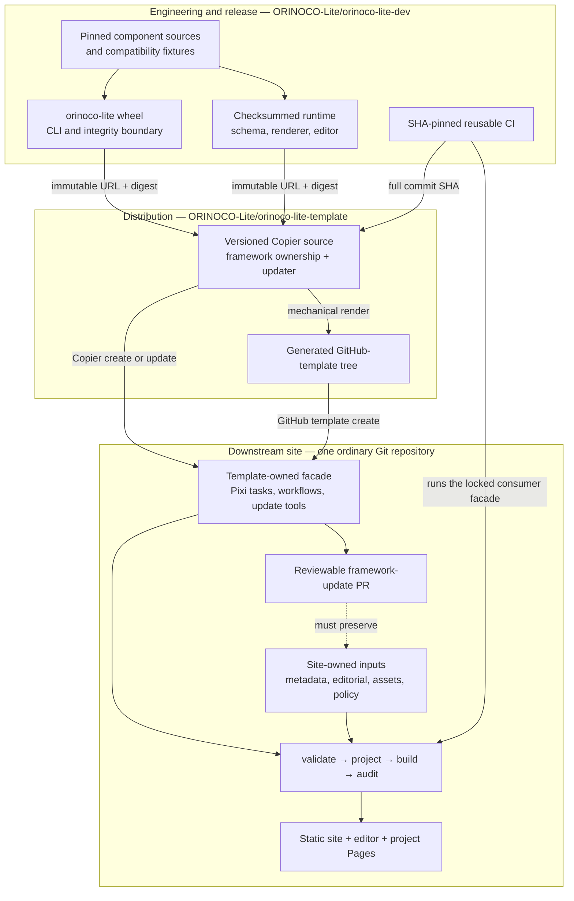

# Orinoco Lite engineering workspace

Orinoco Lite turns reviewed, schema-backed records and editorial inputs into a deterministic static website with a credential-free review-bundle editor.
This repository is the **engineering and release layer**: it integrates pinned upstream components, publishes the `orinoco-lite` engine and runtime, and owns the cross-repository acceptance evidence.

The supported website experience is deliberately simpler than this workspace.
A downstream site is one ordinary Git repository with no submodules, no gitlinks, and no need to understand the component history retained here.

## Architecture



The arrows express release and update direction, not repository nesting.
The engineering workspace may remain multi-repository; the template and every supported consumer are independently usable repositories.
The downstream output owns both human-facing metadata routes: `/edit/` is the only SHACL Vue editor for that site, and `/review/` is the source-adapter decision review.
The optional central service handles only OAuth, verified GitHub reads, explicit confirmation, bundle receipt, and GitHub transport; it does not host either review interface.

## Repository map

| Layer | Repository | Owns | Start here |
| --- | --- | --- | --- |
| Engineering and release | this repository, [`ORINOCO-Lite/orinoco-lite-dev`](https://github.com/ORINOCO-Lite/orinoco-lite-dev) | Component review, engine/runtime assembly, release provenance, reusable CI, and cross-layer acceptance | [`docs/milestone-6.md`](docs/milestone-6.md), [`docs/source-adapters.md`](docs/source-adapters.md), and [`packages/orinoco-lite/README.md`](packages/orinoco-lite/README.md) |
| Distribution | [`ORINOCO-Lite/orinoco-lite-template`](https://github.com/ORINOCO-Lite/orinoco-lite-template) | Copier source, generated GitHub-template tree, ownership rules, updates, and generic consumer guidance | [Template README](https://github.com/ORINOCO-Lite/orinoco-lite-template#readme) |
| Acceptance fixture | [`ORINOCO-Lite/test-orinoco-downstream-website`](https://github.com/ORINOCO-Lite/test-orinoco-downstream-website) | Complete accepted CON snapshot, site policy, presentation overrides, provenance, and point-in-time end-to-end release evidence | [Consumer README](https://github.com/ORINOCO-Lite/test-orinoco-downstream-website#readme) |

The production `centerforopenneuroscience.org` repository is not a fourth implementation layer in Milestone 4.
It remains read-only evidence until a separate, explicitly reviewed graduation plan is accepted.

## Review now

[`Milestone 6`](docs/milestone-6.md) is the current engineering entry point.
Its bounded convergence, aligned-release, and custody-transition prerequisites are complete; the milestone document records their current mechanical coordinates and the remaining metadata-path acceptance work.
The separate [`human-review decision queue`](docs/human-review-decisions.md) records the reviewed planning outcomes and unresolved production and strategic choices.

Supporting records are:

- [`docs/milestone-5.md`](docs/milestone-5.md), its [decision register](docs/milestone-5-decisions.md), and its [acceptance record](docs/milestone-5-acceptance.md) for the accepted source-adapter implementation;
- [`docs/source-adapters.md`](docs/source-adapters.md) for the normative source-adapter contract;
- [`docs/milestone-4-acceptance.md`](docs/milestone-4-acceptance.md) and [`docs/milestone-4-decisions.md`](docs/milestone-4-decisions.md) for the accepted distribution baseline;
- [`docs/milestone-3-decisions.md`](docs/milestone-3-decisions.md) for the original content-policy questions; and
- [engineering pull request 5](https://github.com/ORINOCO-Lite/orinoco-lite-dev/pull/5) for the accepted implementation-review history.

## Stable downstream interface

Normal site maintainers should use the commands exposed by their checked template release, not commands from this engineering workspace:

```console
pixi install --frozen
pixi run validate
pixi run build
pixi run serve
pixi run test-all
pixi run update-check
```

The consumer's `orinoco.lock` is the release authority.
It binds the engine wheel, runtime archive, and reusable workflow to immutable coordinates and digests.
The template owns update mechanics; the site owns its content and declared extension surfaces.
Framework updates stop at a pull request and never merge themselves.

## Working in this repository

Pixi 0.76 or newer is required.
The root environment is deliberately package-focused and contains no local dependency on a submodule, so it can install before any component checkout:

```console
pixi install --locked
pixi run test
```

Project-owned agent skills are canonical under `.apm/skills/`, locked by APM, and deployed as ordinary files under `.agents/skills/`.
Verify the frozen installation and its deployment ledger without changing the engine environment:

```console
pixi run -e skills apm-check
```

That bootstrap suite reports source-compatibility checks as skipped when their recorded component fixtures are absent.
Ordinary engineering CI initializes only the schema and editor components used by a release, checks out one exact accepted-consumer fixture, runs `pixi run test-ci`, and fails if any test skips.
The frozen consumer check generates its projection from tracked metadata and projection inputs; it never depends on a sibling checkout or ignored output.

Submodules remain the source-level dependency and compatibility-fixture pins for engineering integration.
`checkout-submodules` is the explicit full recursive setup command: it synchronizes URLs, initializes every gitlink recorded by the current parent commit, restores exact detached commits, unshallows development history, and verifies the result.
Use it when broad cross-component work needs the complete source graph:

```console
pixi run checkout-submodules
```

Named upstream tasks initialize only their own required gitlinks and expose two checkout policies:

| Scope | Recorded pins | Current candidate worktrees |
| --- | --- | --- |
| Static reference site | `build-upstream-static`, `serve-upstream-static` | `build-upstream-static-worktree`, `serve-upstream-static-worktree` |
| Full service-backed stack | `check-upstream`, `serve-upstream` | `check-upstream-worktree`, `serve-upstream-worktree` |

Recorded tasks refuse modified component worktrees, initialize missing submodules recursively, and restore the exact commits in the parent tree.
They are the known-code reproduction path.
Worktree tasks initialize only missing repositories and preserve every current component commit plus tracked and untracked candidate change.
They are the iterative upstream-integration path.

The static commands build only `www-from-model`, its nested Congo theme, and their annexed presentation assets:

```console
pixi run serve-upstream-static
```

Its executable, Hugo, and git-annex dependencies are declared in [`tools/upstream_static.py`](tools/upstream_static.py) and resolved from the adjacent lock, independently of the root environment.
Use `build-upstream-static` for the same deterministic build without starting the HTTP server.
The full commands add the pool UI, SHACL Vue, Things Schema, and Dump Things service in a second locked inline environment.
`check-upstream` starts the services, seeds and checks both isolated collections, proves the editor write boundary, checks the static site, and stops; `serve-upstream` leaves that checked deployment running at `http://127.0.0.1:8768/`.

The recorded full-stack task pins every source repository and tool, but its public pool input is not yet an immutable release artifact.
A fresh checkout fetches the current public `Thing` collection; a prepared checkout reuses its digest-checked ignored cache.
The historical Milestone 3 capture contained 4,978 records and the 2026-08-14 verification contained 4,979.
Therefore the static recorded build is byte-reproducible, while the full recorded task currently proves the recorded software stack against an identified pool snapshot rather than recreating one permanent data snapshot.

Compare that prepared cache with the current live public pool without replacing it:

```console
pixi run diff-upstream-pool
```

The task compares semantic JSON records by PID, prints added, removed, and changed records with their changed field paths, and writes the complete ignored report to `build/upstream-stack/pool/live-diff.json`.
Differences are informational because the public pool is live.
Run `pixi run diff-upstream-pool -- --check` when a nonzero exit on any difference is explicitly required.

The [upstream snapshot workflows](docs/upstream-snapshot-workflows.md) turn one identified public-pool capture into exact canonical YAML, prove the reverse JSONL conversion, seed the full upstream stack from both representations, and compose an ordinary Orinoco Lite Git repository from the same records.
Use `pixi run refresh-upstream-records` when a new live capture is intentional; use `pixi run snapshot-upstream-records` to reuse the digest-checked cache.
`pixi run check-upstream-orinoco` builds and compares the Orinoco and upstream deployment strategies without changing tracked content or the real site.

To advance upstream dependencies safely:

1. create a review branch and initialize the required repositories;
2. check out proposed component commits and make any cross-repository edits;
3. use the corresponding `*-worktree` build or check throughout development;
4. use `diff-upstream-pool` to separate public data drift from software-stack effects;
5. commit component changes, then record the reviewed gitlinks in this parent repository;
6. rerun the recorded commands from a clean checkout; and
7. manually dispatch `Engineering environment` on the candidate parent ref for a hosted live `check-upstream`, then merge only the parent commit whose recorded tasks and CI establish the next known-good stack.

This keeps checkout automation in the task without letting a validation command silently discard work in progress.
The historical [Milestone 1–4 capability map](docs/archived/milestone-1-4-capability-map.md) explains what the early milestones contributed to the accepted distribution.
The accepted [`Milestone 5 plan`](docs/milestone-5.md) and its concise [acceptance record](docs/milestone-5-acceptance.md) describe the delivered source-adapter system.
The [`source-adapter specification`](docs/source-adapters.md) defines reviewable metadata changes, DataLad execution evidence, PAV annotation overlays, and durable human dispositions.
The current [`Milestone 6 specification`](docs/milestone-6.md) records the completed upstream-convergence, aligned-release, and custody prerequisites and the active open-reference, compatibility, Zotero, and SHACL work.
The superseded [lightweight architecture roadmap](docs/archived/lightweight-architecture-roadmap-through-m5.md) remains available as historical reasoning.

The former unqualified `build`, `serve`, and CON migration tasks belonged to the accepted Milestones 1–3 integration stack.
They remain recoverable from preserved history, but are not a supported `main` development facade: a downstream site uses its own ordinary-repository commands, while new engineering integration commands must name their scope and isolate their dependencies.

Release artifacts are assembled by [`orinoco-release.yml`](.github/workflows/orinoco-release.yml).
That workflow pins the build toolchain, builds the wheel and source archive twice, builds the editor and source-review shells with their dependency-license inventories twice, assembles the runtime twice, compares the results, verifies an installed wheel, attests the checksums, and publishes only immutable release candidates.
Do not reproduce that release boundary with an ad hoc local archive.

## Ownership and safety boundaries

- Original Orinoco Lite software is MIT licensed; original documentation is CC BY 4.0, factual metadata is CC0 1.0, and media remains item-specific.
See [`LICENSES.md`](LICENSES.md) and preserve every upstream notice.
- Every record under `metadata/records/` and companion under `metadata/overlays/annotations/` is canonical semantic input; their joined Thing is the validation, RDF, and projection boundary.
Declarative site policy determines pages and editor exposure.
Projection output is regenerated during validation and build, remains ignored, and never obscures a source-metadata review diff.
- When a downstream uses the current reusable publication workflow, a successful Pages deployment records the complete projection as the sole commit on `latest-hugo-projection` beyond the exact default-branch source, then records the complete deployed website as its child on `gh-pages`.
The two generated refs are force-updated atomically and are debugging evidence, not metadata authority.
- Static validation, building, previewing, Pages deployment, and review-bundle export do not require a continuously running metadata service.
- The source Things Schema and exact `dlthings:*` CURIE contract remain pinned.
See [`docs/explaining-schema-issues.md`](docs/explaining-schema-issues.md).
- Credentials, stores, hydrated caches, browser downloads, and build output are local ignored state.
- The real-site repository, its refs, settings, Pages configuration, DNS, and production domain remain outside this milestone.

## Historical evidence

Milestones 1–3 explain how the accepted content and behavior were derived.
They are preserved as evidence, not as current operating instructions:

- [`docs/orinoco-lite-plan.md`](docs/orinoco-lite-plan.md)
- [`docs/clean-migration.md`](docs/clean-migration.md)
- [`docs/full-con-migration.md`](docs/full-con-migration.md)
- [`docs/milestone-2-acceptance.md`](docs/milestone-2-acceptance.md)
- [`docs/milestone-3.md`](docs/milestone-3.md)
- [`docs/milestone-3-acceptance.md`](docs/milestone-3-acceptance.md)
- [`docs/archived/milestone-1-4-capability-map.md`](docs/archived/milestone-1-4-capability-map.md)

Do not use their old submodule, collection, preview-branch, or full-stack commands as the downstream interface.
The supported distribution follows immutable engine/runtime releases and the versioned template; active engineering work follows Milestone 6 and the normative source-adapter specification.
