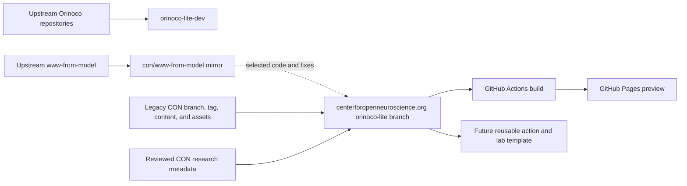

# Orinoco Lite development

This repository is the development and integration workspace for Orinoco Lite.
It tracks upstream Orinoco components, records architectural decisions, and
coordinates development of a GitHub-native lab website workflow.

Lab websites do not build or deploy from this repository. The first
implementation will live on the `orinoco-lite` branch of the existing
[`centerforopenneuroscience.org`](https://github.com/con/centerforopenneuroscience.org)
repository. That branch continues the established CON history while selectively
adopting useful scaffolding from upstream
[`www-from-model`](https://hub.psychoinformatics.de/www/www-from-model).

[`con/www-from-model`](https://github.com/con/www-from-model) remains a clean
GitHub mirror and integration reference for that upstream history.

## Start here

The canonical implementation and handoff document is
[`docs/orinoco-lite-plan.md`](docs/orinoco-lite-plan.md).

The separate current-upstream reproduction branch is documented in
[`docs/upstream-psychoinformatics-trial.md`](docs/upstream-psychoinformatics-trial.md).
It rebuilds the complete pinned Psychoinformatics snapshot locally and carries
a generated-artifact adapter for GitHub Pages project paths without changing
the upstream website source.

The trial is Pixi-controlled. From this worktree, `pixi run serve` builds and
serves a root-local preview at `http://127.0.0.1:8767/`; `pixi run serve-pages`
builds and serves the GitHub Pages project-path preview at
`http://127.0.0.1:8766/orinoco-lite-dev/`. Use `pixi run build`,
`pixi run build-pages`, `pixi run audit-pages`, and `pixi run test` for the
corresponding non-server tasks.

On macOS ARM, conda-forge does not currently publish Git Annex, so Pixi uses
the host `git-annex` executable (for example, installed with Homebrew). The
Linux Pixi environment includes Git Annex `10.20260601` directly in its lock.

For local editing, run `pixi run serve-shacl-vue` in a second terminal. It
prepares and serves the pinned `submodules/shacl-vue` checkout at
`http://127.0.0.1:3000/`; the Pixi-controlled site builds rewrite the “Edit
this record” links to that local instance while preserving the record query
parameters. The static site still has no write backend, so this provides the
local editor UI and form state, not persistence to the generated snapshot. The
preparation task applies one local compatibility patch for an upstream
`show_all_fields` compile error before installing its locked npm dependencies.

The next milestone is a small, connected CON website preview built on the
`orinoco-lite` branch of `centerforopenneuroscience.org`. It will combine
reviewed metadata migrated from `dump-research-info` with selected content,
assets, and visual identity preserved from the legacy website.

## Core constraints

- Canonical metadata is stored as human-editable YAML in Git.
- Pull requests are the review and publication boundary.
- Dump Things may run ephemerally during CI, but no persistent metadata server
  is required for a deployed lab website.
- Generated pages and projections are build artifacts, not canonical records.
- CON-specific content remains downstream; narrow reusable improvements may be
  contributed upstream.
