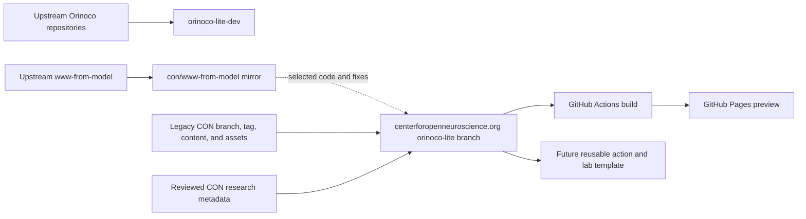

# Orinoco Lite development

This repository is the development and integration workspace for Orinoco Lite.
It tracks upstream Orinoco components, records architectural decisions, and
coordinates development of a GitHub-native lab website workflow.

Lab websites do not build or deploy from this repository. The first
implementation will live on the `orinoco-lite` branch of the existing
[`centerforopenneuroscience.org`](https://github.com/con/centerforopenneuroscience.org)
repository. That branch continues the established CON history while selectively
adopting useful scaffolding from upstream
[`www-from-model`](https://hub.psychoinformatics.de/www/www-from-model).

[`con/www-from-model`](https://github.com/con/www-from-model) remains a clean
GitHub mirror and integration reference for that upstream history.

## Start here

The canonical implementation and handoff document is
[`docs/orinoco-lite-plan.md`](docs/orinoco-lite-plan.md).

The next milestone is a small, connected CON website preview built on the
`orinoco-lite` branch of `centerforopenneuroscience.org`. It will combine
reviewed metadata migrated from `dump-research-info` with selected content,
assets, and visual identity preserved from the legacy website.

## Core constraints

- Canonical metadata is stored as human-editable YAML in Git.
- Pull requests are the review and publication boundary.
- Dump Things may run ephemerally during CI, but no persistent metadata server
  is required for a deployed lab website.
- Generated pages and projections are build artifacts, not canonical records.
- CON-specific content remains downstream; narrow reusable improvements may be
  contributed upstream.
