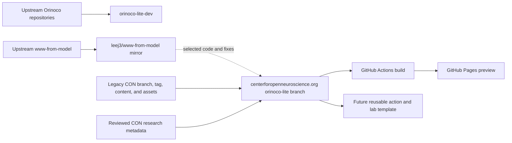

# Orinoco Lite development

This repository is the development and integration workspace for Orinoco Lite.
It tracks upstream Orinoco components, records architectural decisions, and coordinates development of a GitHub-native lab website workflow.

Lab websites do not build or deploy from this repository.
The first implementation will live on the `orinoco-lite` branch of the existing [`centerforopenneuroscience.org`](https://github.com/leej3/centerforopenneuroscience.org) repository.
That branch continues the established CON history while selectively adopting useful scaffolding from upstream [`www-from-model`](https://hub.psychoinformatics.de/www/www-from-model).

[`leej3/www-from-model`](https://github.com/leej3/www-from-model) remains a clean GitHub mirror and integration reference for that upstream history.

## Start here

The canonical implementation and handoff document is [`docs/orinoco-lite-plan.md`](docs/orinoco-lite-plan.md).

The separate current-upstream reproduction branch is documented in [`docs/upstream-psychoinformatics-trial.md`](docs/upstream-psychoinformatics-trial.md).
It rebuilds the complete pinned Psychoinformatics snapshot locally and carries a generated-artifact adapter for GitHub Pages project paths without changing the upstream website source.

All recursive submodule URLs in this branch resolve to public mirrors under [`leej3`](https://github.com/leej3), except `dump-research-info`, which remains the CON-owned migration input at `github.com/con/dump-research-info`.
The account mirrors preserve the upstream refs needed by the pinned checkout; nested pool UI, theme, and schema dependencies are mirrored there as well.

The trial is Pixi-controlled.
`pixi run checkout-submodules` synchronizes and fully checks out every pinned submodule, including nested submodules.
From this worktree, `pixi run serve` builds and serves a root-local preview at `http://127.0.0.1:8767/`; `pixi run serve-pages` builds and serves the GitHub Pages project-path preview at `http://127.0.0.1:8766/orinoco-lite-dev/`.
Use `pixi run build`, `pixi run build-pages`, `pixi run audit-pages`, and `pixi run test` for the corresponding non-server tasks.

Documentation uses Snapper semantic line breaks to keep prose diffs small.
Run `pixi run install-hooks` once per checkout to enable the Pixi-controlled pre-commit hook.
Use `pixi run check-format` to check all tracked files or `pixi run format-docs` to format the repository's Markdown documentation.

On macOS ARM, conda-forge does not currently publish Git Annex, so Pixi uses the host `git-annex` executable (for example, installed with Homebrew).
The Linux Pixi environment includes Git Annex `10.20260601` directly in its lock.

The local editor is a complete service-backed deployment, not a demo-data preview.
Start the whole deployment with one command:

```console
pixi run serve                     # prepare, build, seed, and serve everything
```

Pixi runs the setup and build dependencies before the supervisor starts Dump Things, seeds both local collections, starts the git-annex and SHACL Vue services, checks their contracts, and serves the generated site.
The initial run downloads the upstream public `Thing` collection into ignored `build/local-stack` runtime state; use `pixi run refresh-local-pool` to fetch a new snapshot.
Press Ctrl-C to stop every child service.
Individual `serve-dump-things`, `serve-git-annex`, `serve-shacl-vue`, and `seed-local-pool` tasks remain available for debugging, and `pixi run serve-static` starts only the generated-site HTTP server.

The editor UI is the tracked `submodules/pool.psychoinformatics.de-ui` deployment branch, with its nested SHACL Vue checkout and generated schema assets tracked in submodule history.
Its service URLs, token mode, and git-annex p2p URL all point at the local services above; it does not use bundled demo RDF records or the remote Psychoinformatics service.
Enter the generated token from `build/local-stack/editor-token` in the UI's token settings.

Edit links in the generated site preserve their upstream query parameters and open the local editor.
Reads go through local Dump Things, writes go to the protected incoming view, and the curated/public view remains unchanged until the normal curation operation—matching upstream semantics. Uploaded files are stored by the local git-annex repository, not by a substitute file directory. Run `pixi run check-local-stack` to verify the service, record, schema, and UI configuration contracts. All runtime data, stores, tokens, and annex content are ignored under `build/`; no credentials or snapshot records are committed.

The next milestone is a small, connected CON website preview built on the `orinoco-lite` branch of `centerforopenneuroscience.org`.
It will combine reviewed metadata migrated from `dump-research-info` with selected content, assets, and visual identity preserved from the legacy website.



## Core constraints

- Canonical metadata is stored as human-editable YAML in Git.
- Pull requests are the review and publication boundary.
- Dump Things may run ephemerally during CI, but no persistent metadata server is required for a deployed lab website.
- Generated pages and projections are build artifacts, not canonical records.
- CON-specific content remains downstream; narrow reusable improvements may be contributed upstream.
