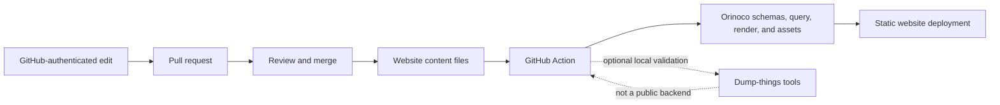

# CON website deployment

This repository coordinates the GitHub Actions deployment of the Center for Open Neuroscience website.

The public site is a deterministic static projection. Website content remains in files, edits are proposed as GitHub pull requests, and the action builds and publishes the result without a public metadata backend.

See [the plan](docs/plan.md) for the current architecture and next steps.
