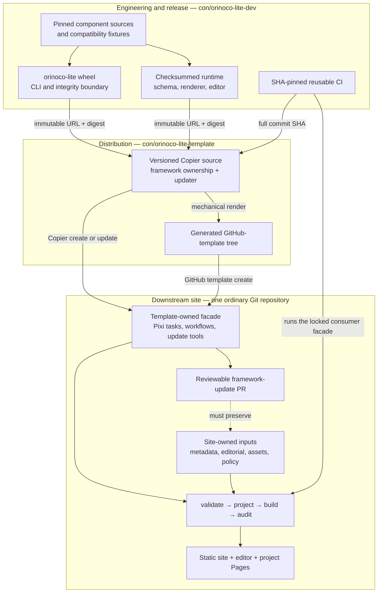

# Orinoco Lite engineering workspace

Orinoco Lite turns reviewed, schema-backed records and editorial inputs into a deterministic static website with a credential-free review-bundle editor.
This repository is the **engineering and release layer**: it integrates pinned upstream components, publishes the `orinoco-lite` engine and runtime, and owns the cross-repository acceptance evidence.

The supported website experience is deliberately simpler than this workspace.
A downstream site is one ordinary Git repository with no submodules, no gitlinks, and no need to understand the component history retained here.

## Architecture



The arrows express release and update direction, not repository nesting.
The engineering workspace may remain multi-repository; the template and every supported consumer are independently usable repositories.

## Repository map

| Layer | Repository | Owns | Start here |
| --- | --- | --- | --- |
| Engineering and release | this repository, [`con/orinoco-lite-dev`](https://github.com/con/orinoco-lite-dev) | Component review, engine/runtime assembly, release provenance, reusable CI, and cross-layer acceptance | [`docs/milestone-4.md`](docs/milestone-4.md) and [`packages/orinoco-lite/README.md`](packages/orinoco-lite/README.md) |
| Distribution | [`con/orinoco-lite-template`](https://github.com/con/orinoco-lite-template) | Copier source, generated GitHub-template tree, ownership rules, updates, and generic consumer guidance | [Template README](https://github.com/con/orinoco-lite-template#readme) |
| Integration consumer | [`con/test-orinoco-downstream-website`](https://github.com/con/test-orinoco-downstream-website) | Complete accepted CON snapshot, site policy, presentation overrides, provenance, and end-to-end tests | [Consumer README](https://github.com/con/test-orinoco-downstream-website#readme) |

The production `centerforopenneuroscience.org` repository is not a fourth implementation layer in Milestone 4.
It remains read-only evidence until a separate, explicitly reviewed graduation plan is accepted.

## Review now

The current human-review entry point is [`docs/human-review-decisions.md`](docs/human-review-decisions.md).
It prioritizes every open human choice, separates those choices from mechanical implementation follow-ups, and links back to the detailed milestone evidence.

Supporting records are:

- [`docs/milestone-4-acceptance.md`](docs/milestone-4-acceptance.md) for exact releases, test results, hosted runs, parity counts, and remaining gates;
- [`docs/milestone-4-decisions.md`](docs/milestone-4-decisions.md) for accepted Milestone 4 architecture decisions;
- [`docs/milestone-3-decisions.md`](docs/milestone-3-decisions.md) for the original content-policy questions; and
- [engineering pull request 5](https://github.com/con/orinoco-lite-dev/pull/5) for the implementation diff under review.

## Stable downstream interface

Normal site maintainers should use the commands exposed by their checked template release, not commands from this engineering workspace:

```console
pixi install --frozen
pixi run validate
pixi run build
pixi run serve
pixi run test-all
pixi run update-check
```

The consumer's `orinoco.lock` is the release authority.
It binds the engine wheel, runtime archive, and reusable workflow to immutable coordinates and digests.
The template owns update mechanics; the site owns its content and declared extension surfaces.
Framework updates stop at a pull request and never merge themselves.

## Working in this repository

Pixi 0.76 or newer is required.
The root environment is deliberately package-focused and contains no local dependency on a submodule, so it can install before any component checkout:

```console
pixi install --locked
pixi run test
```

Submodules remain the source-level dependency and compatibility-fixture pins for engineering integration.
`checkout-submodules` is idempotent: it synchronizes URLs, initializes every recursive gitlink recorded by the current parent commit, restores exact detached commits, unshallows development history, and verifies the result.
Use it before cross-component work.
To update an upstream dependency, advance and commit its gitlink on a review branch, then run this command and the relevant integration checks against that recorded candidate:

```console
pixi run checkout-submodules
```

Integration entry points may perform a narrower checkout automatically.
The German reference site's static preview is the first such command:

```console
pixi run serve-upstream-static
```

Its executable, Hugo, and git-annex dependencies are declared in [`tools/upstream_static.py`](tools/upstream_static.py) and resolved from the adjacent lock, independently of the root environment.
The builder initializes only the exact `www-from-model` and nested Congo gitlinks needed by that artifact, so the command works from recursive and non-recursive clones alike.
Use `build-upstream-static` for the same deterministic build without starting the HTTP server.

The former unqualified `build`, `serve`, and CON migration tasks belonged to the accepted Milestones 1–3 integration stack.
They remain recoverable from preserved history, but are not a supported `main` development facade: a downstream site uses its own ordinary-repository commands, while new engineering integration commands must name their scope and isolate their dependencies.

Release artifacts are assembled by [`orinoco-release.yml`](.github/workflows/orinoco-release.yml).
That workflow pins the build toolchain, builds the wheel and source archive twice, builds the editor and runtime twice, compares the results, verifies an installed wheel, attests the checksums, and publishes only immutable release candidates.
Do not reproduce that release boundary with an ad hoc local archive.

## Ownership and safety boundaries

- Original Orinoco Lite software is MIT licensed; original documentation is CC BY 4.0, factual metadata is CC0 1.0, and media remains item-specific.
See [`LICENSES.md`](LICENSES.md) and preserve every upstream notice.
- Reviewed YAML is the canonical metadata source.
Generated projection files remain committed so stale output, review, and rollback are explicit.
- Static validation, building, previewing, Pages deployment, and review-bundle export do not require a continuously running metadata service.
- The source Things Schema and exact `dlthings:*` CURIE contract remain pinned.
See [`docs/explaining-schema-issues.md`](docs/explaining-schema-issues.md).
- Credentials, stores, hydrated caches, browser downloads, and build output are local ignored state.
- The real-site repository, its refs, settings, Pages configuration, DNS, and production domain remain outside this milestone.

## Historical evidence

Milestones 1–3 explain how the accepted content and behavior were derived.
They are preserved as evidence, not as current operating instructions:

- [`docs/orinoco-lite-plan.md`](docs/orinoco-lite-plan.md)
- [`docs/clean-migration.md`](docs/clean-migration.md)
- [`docs/full-con-migration.md`](docs/full-con-migration.md)
- [`docs/milestone-2-acceptance.md`](docs/milestone-2-acceptance.md)
- [`docs/milestone-3.md`](docs/milestone-3.md)
- [`docs/milestone-3-acceptance.md`](docs/milestone-3-acceptance.md)

Do not use their old submodule, collection, preview-branch, or full-stack commands as the downstream interface.
Current work follows Milestone 4 and the versioned template.
