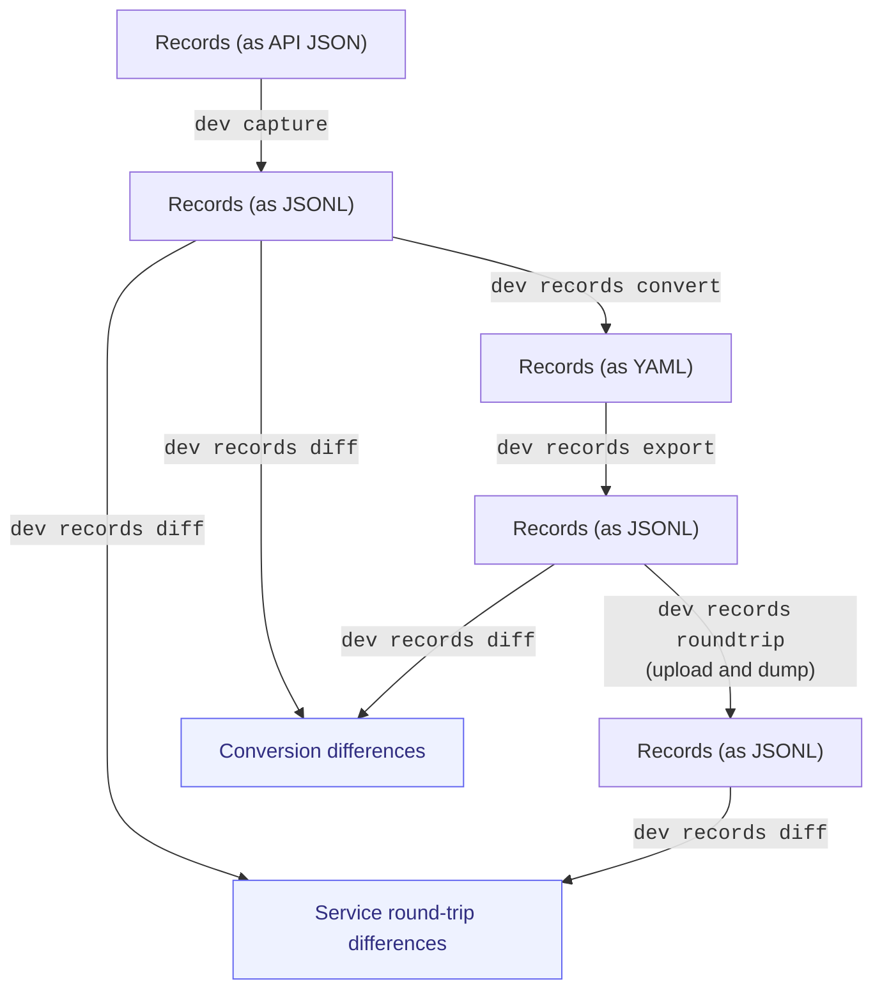
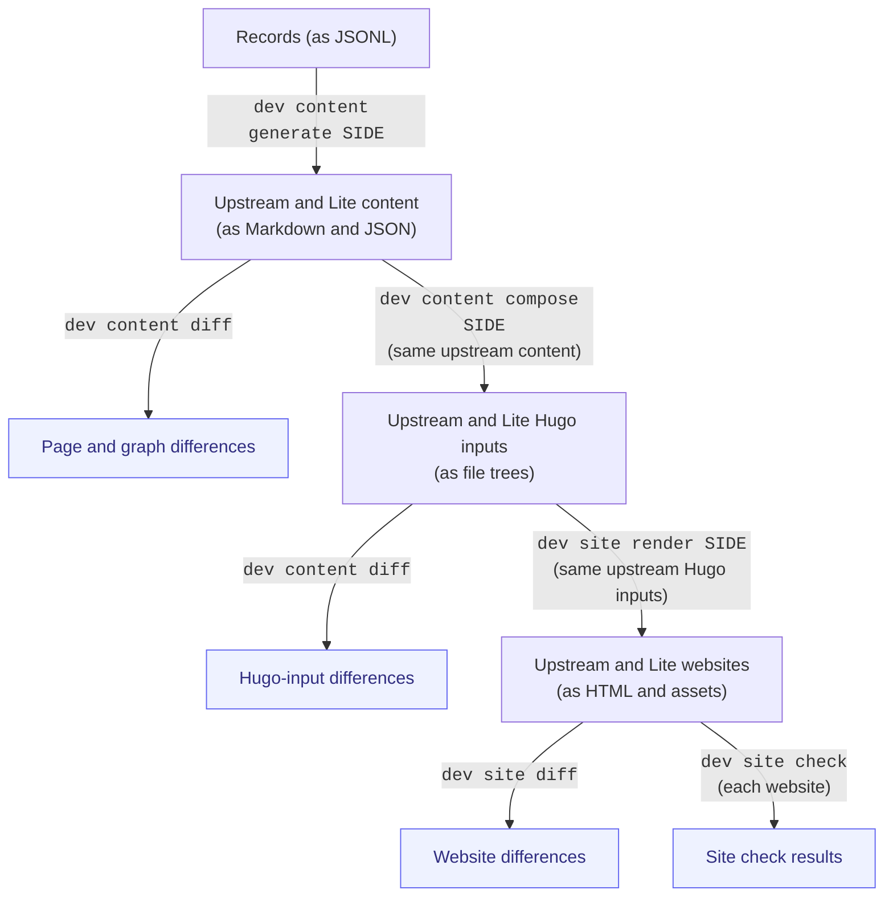

# Upstream diff detection

Active plan for John and Yarik, updated 17 September 2026.
The [design charter](../project-design.md) sets the high-level constraints.
This plan defines the validation commands and recording rules and arranges their implementation into reviewable PRs.

## Review path

Review the charter principle and this implementation plan independently against `main`, then review each command group in order.
Each PR supplies commands, example inputs, and inspectable outputs for its step.
Use the same reviewed inputs for both sides of each comparison.
After those comparisons pass, compare the complete upstream and Lite generation paths.

`orinoco-lite` is the public interface for routine operations; development operations belong under `orinoco-lite dev`.
Pixi tasks may shorten common commands, and CI uses those tasks or the CLI.
Direct scripts and Python module execution are for development and debugging.
The command names below are proposed interfaces.
Existing functions provide much of the implementation.
Keep `dev setup`, `dev enable`, and `dev disable` as convenience operations built from the same code.

Implement the validation pipeline in stages, each introduced in a separately reviewable PR.
Each PR should expose the relevant `dev` commands and inspectable outputs so we can verify that stage before building on it.
The diagrams show record preservation and site generation; the table between them identifies the source layers used in composition.
Inspect each stage's output and correct or account for differences before continuing.

Boxes name data and its form; blue boxes contain comparison or check reports.
Every arrow names a proposed `dev` command, abbreviated from `orinoco-lite dev`.

### Check record preservation

Follow the records from the Pool API through JSONL, YAML, and back to JSONL.
Compare the original capture with both the export and the temporary service's dump.



### Sources used in composition

The build uses the pinned `www-from-model` repository and its pinned dependencies.
Any retained Orinoco Lite commits are already part of that selected Git history.
Lite composition combines those sources with the template, site-specific files, and generated content:

| Source | Contribution |
| --- | --- |
| Pinned `www-from-model` and its dependencies | Base presentation, page templates, and graph generation. Git diffs show the retained commits over upstream. |
| Template | Presentation adaptation and a bounded overlay of required upstream assets. |
| `site-specific/` | Site settings, authored content, files, and overrides for configuration and presentation. |

The template layers over the upstream presentation, then site-specific settings and overrides apply.
Generated content supplies record pages; site-specific authored content is applied afterward.
Inspect changes in their own repositories and compare their combined effect in the Hugo input tree before rendering.

For the psychoinformatics replica, `dev inputs acquire` imports selected site settings, authored pages, and site-owned files into `site-specific/`.
`dev inputs diff` checks that import against its sources.
This import is separate from resolving the pinned presentation and dependencies, which remain in their repositories.

### Compare each generation step

Each box labeled "Upstream and Lite" represents the two outputs of a command pair.
Run each command marked `SIDE` twice, using `upstream` and `lite` with the same input files.
For the next comparison, give both commands the upstream output, as the examples below do.
Lite composition also consumes the source layers described above.



Raw comparisons remain available beside the summary of new differences.

## Proposed PR stack

The letters identify proposed PRs, not GitHub PR numbers.
Cleanup #160 is merged.
The charter principle and this command plan remain separate PRs against `main`.
After agreeing on the plan, start the capture PR from `main`.
Later command PRs may stack on their predecessor until it merges.
Then rebase their unique changes onto `main` and repeat the affected checks.

| PR | Scope | What the reviewer runs and inspects |
| --- | --- | --- |
| A — Cleanup | Retain reusable checkout, service, and worktree-preservation operations. Remove the coupled preview orchestration and its wiring tests. | Helper behavior tests, temporary-service record checks, and CLI help. |
| B — Capture and recording | Extract #152's capture command. Add shared CLI-owned DataLad recording and `--no-record`. | Capture records, inspect their source information, reuse them, and inspect the portable DataLad command. |
| C — Record conversion | Expose conversion, joined export, and field-level comparison. Carry the reviewed date-preservation fix from #152. | Convert the capture, export joined records, and inspect changed identifiers, fields, and values. |
| D — Service round-trip | Upload the exported records to a temporary service and capture the returned records. | Compare the returned records with the original capture. Run a raw-capture control to locate service-side changes. |
| E — Site-data import | Separate import of psychoinformatics site settings, authored pages, and site-owned files from record conversion. Reuse the pinned presentation and template layers. | Inspect copied bytes, transformed settings, and page-resource placement against their sources. |
| F — Content generation | Expose upstream and Lite page generation from an explicit record stream. Extract #152's selection and annotation-rendering fixes. | Compare selected pages, front matter, Markdown, links, and graph data before Hugo. |
| G — Composition | Separate composition from rendering in the existing builder. Apply authored-input fixes from #152 and the site-input PR. | Compare complete Hugo inputs, including page resources and configuration, using the same reviewed projection. |
| H — Rendering and comparison | Render an inspected assembly. Expose HTML, file, and browser checks through the CLI. Use #154's tool evaluation. | Inspect new rendering differences, then run the complete generation comparison. |

Review each stage's implementation and comparison outputs before merging its PR.
Keep the existing #152 discussion available while extracting its changes.
Its commit history mixes these steps, so extract net file changes and individual patches.

## Command review examples

Run these proposed commands from the downstream directory after activating its [Pixi environment](../../README.md#command-environment).
The path names show how one command supplies the next command's input.
Dependency selection comes from the downstream and package, without repeating upstream pins in command arguments.

### Capture, conversion, and service round-trip

```console
orinoco-lite dev capture site-specific/sources/pool/records.jsonl
orinoco-lite dev records convert site-specific/sources/pool/records.jsonl site-specific
orinoco-lite dev records export site-specific build/records/joined.jsonl
orinoco-lite dev records diff site-specific/sources/pool/records.jsonl build/records/joined.jsonl
orinoco-lite dev records roundtrip build/records/joined.jsonl build/records/returned.jsonl
orinoco-lite dev records diff site-specific/sources/pool/records.jsonl build/records/returned.jsonl
```

Annotation companions keep machine attribution for record assertions separate for human readability.
The export rejoins them with the records without generating pages.
The round-trip command manages the temporary service and retains the returned dump for inspection.
The diff shows raw field changes and identifies reviewed annotation-equivalent changes separately.
It preserves list order, duplicate values, scalar types, and the distinction between null and missing values.

### Site-data import and generated content

```console
orinoco-lite dev inputs acquire site-specific
orinoco-lite dev inputs diff site-specific
orinoco-lite dev content generate upstream build/upstream/projection --records build/records/joined.jsonl
orinoco-lite dev content generate lite build/lite/projection --records build/records/joined.jsonl
orinoco-lite dev content diff build/upstream/projection build/lite/projection
```

The import reads selected site data from `www-from-model` and any referenced file sources, preserving required page-resource placement.
Its diff compares those inputs with their imported forms in `site-specific`, including settings mapped into `site.yaml`.
Generation produces pages and graph data from the same joined records on both sides.
The content diff reports page and graph differences separately.

### Composition and rendering

After reviewing the generation comparison, select one output as the shared input for composition.
These examples use the upstream output.

```console
orinoco-lite dev content compose upstream build/upstream/projection build/upstream/assembly --inputs site-specific
orinoco-lite dev content compose lite build/upstream/projection build/lite/assembly --inputs site-specific
orinoco-lite dev content diff build/upstream/assembly build/lite/assembly
```

Then select the reviewed assembly for the rendering comparison.

```console
orinoco-lite dev site render upstream build/upstream/assembly build/upstream/site --base-url /
orinoco-lite dev site render lite build/upstream/assembly build/lite/site --base-url /
orinoco-lite dev site diff build/upstream/site build/lite/site
orinoco-lite dev site check build/upstream/site
orinoco-lite dev site check build/lite/site
```

Rendering consumes the supplied assembly without recomposing it.
For the final comparison, generate upstream content from the raw retained capture and Lite content from the converted records.
Give each path its own projection and assembly, then compare the rendered sites.
This final run checks how the reviewed steps work together.

## Carrying a decision forward

Identify the operation that introduces a difference, then fix or account for it there.
Later isolated comparisons consume the reviewed output.
The final comparison reports a known difference once and links its explanation.
A changed value or behavior outside the accepted scope appears as a new difference.

Keep raw captures unchanged when correcting conversion or presentation behavior.
Put site-data corrections in site inputs and reusable fixes in the package or upstream dependency.
Keep each temporary fix beside the code that needs it, with a focused regression test.
Document its reason, upstream follow-up, and removal condition in that change's PR.
Use existing comparison rules for intentional representation differences.
Do not create a separate exception registry.

### Decision: preserve the source date marker

Preserve `at_time: "-"`.
Keep the adaptation and its regression tests in one commit while deciding how to align with upstream without that commit.
Preserve that commit when merging C instead of squashing it with the new CLI operations.

The adaptation belongs at record conversion in C. #152 preserves the value in storage and adapts the RDF reader where it otherwise disappears.
Investigate the upstream conversion behavior before choosing its permanent correction.
Remove the adaptation when the selected upstream code handles this case and the record-preservation test still passes.

## DataLad recording

Retained-input changes record by default, while comparisons leave reports uncommitted.
The CLI owns recording and uses `--no-record` for the inner command to prevent nested recording.
The same flag allows development runs without a DataLad commit.
Pixi tasks and CI call that same interface.
Required recording for automated metadata proposals and finalization follows the [source-adapter contract](contract/source-adapters.md).

Record the public command, relative paths, declared inputs, and only the operation's outputs.
Use the project's locked tools instead of absolute Python paths or a separately resolved `pixi exec` environment.
External inputs use retrievable repository or service URLs.
Use ordinary Git without requiring Git Annex.
Check portability by cloning into a different directory and rerunning a recorded conversion from the retained capture.

Use the downstream and its pinned site-specific submodule together as the rerun unit.
Reuse the downstream tool lock and record both the input change and the parent submodule pointer.

## Existing PRs and review

| Existing PR | Place in this work |
| --- | --- |
| [Charter #162](https://github.com/ORINOCO-Lite/orinoco-lite-dev/pull/162) | One sentence on upstream comparison under the existing reuse principle. |
| [Plan #161](https://github.com/ORINOCO-Lite/orinoco-lite-dev/pull/161) | This command plan and detailed agent guidance, proposed directly against `main`. |
| [Cleanup #160](https://github.com/ORINOCO-Lite/orinoco-lite-dev/pull/160) | Merged. Retains reusable operations and removes the old preview orchestration. |
| [Package #152](https://github.com/ORINOCO-Lite/orinoco-lite-dev/pull/152) | Source for the split. Retain its discussion until replacement PRs cover the useful changes. |
| [Package #154](https://github.com/ORINOCO-Lite/orinoco-lite-dev/pull/154) | Tool research for H. Promote the chosen procedure, then retire the dated report. |
| [Package #142](https://github.com/ORINOCO-Lite/orinoco-lite-dev/pull/142) | Reuse authored-content and resource preservation in E/G and record, content, and route checks in C/F/G/H. Retire its separate builder after those stages cover it. |
| [Site inputs #1](https://github.com/ORINOCO-Lite/psychoinformatics-site-specific/pull/1) | Separate record preservation for C from authored content and resource placement for E/G. |
| [Downstream #3](https://github.com/ORINOCO-Lite/psychoinformatics-downstream/pull/3) | Integration candidate. Advance package and site-input selections with the verified steps. |

Yarik's message supplied by John establishes the staged review approach.
The five GitHub threads below come from `yarikoptic-gitmate` and identify themselves as Claude-generated reviews.
Address them in the replacement PRs while preserving the original comments.

| Thread | Action |
| --- | --- |
| [Document lifetime and reproducibility](https://github.com/ORINOCO-Lite/orinoco-lite-dev/pull/152#discussion_r4025790917) | Keep design in the charter, instructions with commands, and dated results in PR evidence. |
| [Difference-table readability](https://github.com/ORINOCO-Lite/orinoco-lite-dev/pull/152#discussion_r4025791408) | Report each new difference with its effect and next action. |
| [Broken upstream link](https://github.com/ORINOCO-Lite/orinoco-lite-dev/pull/152#discussion_r4025791960) | Link to the selected file in the upstream repository. |
| [Native procedure and obsolete scripts](https://github.com/ORINOCO-Lite/orinoco-lite-dev/pull/152#discussion_r4025792747) | Separate reusable operations from preview orchestration in A; provide CLI operations in D–H. |
| [Terminology and charter scope](https://github.com/ORINOCO-Lite/orinoco-lite-dev/pull/152#discussion_r4025793492) | Keep high-level constraints in the charter and command and recording details here. |

Rewrite #152's stale summary when the replacements are ready.
No comments were present on #142 or #154 during the initial review.

## Implementation details

- `upstream_snapshot` and record split/join code already exist on `main`.
  The new record export must include annotation companions.
- Conversion must update only the records and annotation companions it owns.
  Preserve the capture, authored inputs, and repository state in an existing `site-specific` directory.
  The current converter replaces its output directory, so C must separate that write boundary before reusing it.
- Reuse the selected upstream query/Jinja commands for upstream page generation.
  Expose Lite generation through the existing projection code, with an explicit record input.
- Extract shared composition and rendering functions from `site.py`.
  Ordinary `build` should call them too.
  Its current implementation recreates the assembly before rendering.
- Move user-facing operations out of recorded `python -m` calls in `instantiate.py` and `development.py`.
  Retain internal Python functions for code reuse.
- Cleanup retains the tested checkout and worktree-preservation helpers.
  It extracts temporary-service configuration and process cleanup beside the existing upload and read-back helpers, with exact record checks against a real filesystem-backed service.
  D can reuse these operations while adding the CLI, retained returned dump, and raw-capture control.
  Consider the upstream `dtc` client there before adding more HTTP code.
- Use #152's capture implementation for B. Reuse #142's authored section and page-resource preservation and its behavioral record, content, and route checks in their owning stages. #142's generator calls the Lite renderer, so upstream generation still needs the selected upstream commands.
  Keep #142 available until the useful behavior has been carried across.
- The retained Pool-diff tool is self-contained.
  Cleanup updates its missing-capture message to select an existing capture instead of referring to removed tasks.
- Resolve the original capture's unknown acquisition time by retaining it as historical input and recording fresh capture facts accurately.
  Pagination completeness checks do not detect every concurrent source edit.
- The legacy capture contains 5,030 records.
  The initial local review found exact agreement with retained upstream YAML. #152 and site-input #1 preserve the date marker after annotation normalization.
- Initial extraction checks passed 19 capture tests and 19 record-preservation tests.
  Content-generation changes applied cleanly.
  Service round-trip and content-tree comparisons remain implementation work.
- Template #75 and #76 are merged.
  Read the selected template from the downstream rather than adding another template PR by default.
