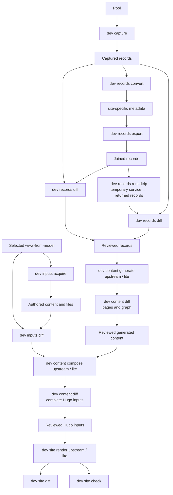

# Upstream diff detection

Active plan for John and Yarik, updated 17 September 2026.
The [design charter](../project-design.md) defines the interface, terminology, and provenance rules.
This plan arranges the implementation into reviewable PRs.

## Review path

Review the design and cleanup independently against `main`, then review each command group in order.
Each PR supplies commands, example inputs, and inspectable outputs for its step.
Use the same reviewed inputs for both sides of each comparison.
After those comparisons pass, compare the complete upstream and Lite generation paths.

The command names below are proposed interfaces.
Existing functions provide much of the implementation.
Keep `dev setup`, `dev enable`, and `dev disable` as convenience operations built from the same code.



Each `upstream / lite` node represents two commands with the same input.
A maintainer reviews the comparison before selecting the input for the next node.
Raw comparisons remain available beside the summary of new differences.

## Proposed PR stack

The letters identify proposed PRs, not GitHub PR numbers.
The design and cleanup are independent PRs based on `main`.
After both merge, start the capture PR from `main`.
Later command PRs may stack on their predecessor until it merges.
Then rebase their unique changes onto `main` and repeat the affected checks.

| PR | Scope | What the reviewer runs and inspects |
| --- | --- | --- |
| A — Cleanup | Remove the obsolete upstream preview builder, service scripts, and tests that only preserve them. Correct references to removed tasks. | Existing engineering checks and CLI help. Ordinary downstream setup and builds remain available. |
| B — Capture and recording | Extract #152's capture command. Add shared CLI-owned DataLad recording and `--no-record`. | Capture records, inspect their source information, reuse them, and inspect the portable DataLad command. |
| C — Record conversion | Expose conversion, joined export, and field-level comparison. Carry the reviewed date-preservation fix from #152. | Convert the capture, export joined records, and inspect changed identifiers, fields, and values. |
| D — Service round-trip | Upload the exported records to a temporary service and capture the returned records. | Compare the returned records with the original capture. Run a raw-capture control to locate service-side changes. |
| E — Authored inputs | Separate acquisition of authored content, configuration, images, and downloads from record conversion. | Inspect copied bytes, transformed configuration, and file placement against the selected upstream inputs. |
| F — Content generation | Expose upstream and Lite page generation from an explicit record stream. Extract #152's selection and annotation-rendering fixes. | Compare selected pages, front matter, Markdown, links, and graph data before Hugo. |
| G — Composition | Separate composition from rendering in the existing builder. Apply authored-input fixes from #152 and the site-input PR. | Compare complete Hugo inputs, including page resources and configuration, using the same reviewed projection. |
| H — Rendering and comparison | Render an inspected assembly. Expose HTML, file, and browser checks through the CLI. Use #154's tool evaluation. | Inspect new rendering differences, then run the complete generation comparison. |

A difference must be corrected or explicitly accepted before its PR merges.
Keep the existing #152 discussion available while extracting its changes.
Its commit history mixes these steps, so extract net file changes and individual patches.

## Command review examples

Run these proposed commands from the downstream directory through its locked Pixi environment.
The path names show how one command supplies the next command's input.
Dependency selection comes from the downstream and package, without repeating upstream pins in command arguments.

### Capture, conversion, and service round-trip

```console
pixi run --locked orinoco-lite dev capture site-specific/sources/pool/records.jsonl
pixi run --locked orinoco-lite dev records convert site-specific/sources/pool/records.jsonl site-specific
pixi run --locked orinoco-lite dev records export site-specific build/records/joined.jsonl
pixi run --locked orinoco-lite dev records diff site-specific/sources/pool/records.jsonl build/records/joined.jsonl
pixi run --locked orinoco-lite dev records roundtrip build/records/joined.jsonl build/records/returned.jsonl
pixi run --locked orinoco-lite dev records diff site-specific/sources/pool/records.jsonl build/records/returned.jsonl
```

The export joins records and their annotation companions without generating pages.
The round-trip command manages the temporary service and retains the returned dump for inspection.
The diff shows raw field changes and identifies reviewed annotation-equivalent changes separately.
It preserves list order, duplicate values, scalar types, and the distinction between null and missing values.

### Authored inputs and generated content

```console
pixi run --locked orinoco-lite dev inputs acquire site-specific
pixi run --locked orinoco-lite dev inputs diff site-specific
pixi run --locked orinoco-lite dev content generate upstream build/upstream/projection --records build/records/joined.jsonl
pixi run --locked orinoco-lite dev content generate lite build/lite/projection --records build/records/joined.jsonl
pixi run --locked orinoco-lite dev content diff build/upstream/projection build/lite/projection
```

Input acquisition uses the selected `www-from-model` and preserves required page-resource placement.
Its diff compares those source files with their destinations in `site-specific`.
Generation produces pages and graph data from the same joined records on both sides.
The content diff reports page and graph differences separately.

### Composition and rendering

After reviewing the generation comparison, select one output as the shared input for composition.
These examples use the upstream output.

```console
pixi run --locked orinoco-lite dev content compose upstream build/upstream/projection build/upstream/assembly --inputs site-specific
pixi run --locked orinoco-lite dev content compose lite build/upstream/projection build/lite/assembly --inputs site-specific
pixi run --locked orinoco-lite dev content diff build/upstream/assembly build/lite/assembly
```

Then select the reviewed assembly for the rendering comparison.

```console
pixi run --locked orinoco-lite dev site render upstream build/upstream/assembly build/upstream/site --base-url /
pixi run --locked orinoco-lite dev site render lite build/upstream/assembly build/lite/site --base-url /
pixi run --locked orinoco-lite dev site diff build/upstream/site build/lite/site
pixi run --locked orinoco-lite dev site check build/upstream/site
pixi run --locked orinoco-lite dev site check build/lite/site
```

Rendering consumes the supplied assembly without recomposing it.
For the final comparison, generate upstream content from the raw retained capture and Lite content from the converted records.
Give each path its own projection and assembly, then compare the rendered sites.
This final run checks how the reviewed steps work together.

## Carrying a decision forward

Identify the operation that introduces a difference, then fix or account for it there.
Later isolated comparisons consume the reviewed output.
The final comparison reports a known difference once and links its explanation.
A changed value or behavior outside the accepted scope appears as a new difference.

Keep each temporary fix beside the code that needs it, with a focused regression test.
Document its reason, upstream follow-up, and removal condition in that change's PR.
Use existing comparison rules for intentional representation differences.
Do not create a separate exception registry.

### Decision: preserve the source date marker

Preserve `at_time: "-"`.
Keep the adaptation and its regression tests in one commit while deciding how to align with upstream without that commit.
Preserve that commit when merging C instead of squashing it with the new CLI operations.

The adaptation belongs at record conversion in C. #152 preserves the value in storage and adapts the RDF reader where it otherwise disappears.
Investigate the upstream conversion behavior before choosing its permanent correction.
Remove the adaptation when the selected upstream code handles this case and the record-preservation test still passes.
The raw capture remains unchanged.

## DataLad recording

Retained-input changes record by default, while comparisons leave reports uncommitted.
The CLI owns recording and uses `--no-record` for the inner command to prevent nested recording.
Pixi tasks and CI call that same interface.

Record the public command, relative paths, declared inputs, and only the operation's outputs.
Use the project's locked tools instead of absolute Python paths or a separately resolved `pixi exec` environment.
Check portability by cloning into a different directory and rerunning a recorded conversion from the retained capture.

Use the downstream and its pinned site-specific submodule together as the rerun unit.
Reuse the downstream tool lock and record both the input change and the parent submodule pointer.

## Existing PRs and review

| Existing PR | Place in this work |
| --- | --- |
| [Package #152](https://github.com/ORINOCO-Lite/orinoco-lite-dev/pull/152) | Source for the split. Retain its discussion until replacement PRs cover the useful changes. |
| [Package #154](https://github.com/ORINOCO-Lite/orinoco-lite-dev/pull/154) | Tool research for H. Promote the chosen procedure, then retire the dated report. |
| [Package #142](https://github.com/ORINOCO-Lite/orinoco-lite-dev/pull/142) | Retire its separate builder. Recover useful checks through the staged CLI. |
| [Site inputs #1](https://github.com/ORINOCO-Lite/psychoinformatics-site-specific/pull/1) | Separate record preservation for C from authored content and resource placement for E/G. |
| [Downstream #3](https://github.com/ORINOCO-Lite/psychoinformatics-downstream/pull/3) | Integration candidate. Advance package and site-input selections with the verified steps. |

Yarik's message supplied by John establishes the staged review approach.
The five GitHub threads below come from `yarikoptic-gitmate` and identify themselves as Claude-generated reviews.
Address them in the replacement PRs while preserving the original comments.

| Thread | Action |
| --- | --- |
| [Document lifetime and reproducibility](https://github.com/ORINOCO-Lite/orinoco-lite-dev/pull/152#discussion_r4025790917) | Keep design in the charter, instructions with commands, and dated results in PR evidence. |
| [Difference-table readability](https://github.com/ORINOCO-Lite/orinoco-lite-dev/pull/152#discussion_r4025791408) | Report each new difference with its effect and next action. |
| [Broken upstream link](https://github.com/ORINOCO-Lite/orinoco-lite-dev/pull/152#discussion_r4025791960) | Link to the selected file in the upstream repository. |
| [Native procedure and obsolete scripts](https://github.com/ORINOCO-Lite/orinoco-lite-dev/pull/152#discussion_r4025792747) | Remove obsolete tooling in A and provide CLI operations in D–H. |
| [Terminology and charter scope](https://github.com/ORINOCO-Lite/orinoco-lite-dev/pull/152#discussion_r4025793492) | Define terms once in the charter and keep implementation details here. |

Rewrite #152's stale summary when the replacements are ready.
No comments were present on #142 or #154 during the initial review.

## Implementation details

- `upstream_snapshot` and record split/join code already exist on `main`.
  The new record export must include annotation companions.
- Conversion must update only the records and annotation companions it owns.
  Preserve the capture, authored inputs, and repository state in an existing `site-specific` directory.
  The current converter replaces its output directory, so C must separate that write boundary before reusing it.
- Reuse the selected upstream query/Jinja commands for upstream page generation.
  Expose Lite generation through the existing projection code, with an explicit record input.
- Extract shared composition and rendering functions from `site.py`.
  Ordinary `build` should call them too.
  Its current implementation recreates the assembly before rendering.
- Move user-facing operations out of recorded `python -m` calls in `instantiate.py` and `development.py`.
  Retain internal Python functions for code reuse.
- Cleanup can remove the obsolete scripts without the new capture implementation.
  The retained Pool-diff tool is self-contained, but its error message still points to removed tasks.
- Resolve the original capture's unknown acquisition time by retaining it as historical input and recording fresh capture facts accurately.
  Pagination completeness checks do not detect every concurrent source edit.
- The legacy capture contains 5,030 records.
  The initial local review found exact agreement with retained upstream YAML. #152 and site-input #1 preserve the date marker after annotation normalization.
- Initial extraction checks passed 19 capture tests and 19 record-preservation tests.
  Content-generation changes applied cleanly.
  Service round-trip and content-tree comparisons remain implementation work.
- Template #75 and #76 are merged.
  Read the selected template from the downstream rather than adding another template PR by default.
