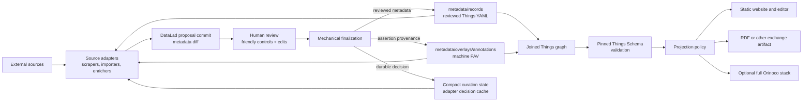

# Lightweight architecture roadmap through Milestone 5

Status: historical planning record; superseded by [`milestone-6.md`](../agents/archived/milestone-6.md)

This document preserves the reasoning that led to configuration contract 2 and the Milestone 5 source-adapter architecture.
Its delivery sequence and status language are not current operating instructions.

## Goal

Orinoco Lite keeps reviewed lab metadata in an ordinary Git repository and derives disposable outputs for websites, data exchange, and optional use by the full Orinoco service stack.
It changes the curation transport, not the Things data model.
The normative source-adapter flow is:

Every record and annotation companion is canonical semantic input, and their joined Thing is the schema and RDF boundary.
Page creation, graph membership, editor exposure, and future exports are view policy rather than separate categories of source metadata.
Generated output is ignored and regenerated so a metadata pull request presents the source change itself.
Durable human dispositions are tracked site policy and adapter input, not generated output, a disposable cache, or automatically a public Thing.

The service-backed Dump Things, pool UI, and SHACL Vue stack remains an engineering capability and an optional advanced deployment.
A normal downstream validates, reviews, builds, and deploys without running a persistent service.

## Upstream alignment policy

Orinoco Lite follows five rules when local and upstream implementations overlap:

1. Pin exact reviewed upstream commits and report authoritative-head drift.
2. Reuse a released upstream schema, query, acquisition, matching, enrichment, or serialization primitive before implementing another one locally.
3. When Lite needs a local compatibility layer, retain executable parity tests against the upstream behavior and fixtures it replaces.
4. Keep local behavior narrower than upstream when broader behavior has not been demonstrated by a downstream use case.
5. Contribute generally useful fixes upstream and remove the local layer after an upstream release passes the same acceptance contract.

This policy applies especially to the qri-like selection and relationship projection currently implemented inside the static-site engine.
The local implementation remains acceptable while it is required for a deterministic service-free build, but its behavior must not silently diverge from `query-things`.

The upstream Things tools use the concrete roles *scraper*, *importer*, and *enricher*.
Orinoco Lite uses *source adapter* only as a local umbrella for tools that propose changes to a downstream record pool; it is not presented as an upstream-defined plugin interface.

## Provenance and adapter policy

The source-adapter specification distinguishes execution provenance, machine assertion provenance, and durable curation state.
Git and preserved DataLad run commits record execution.
Site-owned PAV annotation companions join with user-facing records to form the complete semantic Things graph, while compact adapter-owned decisions prevent a materially unchanged rejection from being proposed again.
A content diff cannot explain why an absent candidate was rejected or deferred, so the decision cache is not a duplicate metadata inventory.

Proposal, human modification, and complete decisions remain on one pull-request branch and enter the curated branch through an exact-commit-preserving merge.
The workflow requires neither a persistent service nor a follow-up pull request.
The normative contract and its complexity guardrails are maintained in [`source-adapters.md`](../agents/contract/source-adapters.md).

## Known compatibility seams

The pinned demo research-information schema is recursive by design and has an acyclic inheritance graph.
LinkML expands an inlined type-designated `Thing` range to a wide repeated union, and Pydantic exhausts Python's default recursion limit while rebuilding that generated model.
The same generator and schema combination underlies the upstream stack.
Dump Things already catches the same `RecursionError`, increases the process-wide limit, and retries; the defect is not caused by Orinoco Lite's record layout or projection engine.
Until LinkML emits a named recursive alias, Lite constructs the converters under a lock with a temporary fixed recursion limit and restores the caller's exact limit afterward.

Other deliberate seams are:

- exact reviewed `dlthings:*` CURIE type designators rather than unreviewed full-URI alternatives;
- a credential-free static review-bundle editor plus the GitHub source-adapter review profile, instead of the upstream authenticated service workflow;
- project-path and host-neutral static artifacts adapted from upstream's root-absolute presentation; and
- ordinary-Git runtime assets instead of requiring git-annex in a downstream.

Each seam has a narrower downstream purpose and an objective removal or parity condition.

## Delivery plan

### 1. Release configuration contract 2

- Release an engine and runtime that accept only `paths.records`, `paths.source_adapters`, and the hidden framework-provenance root.
- Pin that release in the template, regenerate both frozen locks and the checked GitHub-template render, and run the cross-platform release contract.
- Recreate the disposable test consumer from the aligned template rather than carrying prototype compatibility migrations.
- Prove the complete 199-record corpus, 185 pages, 186-node/467-edge graph, and 186-record editor catalog from clean clones.

### 2. Make creation truthful

A newly rendered content-neutral template must not imply that an empty scaffold is already a buildable site.
Choose and test one explicit creation contract:

- ship a tiny neutral starter profile containing a schema-compatible record, projection policy, assets manifest, and presentation; or
- require a versioned profile/import-bundle step before `validate` and `build`.

Until that choice is implemented, creation documentation must place the profile step before the normal site commands and the empty records directory must not contain a non-Thing placeholder.

### 3. Exercise reusable upstream enrichment

- Implement the identity, disposition, annotation-overlay, hosted-review, and verification contract defined in [`source-adapters.md`](../agents/contract/source-adapters.md).
- Demonstrate the complete workflow with Zotero and the CON-specific `dump-research-info` importer, including all-rejected review and material-change re-review.
- Use upstream PAV and enrichment/update helpers where their behavior matches a demonstrated mode, and test A Simple Standard for Sharing Ontological Mappings (SSSOM) only as a mapping interchange format.
- Keep the core host-neutral without freezing a Python ABI or plugin protocol from two implementations.

### 4. Prove a non-website projection

Add one useful, deterministic export by composing upstream query and serialization primitives.
The first proof should be a separately invokable RDF dataset export of the reviewed record pool.
Upstream `query-things` already supplies JSONL selection, while Dump Things supplies `FormatConverter`, `combine_ttl`, the `json2ttl` client command, and a Turtle service response.
Lite's editor already composes that converter with deterministic RDFLib canonicalization, so the proof should factor and expose that existing path as a canonical N-Triples dataset rather than create another representation.

The static focus is the reason for this thin export: full Orinoco can serve RDF dynamically, while Lite can publish the same upstream-defined semantics without operating the service.
This justifies one ignored, reproducible artifact and parity tests against the upstream conversion; it does not justify a new general projection registry.

Only after a second distinct target exists should Orinoco Lite extract the smallest common projection interface.

### 5. Reduce maintained seams

- Pursue the named-recursive-alias correction in LinkML and remove the recursion boundary only after the pinned full corpus passes at the default limit.
- Rebase or retire editor overlays as upstream exposes equivalent credential-free static review behavior.
- Advance upstream pins through the recorded known-good and worktree workflows, preserving parity evidence for every affected capability.

## Release gate

Contract 2 is ready for publication only when the engine/runtime release, template render, and recreated consumer all pass from clean checkouts without a local engine override.
Local cross-repository tests against an editable engine are development evidence, not a substitute for that released-interface proof.
