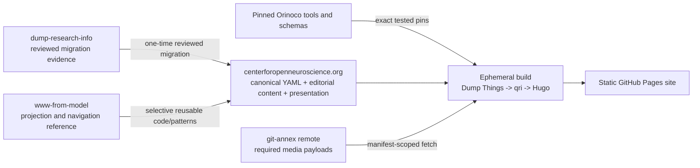
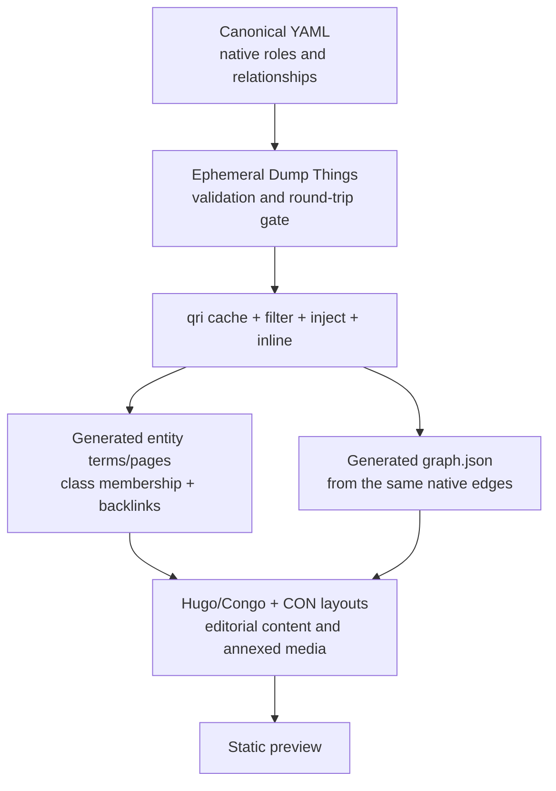

# Milestone 1 design review

Status: resolved in the revised Milestone 1 prototype

Original candidate reviewed: `centerforopenneuroscience.org` at
`2c4f7e5a19d8ade7aee25ef1e8dc786bfdb3a577`

Revised candidate: `centerforopenneuroscience.org` at
`2621231d27b70fb425107a132159f7a9e0d99cda`

Reviewed `www-from-model`: `6945272e5f3fcf353627b8e1c3e68bcaf76cc2ce`

Date: 2026-07-31

## Resolution implemented

The revised prototype now uses the functional website layer that was missing
from the original candidate. It selectively restores the reviewed
`www-from-model` taxonomy and term layouts, metadata-derived class lists,
filter controls, forward relationship terms, Hugo-derived reverse backlinks,
qri inlining, and the pinned Things graph renderer. The same validated record
stream generates every entity page, list membership, relationship panel, and
graph node and edge. Adding a connected sixth record requires no route,
template, index, or Python inventory change.

The implementation also resolves the operational concerns raised below:

- `enrich_projection.py`, `validate_records.py`, the individual gate scripts,
  and `install-hugo.sh` were removed;
- the exact YAML streams now pass directly through upstream `dtc` and an
  ephemeral Dump Things service;
- Pixi is the sole locked Python, Hugo, Node, and Linux CI environment;
- entity `_index.md` bundles are generated, while checked-in collection
  `_index.md` files contain only editorial introductions and presentation
  settings;
- Yaroslav's portrait remains the pre-existing git-annex object and CI
  retrieves and verifies it from `datasets.datalad.org`; and
- the graph is a compact side panel by default, with an accessible link view
  and responsive stacking on narrow screens.

The native type-discriminator incompatibility is the one accepted exception.
It is pinned, reproduced, and documented separately in the site repository's
`docs/upstream-schema-discriminator-issue.md`, including the tested options,
trade-offs, pin-update discipline, and removal condition. The current bridge
is one generic projection with retained raw assertions; it contains no CON
PID, label, route, or asset table. Per the design decision, no local or
provisional upstream patch is being accumulated while the compatible upstream
tuple is unresolved. Native qualified roles and typed DOI/ISSN records remain
explicitly deferred.

The full acceptance suite passes deterministic repeat builds, direct upstream
schema rejection, dangling-target rejection for arbitrary PID syntax, exact
metadata/page authority, base-path links, backlinks, graph consistency, and a
metadata-only sixth-record extension. Visual theming and broader organization
are intentionally left for a later focused design pass.

## Original conclusion (superseded by the resolution above)

The remainder of this document records the diagnosis and options that led to
the revised prototype. Statements about what the original `2c4f7e5` candidate
did or lacked are historical and do not describe `2621231`.

Milestone 1 proves that five repository-resident CON records can be validated
with an ephemeral Dump Things service and rendered reproducibly by qri and
Hugo. It does **not** yet prove the intended metadata-driven website
architecture.

The candidate retained the upstream command-line spine—Dump Things, `dtc`, qri,
Jinja, Hugo, and Congo—but replaced most of the upstream behavior that made the
site navigable as a metadata graph. In particular, it omitted relationship
injection and inlining, taxonomy-derived class lists and backlinks, the graph
projection, and the graph interface. Those behaviors were replaced by a
five-record Python view adapter and hand-authored class indexes.

That trade was acceptable for diagnosing whether the components could run
together, but it is not an acceptable baseline for the complete migration or a
reusable lab template. Draft PR 84 should therefore be treated as a technical
spike. Milestone 2 and production cutover should wait until the metadata,
navigation, compatibility, and asset decisions below are resolved.

The recommended direction is:

1. restore native qualified relationships and typed identifiers through the
   tested narrow LinkML/LinkML-runtime fix and exact component pins;
2. restore a base-path-safe subset of `www-from-model`'s qri relationship,
   taxonomy, backlink, and graph pipeline;
3. use legacy CON as the source of identity, editorial content, URL
   compatibility, and visual design—not as a reason to replace the upstream
   information architecture;
4. fetch required annexed assets from an availability-tested remote during the
   build; and
5. use Pixi to pin Hugo and the Python toolchain, eliminating the custom Hugo
   downloader.

## What the candidate currently proves

The working path is real:

```text
five canonical YAML files
  -> isolated local Dump Things collection
  -> per-record upstream validation endpoint
  -> dtc JSONL export
  -> qri cache, selection, and Jinja rendering
  -> Hugo/Congo static site
  -> fork-only GitHub Pages preview
```

It demonstrates repository-contained input, deterministic output, failure on
invalid records, no persistent metadata service, and no production deployment
change. Those are useful results and should be retained.

The missing product invariant is stronger:

> Adding a valid, connected record should produce its page, place it in the
> appropriate class navigation, create its forward and reverse navigation,
> and add its graph node and edges without editing Python, templates, class
> indexes, or acceptance constants.

The current candidate does not satisfy that invariant. A sixth record fails
unless it is added to `scripts/enrich_projection.py`; it would not
automatically appear in a class index; and no graph artifact is generated.

### Corrections to the current progress report

Three statements should be revised after the design is agreed:

- “Milestone 1 complete” is accurate only against the original literal exit
  criteria. A clearer status is “technical spike complete; design acceptance
  pending.”
- The report says Yaroslav's annex payload had no available copies. Direct
  remote probing shows that `datasets.datalad.org` has the key.
- The provenance inventory identifies copied and adapted files, but it does
  not make the functional omission of taxonomy navigation, backlinks, graph
  UI, and add-record behavior sufficiently clear.

The successful build evidence remains valid; these corrections change how the
result should be interpreted, not whether that candidate commit built.

## Why there are so many scripts

There are ten files and 1,233 lines under `scripts/`. The count is inflated
because ordinary build orchestration, upstream API adaptation, a temporary
schema workaround, site projection, and milestone tests all share one
directory and several tests run inside every build.

| Script | Why it exists | Assessment | Intended fate |
| --- | --- | --- | --- |
| `build.sh` | Starts the ephemeral service and runs validation, qri, Hugo, and checks. | Legitimate orchestration. Upstream assumes a persistent pool, so some local orchestration is required. | Keep a much smaller entry point, exposed as a Pixi task and later extracted into the reusable action. |
| `prepare_build.py` | Creates an isolated Dump Things store/config and a generated Hugo content tree. | Legitimate transitional glue; Dump Things has no command that assembles this repository layout. | Make it generic and configuration-driven, or upstream the missing bootstrap behavior. |
| `validate_records.py` | Walks the repository and calls Dump Things' per-record validation endpoint, collecting one report. | It is not a second validator. The validation semantics are upstream; the local code supplies the missing batch/repository interface. The pinned client and service also disagree on the validation endpoint path. | Retain only as a thin adapter until Dump Things or its client provides a compatible bulk validation command. |
| `check_relationships.py` | Checks targets, classes, reciprocals, connectivity, DOI, and ISSN after native relationships were flattened. | Mostly compensation for the schema workaround. It also mixes generic referential integrity with the exact five-record acceptance fixture. Some required reciprocals are navigation backlinks rather than defensible canonical facts. | Restore native relationships, derive backlinks during projection, and reduce this to generic collection-integrity checks plus separate test fixtures. |
| `enrich_projection.py` | Assigns routes, labels, depictions, roles, and forward/reverse links before Jinja rendering. | This is the central wrong abstraction. Its `INFO` table names all five PIDs, routes, labels, and images. Predicate-specific code reconstructs semantics that qri handles for native relations. | Delete it after native relations return. At most retain a small generic route convention or optional site-path override—not a record inventory or relationship engine. |
| `install-hugo.sh` | Downloads a checksum-pinned Hugo binary on supported platforms. | A reproducible bootstrap, but unnecessary once Pixi is the environment boundary. Hugo 0.154.5 Extended is available from conda-forge for both macOS arm64 and Linux x86-64. | Replace with an exact Pixi dependency and delete. |
| `check_site.py` | Verifies expected pages/assets, base-path-safe links, legacy fragments, and a deterministic output manifest. | Useful publication testing, but generic checks are mixed with five-record constants. | Keep generic broken-link/base-path/manifest checks; move slice-specific assertions into test data. |
| `test_validation_gate.py` | Proves a deliberately invalid record is rejected. | Useful integration test, not an ordinary-build step. | Move under `tests/`; run in pull-request or release verification. |
| `test_relationship_gate.py` | Proves a deliberately dangling relationship is rejected. | Useful integration test while local integrity validation exists, not an ordinary-build step. | Move under `tests/`; replace with native-relation fixtures. |
| `test-milestone.sh` | Runs repeat builds and a metadata-mutation proof. | Useful milestone evidence, but it causes repeated full builds and is not production machinery. | Retain as a release/acceptance suite, not the deployment entry point. |

The desired outcome is not “no scripts.” A repository-backed, ephemeral
version of a pipeline designed around a live service needs some glue. The
desired outcome is a small generic build adapter with the metadata semantics
left in the schema, qri operations, and templates, and with tests clearly
separated from production transforms.

The current Pages job performs four complete builds: three inside
`test-milestone.sh` and a fourth for deployment. Every one also reruns the two
deliberately broken-record gate proofs. That is strong one-time milestone
evidence, but unnecessary deployment work. The ordinary build should validate
the real snapshot once; mutation, repeat-build, and negative-fixture tests
belong in a separate pull-request or release-verification job.

### `validate_records.py` in particular

Dump Things exposes `POST /<collection>/validate/record/<class>` for one
record. Its service CLI starts a service, and `dtc` can import, post, and read
records, but the pinned tools do not expose a command that walks a repository,
validates every source file without storing it, fails once for the collection,
and writes a useful report. The local script supplies that missing batch
operation.

That makes a thin wrapper reasonable. What would be unreasonable is
reimplementing LinkML rules locally; the script does not do that. Its likely
long-term home is an upstream `dtc validate` command or a small reusable build
action, not a CON-specific 101-line script.

There is also a small snapshot bug in the current wiring: `prepare_build.py`
first copies the metadata into the isolated store, but validation and local
relationship checks then read the original directory while the service and qri
read the copy. All gates should consume the same immutable build snapshot.

### `enrich_projection.py` in particular

This file does much more than its name suggests. It is both a routing table and
a hand-written graph projector:

- every accepted PID must occur in `INFO`;
- labels and depiction paths are duplicated from records or site data;
- DOI-safe and CURIE routes are decided per record;
- predicates are translated into presentation labels;
- forward relationships and selected backlinks are assembled into `x_*`
  fields; and
- roles that were lost during validation are approximated for display.

qri already supports record caching, class/PID selection, direct-record
inlining, reverse-link injection, filtering, and template rendering. It can
even inline the current string targets using `attributes::value`, although it
cannot predicate-filter or reverse-inject those nested compatibility
attributes. The large adapter exists because the records no longer contain
native links that qri understands and because routing was solved with a
five-record table. Fixing those two boundaries should remove almost all of the
file.

## Which hard-coded content is appropriate

Not every `_index.md` file must be generated. A metadata-driven site can still
contain human-authored editorial material.

Appropriate manual content includes:

- a short introduction to “Projects” or “People”;
- the organization mission and principles;
- calls to engage or support CON;
- redirects and compatibility anchors; and
- layout choices such as list style or graph description.

Content that must be generated from metadata includes:

- the membership of Projects, People, Publications, Outputs, Objectives, and
  other entity collections;
- entity labels and routes;
- roles, authorship, generation, membership, and other relationship lists;
- backlinks and related-record groupings; and
- graph nodes and edges.

The current section files under `content/{persons,projects,publications,
instruments}/_index.md` each hand-write the only entity link. The homepage and
publication templates also contain milestone-specific narrative. This is why
the implementation feels hard-coded even though individual detail-page titles
and descriptions originate in YAML.

A better separation is:

```text
content/ editorial text and optional section introductions
metadata/ canonical entity facts and native relationships
projection generated class membership, pages, backlinks, and graph data
layouts/ presentation of those generated structures
```

An empty collection should render an intentional empty state. Adding a record
should never require adding a bullet to `_index.md`.

## What was actually taken from `www-from-model`

The candidate correctly avoided merging or grafting the complete upstream
history. At the initial import commit, 20 paths were copied byte-for-byte. By
the current candidate, only six remain exact upstream files—four menu icons,
`markup.toml`, and `taxonomies.toml`—plus the same Congo v2.13.0 submodule pin.
Every imported page template and layout partial was subsequently adapted, and
several are functional replacements rather than small adaptations.

| Category | Current result |
| --- | --- |
| Retained | Congo; qri's cache/list/render pattern; Dump Things/`dtc`; the Jinja template concept; basic Hugo configuration; a few icons. |
| Adapted or replaced | CSS, navigation, Hugo parameters, homepage partials, all six imported Jinja templates, live-pool access, and deployment. |
| Omitted | qri relationship filtering/inlining/injection used by upstream; `layouts/taxonomy.html`; `layouts/term.html`; taxonomy cards, filters, relation groupings, and backlinks; graph generation and graph client; Explore page; Objective, Topic, and Dataset templates; depiction registration; and git-annex deployment behavior. |

At the reviewed upstream commit, the update workflow:

1. caches all records;
2. selects each class;
3. injects reverse links such as generated outputs and child projects;
4. inlines linked people, roles, objectives, projects, publications, and
   identifiers;
5. renders entity records as Hugo taxonomy terms; and
6. derives `graph.json` from the same native relationships.

The custom taxonomy and term layouts then turn those terms into class grids,
filters, related-record panels, backlinks, and per-record graphs. The reviewed
upstream content contains 221 taxonomy terms. The candidate produces zero
terms; its entities are ordinary leaf pages and its four class roots contain
manual links. The exact-copy taxonomy configuration additionally exposes empty
Datasets, Objectives, Topics, and Tags roots.

The graph was not merely a decoration. Upstream's `code/pool2graph.py` turns
Organizations, People, Projects, Publications, Topics, Objectives, Datasets,
and Instruments into nodes and their native relationships into edges. The
homepage and term layout load the renderer, and each term declares a graph root
PID. The current candidate only checks a five-node graph during the build and
renders selected textual links. It publishes neither graph data nor a graph
interface.

### Why the preview looks completely different

`www-from-model` is not just stock Congo with generated Markdown. Its custom
application layer supplies taxonomy grids, filtering, related-term panels,
backlinks, a hybrid navigation header, and graph views. The candidate removed
that layer, flattened the menu, disabled several theme features, and applied
legacy CON colors, typography, logo treatment, and sparse five-record prose.

Using CON's visual identity was appropriate. Removing the upstream information
architecture was not required by that decision. The better blend is legacy CON
branding and editorial voice applied to the upstream metadata navigation
model.

## A clearer responsibility model for the three repositories



| Repository or component | Owns | Must not become |
| --- | --- | --- |
| `dump-research-info` | Source snapshots, reconciliation decisions, migration transforms, and evidence for what CON accepts. | A production build input or continuously joined data source. |
| `www-from-model` | The proven qri projection patterns, taxonomy/backlink behavior, graph projection, and generally reusable fixes. | The source of CON identity, editorial policy, or a history that is wholesale merged into the CON branch. |
| `centerforopenneuroscience.org` | Accepted canonical YAML, editorial content, URL policy, CON styling/layout overrides, asset manifest, and deployment configuration. | A copy of migration internals or a growing collection of record-specific compatibility hacks. |
| Pinned Orinoco components | Schema validation, service behavior, queries, relationship projection, and graph rendering primitives. | Floating dependencies whose compatibility is inferred from a single successful simple record. |

This model permits selective adoption without losing the essential design:
CON owns the site, while reusable metadata-navigation behavior continues to be
derived from and, where possible, contributed back to `www-from-model` and the
relevant Orinoco component.

## The native type-discriminator incompatibility

### What fails

The reviewed schema represents qualified facts with native containers:

- `Association` connects an agent to a project and carries roles such as
  `marcrel:led`;
- `Attribution` connects an author to a publication and carries
  `marcrel:aut`;
- `Generation` represents generated outputs or publication venue information;
  and
- `DOI` and `ISSN` are typed identifier subclasses.

At the candidate's pins—Dump Things service 6.3.6 at `9f101d9`, the vendored
schema from `d26ea41`, and LinkML/LinkML-runtime 1.11.1—validation uses two
generated representations in sequence:

1. a Pydantic API model validates the JSON/YAML shape; and
2. the internal LinkML loader loads the same data while probing conversion to
   RDF.

For the affected subclasses, the generated Pydantic model accepts a full class
URI or an `xyzri:*` designator. The generated Python loader identifies the
subclass with a `dlschemas:*` CURIE or a URI object and compares it to the
plain string from the Pydantic dump. The older `dlthings:*` aliases present in
the migration input fail earlier in Pydantic. In the tested combination there
is consequently no single YAML string that both generated stages accept for
the affected nested classes.

Omitting the DOI or ISSN discriminator can pass by loading the value as the
base `Identifier`, but that is silent semantic loss, not compatibility.

This is best understood as a generator/runtime compatibility defect at the
selected pins, plus an ordinary migration from older aliases—not evidence that
qualified relationships are unsuitable for the canonical data.

### What the compatibility matrix found

The simple “choose a different nearby version” solution has now been tested
and ruled out:

- with Dump Things 6.3.6 and schema `d26ea413`, exact LinkML and
  LinkML-runtime pairs 1.10.0, 1.11.0, and 1.11.1 all fail all five types in
  the same way;
- historical schema commits `e47faa47` (pre-v1 imported schemas) and
  `21fd187d` (the first v1 imports/things-v2 switch), each tested with LinkML
  1.10.0 and 1.11.1, fail identically;
- Dump Things 6.3.7 differs from 6.3.6 only in its changelog; and
- the current LinkML (`e5d97c45`) and LinkML-runtime (`7f98f220`) main branches
  still contain the same mismatch.

The relevant upstream compliance suite already identifies overridden class
URIs as incomplete for Pydantic and Python dataclasses. This is therefore not
a CON-specific schema anomaly.

A two-part in-memory proof patch succeeded with the current schema and service
pins:

1. include the namespace-compacted explicit class URI—the `dlschemas:*`
   value emitted by PythonGenerator—in Pydantic's accepted discriminator set;
2. compare URI-like discriminator values as normalized strings in
   `linkml_runtime.utils.yamlutils.YAMLRoot._class_for`.

With both changes, native Project and Publication fixtures containing all five
affected types survived JSON -> internal model -> Turtle -> JSON -> Turtle.
The two Turtle graphs were RDF-isomorphic, and lead/author roles and all typed
discriminators remained present. A one-sided normalization is insufficient:
it fixes the first load, but PythonGenerator then emits `dlschemas:*`, which
unpatched Pydantic rejects on the second cycle.

### Why the current workaround is unacceptable as architecture

The workaround replaced the native containers with generic
`AttributeSpecification` objects whose `value` is a PID string. That lets the
five files pass the service, but it has four consequences:

- lead and author roles are no longer present in machine-readable canonical
  records;
- qri no longer recognizes those values as native relationship edges;
- graph generation no longer sees them; and
- local predicate- and class-specific code must reconstruct navigation and
  format validation.

The workaround is useful as a diagnostic probe. It should not be promoted as
the accepted Milestone 1 data model.

### Options

| Option | Advantages | Costs and risks | Assessment |
| --- | --- | --- | --- |
| Find and pin an already-compatible schema/service/LinkML combination | Would avoid a downstream fork. | The bounded plausible matrix across current and historical schemas and every nearby service-supported LinkML release found no working tuple. | Tested and ruled out; do not continue blind pin-searching. |
| Fix the mismatch upstream and temporarily pin focused LinkML and LinkML-runtime commits | Preserves current schema semantics; the two-part proof patch passes repeated round trips and retains all roles/types; creates a durable regression test. | Requires coordination with LinkML; the CON build may carry short-lived fork pins until merged/released. | Recommended. |
| Add a downstream schema overlay or discriminator aliases | Can avoid modifying the service and may be quick to prototype. | Risks changing canonical class URIs, creating RDF divergence, and accumulating schema-local exceptions. | Diagnostic only unless upstream explicitly endorses the overlay. |
| Rewrite discriminators differently for each validation stage | Can demonstrate the precise failure. | Requires invasive conversion hooks and means the same record has different types at different stages. | Not a production design. |
| Keep generic attributes and custom checks | Already builds. | Loses roles and native edges; forces hard-coded projection and graph logic; scales poorly. | Reject as the baseline. |

### Recommended pin and upgrade contract

Create a small native compatibility fixture containing at least one
`Association`, `Attribution`, `Generation`, `DOI`, and `ISSN`. A candidate pin
is acceptable only when the fixture:

1. validates through the actual Dump Things endpoint;
2. survives JSON -> internal LinkML model -> Turtle -> JSON without losing its
   subclass, target, or roles;
3. survives `dtc` export and qri caching;
4. can be discovered by qri direct inlining and reverse-link injection; and
5. produces the expected taxonomy/backlink and graph edges.

The bounded version matrix is complete and found no existing compatible tuple.
The next step is to turn the successful two-part proof into upstream tests and
focused fixes in:

- `linkml/generators/common/type_designators.py`, so the Pydantic accepted set
  includes PythonGenerator's namespace-compacted explicit class URI; and
- `linkml_runtime/utils/yamlutils.py` in LinkML-runtime, so
  `YAMLRoot._class_for` dispatches URI objects and equivalent strings to the
  same subclass.

The upstream compliance test should cover an imported class with an overridden
URI and require agreement between the Pydantic and Python generators. Dump
Things should add a regression fixture containing all five native types through
`FormatConverter` and the validation endpoint. Until releases contain those
fixes, pin the exact tested LinkML and LinkML-runtime fork commits alongside
the existing exact schema and service pins.

After the fix, migrate the old `dlthings:*` type aliases in migration input to
the canonical `dlschemas:things-prov/v1/*` and
`dlschemas:things-publications/v1/*` discriminators emitted by the generated
model. That is a reviewable schema migration, not a site projection hack.

Upgrades should then be deliberate migrations:

```text
change one or more candidate pins
  -> run native compatibility fixtures
  -> regenerate/validate canonical YAML if the schema changed
  -> review the semantic YAML diff
  -> run qri navigation and graph regression tests
  -> update the exact lock and provenance together
```

That creates schema-driven updates rather than a growing list of downstream
predicate hacks.

## Assets and git-annex

The previous progress report's conclusion about Yaroslav's photograph was
incorrect. The legacy path is an annex pointer with key
`MD5E-s37940--90e74fa17a709006dd527c5b36e41217.jpg`. `git annex whereis`
currently lists only the local repository, but
`git annex checkpresentkey <key> datasets.datalad.org` succeeds. The payload is
available from the configured `datasets.datalad.org` remote. `whereis` reads
the locally available git-annex location log; it does not probe each content
remote. The GitHub/fork annex branch has stale location metadata, while the
remote itself and its annex branch report the key. Falling back to the deployed
website before testing the remote directly was premature.

The candidate copied the photograph into `assets/img` as an ordinary Git blob
and added an `annex.largefiles=nothing` exception. That should be reversed. The
final Hugo asset path can itself be annexed, with the required key fetched
before Hugo runs.

The CON raster and SVG logos and the selected DataLad logo are different: at
the legacy commit they were already ordinary Git blobs, not annex pointers.
Their `assets/img` copies have the same Git object IDs as the legacy paths, so
Git does not store a second payload. Those paths were added because the
Hugo/Congo asset pipeline expects processable assets under `assets/`. We should
nevertheless choose an explicit asset policy rather than infer one file at a
time.

Recommended policy:

- keep small existing branding files in ordinary Git unless CON chooses an
  all-binary annex policy;
- keep photographs, large media, graph bundles, and generated depictions in
  git-annex;
- maintain a manifest of build-required asset paths and keys;
- fetch only that manifest from an availability-tested remote before Hugo;
- fail early if any required key is unavailable; and
- repair stale annex location metadata rather than treating `whereis` alone as
  an availability test.

A fresh Pages checkout should fetch the `git-annex` branch before
initialization, enable the DataLad remote over read-only HTTPS, repair or verify
the location log with a remote-scoped fast `fsck`, and then `get` only the
manifest paths. The built Pages artifact contains ordinary dereferenced media;
site visitors do not need git-annex. Any repaired annex metadata should be
pushed deliberately, separately from the site-source change.

For GitHub Actions on Linux, both Hugo and git-annex can be pinned from
conda-forge through Pixi. Hugo 0.154.5 Extended is also available there for
macOS arm64 and Windows. git-annex is currently packaged there for Linux
x86-64, but not for macOS, Windows, or Linux ARM. Local Mac development still
needs a system installation such as the existing Homebrew package. This does
not prevent Pixi from owning the site build and the Linux x86-64 CI toolchain.

## Recommended metadata-driven site baseline



The first redesign should restore only the subset required by the reviewed CON
slice, but it should be generic across records:

- Organization, Person, Project, Publication, and Instrument are generated
  members of their classes;
- their native roles and links drive forward navigation and backlinks;
- the same record stream generates the graph;
- an added valid record automatically appears in its class index;
- routes follow a generic PID convention with an optional explicit site-path
  annotation for exceptions such as DOI URLs;
- depictions are associated through metadata or a generic bundle convention,
  not a Python PID table; and
- editorial `_index.md` content augments generated lists rather than encoding
  them.

The pinned upstream `term.html` is a useful starting point for the requested
graph placement: it already puts a depiction in a 30% table cell and the graph
beside it. For CON, the detail-page graph should start smaller—approximately a
30–35% side panel with a 280–320 pixel height cap on desktop—and stack or
collapse below the main record content on narrow screens. A separate Explore
page can retain a larger graph. Exact dimensions and controls belong in the
focused visual-design discussion, but the graph should be part of the data
contract, not an optional late decoration.

## Proposed revised Milestone 1 acceptance criteria

Keep the existing deterministic-build and static-deployment criteria, and add:

1. canonical records use native `Association`, `Attribution`, `Generation`,
   `DOI`, and `ISSN` where the source calls for them;
2. role and relationship semantics survive the full validation and qri path;
3. adding a fixture record, without code or index edits, creates its page and
   class-list membership;
4. forward links and at least one derived backlink are rendered from metadata;
5. graph nodes and edges are generated from the same canonical records and a
   compact graph appears on entity pages;
6. no record PID inventory exists in projection code;
7. required annexed assets are fetched from a verified remote in CI; and
8. the ordinary build runs once, while negative and repeat-build proofs live in
   a separate acceptance suite.

## Focused decisions before implementation resumes

1. Confirm that Milestone 1 should be reopened around the stronger acceptance
   criteria above rather than treating PR 84 as the migration baseline.
2. Decide whether to retain Hugo taxonomies exactly as upstream or implement
   equivalent generated class sections. Reusing the upstream taxonomy/term
   machinery is the lower-risk starting point.
3. Agree on the route contract: generic PID-derived paths plus explicit
   metadata/site overrides for exceptions is recommended.
4. Confirm graph scope, initial node/edge classes, compact detail placement,
   and larger Explore behavior.
5. Confirm the asset policy. Preserving ordinary-Git logos and annexing
   photographs/large media matches the legacy repository's actual history.
6. Adopt Pixi as the single build entry point and exact Hugo/Python lock, with
   system git-annex allowed on macOS and Pixi-pinned git-annex in Linux CI.

## Bounded next step

Do not begin the full CON migration. First run three small spikes against the
same five records:

1. land or temporarily pin the tested two-part LinkML discriminator fix and
   restore the native relationship/identifier fixtures;
2. restore metadata-derived class lists, backlinks, and graph generation from
   the reviewed upstream code; and
3. restore the Yaroslav image as an annexed build input and replace the Hugo
   installer with Pixi.

Once those pass the revised acceptance criteria and the compact graph layout is
reviewed, update the execution plan and decide whether PR 84 should be revised
in place or superseded by a cleaner branch.
