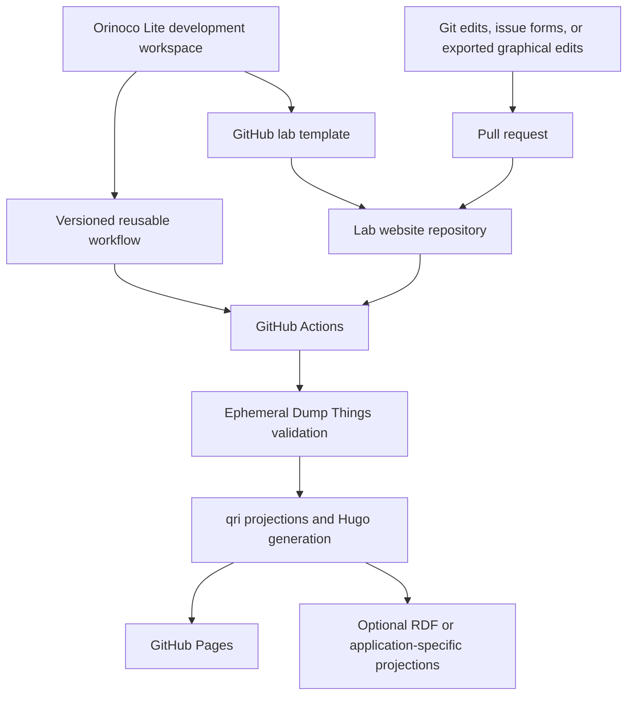

# Orinoco Lite implementation plan

Status: revised proposal for review

## Goal

Let a lab create one GitHub repository, add structured research metadata and
editorial content, and deploy a lab website to GitHub Pages. The repository
should remain understandable without knowledge of the underlying Orinoco
toolchain.

Canonical metadata is human-editable YAML in Git. The same records may later
support websites, graphs, grants, CVs, annual reports, and other projections.

## Proposed architecture

- A lab starts from a small GitHub template, not a fork of the coordination
  repository.
- Each lab initially keeps canonical metadata, website content, configuration,
  and deployment in one repository.
- Each lab repository calls a tagged reusable workflow from
  `con/orinoco-lite-action`. That workflow is the runtime implementation of
  metadata validation, projection, Hugo generation, and Pages deployment.
- The current coordination repository is a development workspace used to track
  upstream components, document the architecture, and assemble candidate
  releases. Lab builds and deployments never depend on it.
- Git branches, pull requests, protections, and reviews provide curation.
- The deployed website requires no continuously running metadata service.
- Dump Things may run ephemerally inside CI to reuse upstream validation and
  projection behavior.
- JSONL is an internal adapter when required by `qri`, not a second canonical
  format.
- RDF is generated only for an identified consumer, such as SHACL-vue or a
  linked-data application.
- The first release uses GitHub-native editing and authentication mechanisms.
  A GitHub App and OAuth broker remain optional later capabilities.

## Repository roles

| Repository | Responsibility |
| --- | --- |
| `con/orinoco-lite-dev` | Proposed name for this coordination and integration workspace |
| `con/orinoco-lite-action` | Versioned reusable workflows and build implementation |
| `con/orinoco-lite-template` | Minimal GitHub template and optional Copier configuration |
| `<lab>/<lab-website>` | Canonical lab metadata, content, theme, configuration, and deployment |
| `centerforopenneuroscience.org` | First complete lab instance and migration target |
| `dump-research-info` | CON migration source and historical ingestion implementation |
| `www-from-model` | Primary Hugo-generation reference and source of reusable patterns |
| Orinoco components | Upstream schemas, validation, query, graph, UI, and enrichment tools |

The current `orinoco-action` directory should not be renamed until this plan
and repository ownership are approved. Released action versions must pin a
tested set of Orinoco dependencies independently of the coordination
repository's current upstream pins.

## Coordination layout

The coordination repository should distinguish upstream projects from
implementations and migration inputs. A later reorganization may use:

```text
upstream/orinoco/
references/www-from-model/
migration/dump-research-info/
instances/centerforopenneuroscience.org/
components/orinoco-lite-action/
components/orinoco-lite-template/
docs/
```

These may remain Git submodules so cross-repository development states are
reproducible. The `upstream/orinoco/` area is specifically for tracking the
rapidly changing Orinoco projects; lab instances are not upstream components.

## Lab repository contract

The default topology is one self-contained repository per lab:

```text
metadata/
content/
static/
config/
lab.yaml
.github/workflows/pages.yaml
```

The exact Hugo and metadata subdirectories will be fixed by the CON vertical
slice rather than invented in advance. Stable conventions should remove the
need for most action inputs.

Keeping the website and metadata together provides one pull request, preview,
review policy, and deployment boundary. Other applications can still consume
the stable `metadata/` tree or explicitly published projections.

A separate metadata repository is an advanced topology. It should be added
only when different access controls, release schedules, or independently
managed consumers justify cross-repository coordination.

## Target system



## Metadata and build contract

- Store approved records as individual YAML files following the upstream Dump
  Things filesystem and Things-derived schema conventions.
- Use `.dumpthings.yaml` configuration where required by the selected upstream
  collection layout.
- Preserve source observations, retrieval details, candidate records,
  reconciliation decisions, and reviewed additions separately from approved
  public records.
- Pin a released schema and compatible Orinoco toolchain for each action
  release.
- Start Dump Things locally and ephemerally in CI when that is the most faithful
  way to validate or project records; never depend on a dedicated remote
  service.
- Run Dump Things ephemerally in CI using the upstream Orinoco validation path.
  Direct LinkML validation may provide an earlier, faster check, but it is not
  the sole publication gate unless its scope is shown to match the required
  Dump Things checks.
- Convert validated records to JSONL transiently when `qri` requires its
  record-stream interface.
- Generate RDF only when SHACL-vue or another named consumer requires it.
- Treat generated pages, caches, JSONL, and RDF as build artifacts rather than
  canonical records.
- Keep editorial Markdown, theme overrides, media, redirects, and site
  configuration in the lab repository.

## Template strategy

The GitHub template is the primary zero-install onboarding path. It should
contain only:

- the canonical directory skeleton;
- a small lab configuration file;
- example metadata and content;
- a short caller workflow pinned to a released Orinoco Lite workflow; and
- concise setup and editing instructions.

The same repository may optionally support Copier for prompted setup, including
lab identity, repository settings, initial people, and theme choices. Copier
must not own ongoing build behavior. Improvements should normally reach labs
through action-version updates rather than large template rewrites.

## Action interface

The primary public interface should be a reusable workflow rather than a set of
low-level build inputs. Version one should:

- assume metadata and site content are in the same repository;
- use conventional paths instead of requiring `metadata-root`, `site-root`, or
  `output-dir`;
- obtain the Pages URL and base path from GitHub Pages configuration rather
  than asking the lab to supply `base-url`;
- start any required Orinoco services ephemerally;
- validate metadata and fail before publication on invalid records;
- run `qri` and Hugo;
- upload previews or review artifacts for pull requests;
- deploy approved default-branch builds through GitHub Pages; and
- pin every runtime Orinoco dependency.

Composite actions may implement internal stages, but labs should call one short
workflow. Optional `metadata-repository` and `metadata-ref` inputs may be added
later for the split-repository topology.

## Editing and authentication

Version one must work without operating an interactive external service:

- Direct GitHub file editing and normal pull requests are the complete,
  authoritative path.
- GitHub Issue Forms may provide structured proposals for common additions and
  an Action may convert accepted proposals into metadata pull requests.
- SHACL-vue may initially load the schema and current graph, validate edits,
  and export proposed YAML or a patch for submission through GitHub.

Using GitHub as the identity provider does not remove the need for a secure
OAuth code exchange. GitHub Pages and Actions cannot provide that interactive
endpoint. A full SHACL-vue write path therefore requires either user-managed
credentials or a small broker.

If graphical editing proves to justify that service, a later release may add a
GitHub App and stateless OAuth broker. Cloudflare Workers is one possible
implementation, not a version-one dependency. The broker must store neither
metadata nor long-lived user tokens, and all changes must still enter through a
pull request.

## Architecture documents

After this plan is approved:

- create `orinoco-system.md` as a dated description of the original Orinoco
  architecture and current upstream behavior;
- create `orinoco-lite-system.md` as the maintained description of the adopted
  Lite architecture; and
- create `required-clarifications.md` containing only unresolved decisions
  that block implementation.

The documents should explain system behavior and advantages without framing
Orinoco Lite as a philosophical critique of upstream Orinoco.

## Implementation phases

### 1. Coordination foundation

- Approve repository names, ownership, and the one-repository-per-lab default.
- Classify tracked repositories as upstream, reference, migration, instance,
  or Lite component.
- Reorganize component paths without changing nested repository history.
- Create the three architecture documents described above.
- Update the README and agent instructions.
- Rename and publish this repository only after review.

Exit: contributors can identify every repository, source of truth, generated
artifact, and unresolved decision.

### 2. CON metadata migration

- Define the upstream-compatible YAML collection layout in
  `centerforopenneuroscience.org`.
- Transform accepted records from `dump-research-info` into individual YAML
  files.
- Preserve source snapshots, evidence, review additions, merge policy, and
  identifiers.
- Compare record counts, persistent identifiers, relationships, and approved
  assets before retiring any old path.
- Keep `dump-research-info` available until migration parity is accepted.

Exit: all accepted CON records validate from canonical files in the website
repository without loss of meaningful provenance or review information.

### 3. Website vertical slice

- Create an integration branch in `centerforopenneuroscience.org`.
- Replace the Pelican build on that branch with a Hugo structure based on
  `www-from-model`.
- Reuse its taxonomy, templates, `qri`, graph, assets, and Congo-theme patterns
  where they fit.
- Run required Dump Things behavior ephemerally during CI.
- Implement one connected slice containing an organization, person, project,
  publication or dataset, relationships, depictions, and editorial content.
- Preserve existing public URLs or define explicit redirects.

Exit: one canonical metadata correction deterministically changes the preview
site, without a persistent metadata backend.

### 4. Reusable action and template

- Create `con/orinoco-lite-action`.
- Extract validation, cache generation, projection, Hugo build, and Pages
  deployment from the working CON slice.
- Create `con/orinoco-lite-template` with a minimal caller workflow and example
  lab.
- Add optional Copier questions only after the plain GitHub template works.
- Test a new independent lab repository created from the template.
- Keep the production CON domain unchanged until parity review.

Exit: a lab can create one repository, replace the example metadata, and deploy
through a pinned Orinoco Lite release.

### 5. GitHub-native editing

- Document direct file and pull-request editing.
- Prototype Issue Forms for common, bounded metadata additions.
- Convert suitable submissions into branches and pull requests through Actions.
- Configure SHACL-vue for schema-driven validation and export without a write
  service.
- Require branch protection and designated metadata reviewers.

Exit: a lab member can propose a metadata change without bypassing Git review
or operating external authentication infrastructure.

### 6. Generalization and optional services

- Publish stable action tags and an upgrade policy.
- Add RDF only for a demonstrated graph or editor integration.
- Add grant, CV, annual-summary, and other projections incrementally.
- Evaluate a GitHub App and OAuth broker only after testing GitHub-native
  editing.
- Evaluate split metadata repositories against an actual multi-application use
  case.
- Contribute generally useful, narrowly scoped changes upstream.
- Keep lab-specific content and presentation downstream.

Exit: another lab can adopt a documented release without understanding the
underlying Orinoco toolchain, while advanced consumers have a clear extension
path.

## Upstream synchronization and contribution policy

- Check upstream component heads on a scheduled basis.
- Open grouped coordination pull requests when pins change.
- Never auto-merge upstream updates.
- Summarize changed components and run integration tests before promoting pins
  into an action release.
- Ensure a released action cannot change merely because an upstream branch
  advances.
- Develop reusable fixes on focused branches in the relevant component.
- Submit only narrow, generally useful changes upstream.
- Keep CON-specific policy, metadata, content, and presentation downstream.

## Acceptance scenarios

- A lab creates one independent repository from the GitHub template.
- Replacing example metadata and enabling Pages is sufficient for a first
  deployment.
- One pull request can update canonical metadata, preview the result, and merge
  the website change atomically.
- Invalid records cannot be published.
- CI may start Dump Things, but the build and deployed website require no
  continuously running metadata backend.
- Repeated builds from identical inputs are identical.
- JSONL remains transient unless a documented consumer requires publication.
- RDF is published only when a documented consumer requires it.
- Another application can consume the canonical `metadata/` contract without
  owning the website build.
- Existing CON content, assets, URLs, and attribution are accounted for before
  production cutover.
- Upstream updates cannot silently alter a released action.

## Required clarifications

- Who creates and administers `con/orinoco-lite-dev`,
  `con/orinoco-lite-action`, and `con/orinoco-lite-template`?
- Should the public product name belong to the template repository or to a
  separate documentation entry point?
- What exact upstream collection layout and schema release become the
  version-one metadata contract?
- Which initial setup questions belong in `lab.yaml`, GitHub repository
  settings, and optional Copier prompts?
- Are Issue Forms sufficient for the first guided editing workflow?
- Is an external OAuth broker ever acceptable, or must graphical editing remain
  export-only until GitHub provides a suitable native mechanism?
- What event would justify splitting canonical metadata into its own
  repository?
- Which team or CODEOWNERS entry must approve metadata and editorial changes?
- Who controls GitHub Pages, DNS, and the production CON domain cutover?
- Which explicit license applies to canonical metadata?
- What preview experience is required for pull requests?

## Working assumptions

- One self-contained repository per lab is the default topology.
- GitHub templates are the primary onboarding path; Copier is optional.
- GitHub Pages is the initial deployment target.
- Canonical metadata is YAML following the selected Orinoco filesystem
  convention.
- Dump Things may run ephemerally in CI but is not deployed as a persistent
  service.
- Version one requires no OAuth broker.
- JSONL is an internal `qri` adapter.
- RDF and other projections are demand-driven.
- Media uses ordinary Git unless repository size requires another decision.
- English-only content is sufficient for the first release.
