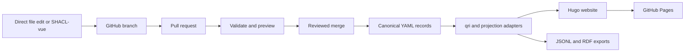

# Orinoco Lite implementation plan

Status: proposal for review

## Goal

Provide a lightweight GitHub-based system for creating a lab website from
structured research metadata. Users can edit metadata directly in Git or
through a schema-generated interface. The same records can support website,
JSONL, RDF, grant, CV, and reporting projections.

## Decisions

- This coordination repository will become `con/orinoco-lite`.
- The reusable action will live in a separate `con/orinoco-lite-action`
  repository tracked here as a component.
- Canonical metadata will follow the Orinoco dump-things filesystem convention:
  one YAML record per file, grouped by schema class.
- GitHub branches, pull requests, protections, and reviews provide curation.
- The deployed system has no long-running metadata backend.
- A GitHub App and small OAuth broker will support graphical editing.
- CON content, metadata, theme, and deployment configuration will live in
  `centerforopenneuroscience.org`.

## Repository roles

| Repository | Responsibility |
| --- | --- |
| `orinoco-lite` | Architecture, planning, component pins, integration research |
| `orinoco-lite-action` | Build action, reusable workflows, adapters, OAuth broker |
| `centerforopenneuroscience.org` | Canonical CON metadata, editorial content, theme, deployment |
| `dump-research-info` | Migration source and historical ingestion implementation |
| `www-from-model` | Primary website-generation reference and source of reusable patterns |
| Orinoco components | Schemas, query tools, UI, graph, enrichment, and upstream references |

The coordination repository tracks current upstream commits for awareness.
Released action versions separately pin combinations that have passed
integration tests.

## Target system

The OAuth broker only exchanges GitHub authorization codes. It does not store
metadata or user tokens.

## Metadata and build contract

- Store approved records under
  `metadata/public/<Class>/<record-id>.yaml`.
- Add `.dumpthings.yaml` files that identify the collection, schema, format,
  and identifier mapping.
- Preserve source observations, retrieval details, reconciliation decisions,
  and reviewed additions separately from approved public records.
- Pin a released Things-derived schema for production data.
- Validate records directly with the pinned LinkML toolchain without starting
  or contacting a Dump Things HTTP service.
- Convert validated YAML to JSONL for `qri`, then build linked caches, generated
  Hugo content, navigation data, and RDF exports.
- Treat generated pages and exports as build artifacts, not canonical records.
- Keep editorial Markdown, theme overrides, media, redirects, and site
  configuration in the website repository.

## Action interface

The action repository should expose:

- a build-only composite action with `metadata-root`, `site-root`,
  `output-dir`, and `base-url` inputs;
- `site-path`, `jsonl-path`, and `rdf-path` outputs;
- a reusable pull-request validation workflow;
- a reusable GitHub Pages deployment workflow;
- pinned versions or commits for every runtime Orinoco dependency.

A consuming lab repository should need only its metadata, site configuration,
and a short caller workflow.

## Editing

The first graphical editor will adapt SHACL-vue to:

1. load OWL, SHACL, and RDF projections from the default branch;
2. create or modify one canonical record;
3. authenticate through an installed GitHub App;
4. commit the record to a generated branch;
5. open a pull request;
6. rely on CI and required review before publication.

The initial permission set is repository metadata read, contents write, and
pull requests write. Tokens must be short-lived, held in memory, and excluded
from logs. Direct file editing remains an equivalent supported path.

## Implementation phases

### 1. Coordination foundation

- Track every current component as a parent submodule.
- Record each component's role and adoption status.
- Create `orinoco-system.md` as a dated description of upstream Orinoco.
- Create `orinoco-lite-system.md` as the maintained target architecture.
- Create `required-clarifications.md` containing only actual implementation
  blockers.
- Update the README overview and agent instructions.
- Rename and publish this repository after the documents are approved.

Exit: contributors can identify every repository, source of truth, generated
artifact, and unresolved decision.

### 2. CON metadata migration

- Create the filesystem collection in `centerforopenneuroscience.org`.
- Transform source-scoped JSON arrays from `dump-research-info` into individual
  YAML records.
- Preserve source snapshots, evidence, review additions, merge policy, and
  identifiers.
- Compare record counts, PIDs, relationships, and approved assets before
  retiring any old path.
- Keep `dump-research-info` available until migration parity is accepted.

Exit: all accepted CON records validate from files in the website repository
and no meaningful source or review information is lost.

### 3. Website vertical slice

- Create an integration branch in `centerforopenneuroscience.org`.
- Replace the Pelican build on that branch with a Hugo structure based on
  `www-from-model`.
- Reuse its taxonomy, Jinja, `qri`, graph, and Congo-theme patterns.
- Implement one connected slice containing an organization, person, project,
  publication or dataset, relationships, depictions, and editorial content.
- Preserve existing public URLs or define explicit redirects.

Exit: one metadata correction changes the preview site and data exports
deterministically.

### 4. Reusable action and deployment

- Create `con/orinoco-lite-action`.
- Extract offline validation, cache generation, rendering, Hugo build, and
  export steps from the vertical slice.
- Produce pull-request artifacts and previews.
- Deploy approved default-branch builds with GitHub Pages.
- Keep the production CON domain unchanged until parity review.

Exit: a minimal independent lab repository can deploy using a versioned
Orinoco Lite workflow.

### 5. Graphical editing

- Package a deployment-specific SHACL-vue configuration.
- Implement the GitHub repository adapter and pull-request flow.
- Implement the OAuth exchange as a stateless Cloudflare Worker.
- Require branch protection and designated metadata reviewers.
- Test expired tokens, duplicate branches, concurrent edits, invalid records,
  and rejected pull requests.

Exit: a permitted lab member can edit a record graphically without bypassing
Git review.

### 6. Generalization and release

- Publish stable action tags and an upgrade policy.
- Add JSONL and RDF as supported first-release projections.
- Add grant, CV, annual-summary, and other human-facing projections
  incrementally.
- Contribute generally useful, narrowly scoped changes to the relevant
  Orinoco repository.
- Keep CON-specific content and presentation downstream.

Exit: another lab can adopt a documented release without understanding the
underlying Orinoco toolchain.

## Upstream synchronization

- Check upstream component heads daily.
- Open one grouped parent pull request when pins change.
- Never auto-merge upstream updates.
- Summarize changed components and run integration tests before promoting new
  pins into an action release.
- Develop reusable fixes on focused branches in the relevant component and
  submit them upstream independently.

## Acceptance scenarios

- Direct and graphical edits produce equivalent canonical record changes.
- Invalid records cannot merge.
- Approved changes update the website, graph, JSONL, and RDF outputs.
- Repeated builds from identical inputs are identical.
- The build and deployed site require no metadata backend.
- OAuth credentials and tokens never enter repository content, artifacts, or
  logs.
- Existing CON content, assets, URLs, and attribution are accounted for before
  production cutover.
- Upstream updates cannot silently alter a released action.

## Required clarifications

- Who creates and administers `con/orinoco-lite` and
  `con/orinoco-lite-action`?
- Who owns the GitHub App and its installation policy?
- Which Cloudflare account, Worker domain, and secret owners are used?
- Which team or CODEOWNERS entry must approve metadata and editorial changes?
- Who controls GitHub Pages, DNS, and the production CON domain cutover?
- Which explicit license applies to canonical metadata?
- Are graphical submissions initially limited to repository collaborators, or
  must fork-based public submissions be supported?

## Working assumptions

- The OAuth broker is a stateless Cloudflare Worker.
- Version one publishes the website plus JSONL and RDF exports.
- GitHub Pages is the initial preview and deployment target.
- Graphical editing initially serves repository collaborators.
- Media uses ordinary Git unless repository size requires another decision.
- English-only content is sufficient for the first release.
