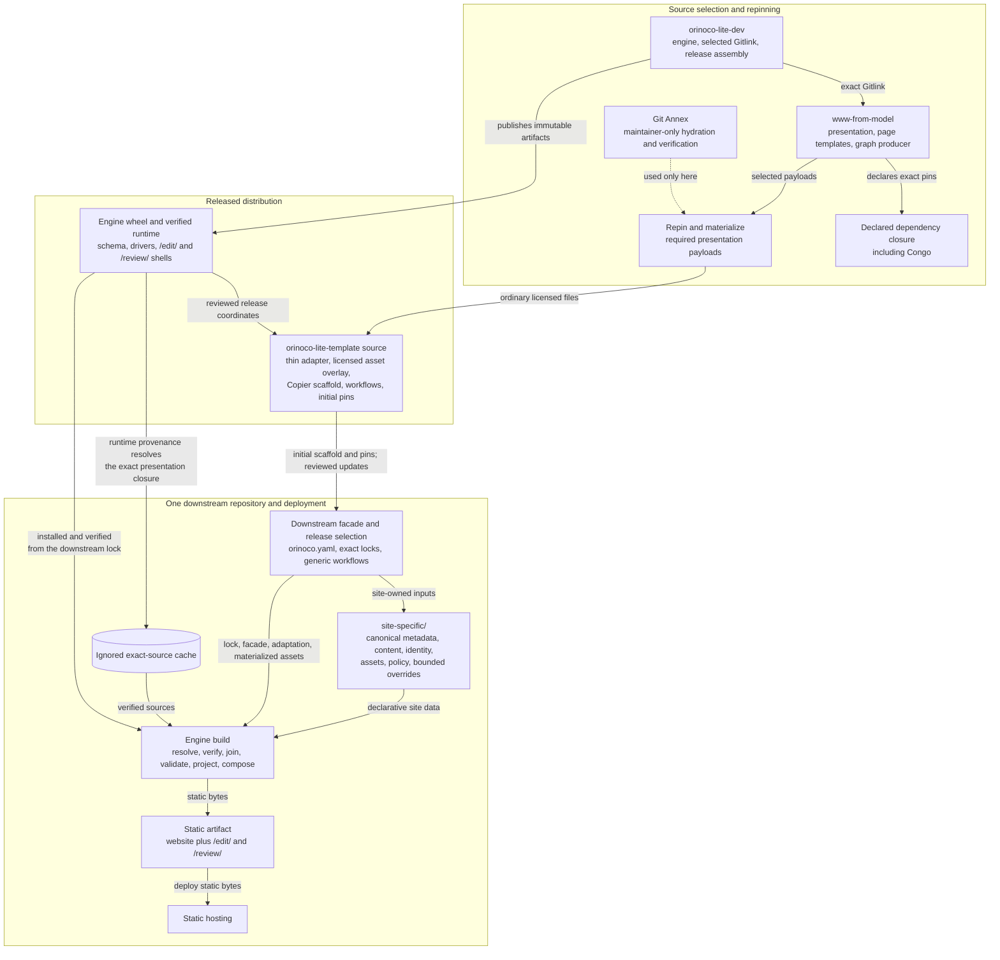
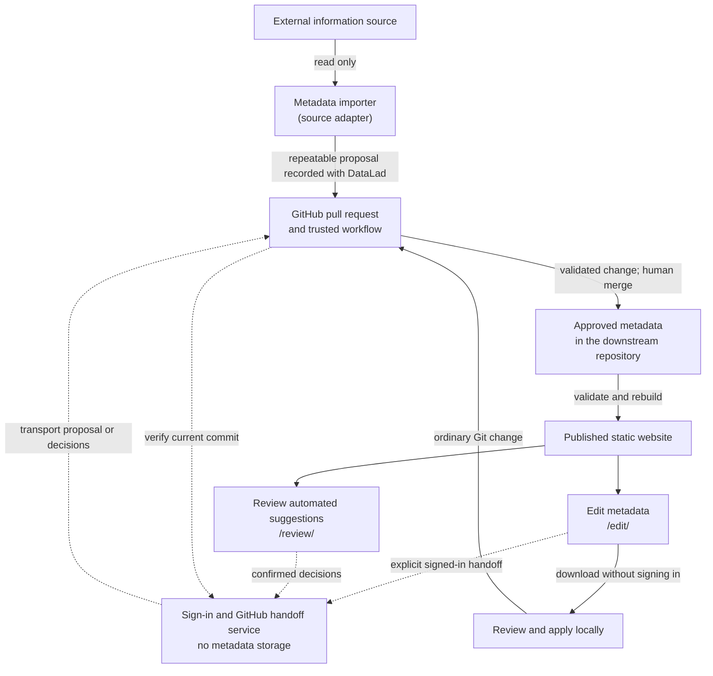

# Orinoco Lite project design

Orinoco Lite provides a templated repo to maintain schema-backed research information that, among other things, can generate an associate static website for the organization.
It is based on the the ORINOCO ecosytem (Organized Research Information: Ontology-mapping, Curation, Orchestration) maintained separately.
It differs in that it hosts the records on github, uses github to host the website, and replaces the server backed metadata management of the original system with a github pull request based workflow.

This document is the durable, high-level design contract shared by maintainers, developers, and AI agents.
It describes the intended architecture rather than a release inventory or progress report.
Detailed protocols, procedures, and temporary implementation plans belong in the documents linked below.

## Objective

An Orinoco Lite deployment should help an organization:

- maintain human-readable metadata under review in Git conformant with the schema defined by the ORINOCO system;
- augment metadata external sources using automation while allowing convenient human review using PRs;
- use github pages to publish a website based on the upstream psychoinformatics.de;
- implement customization of website content, style, and organization while continuing to update their version of orinoco-lite;

The deployed site includes `/edit/` for webpage based metadata changes and `/review/` for integrating changes from automated metadata improvement.

## System organization

| Component | Description | Authority and responsibility | Boundary |
| --- | --- | --- | --- |
| Selected [`www-from-model`](https://github.com/ORINOCO-Lite/www-from-model) revision and its declared dependency closure | The existing website and visual theme Orinoco Lite reuses for its pages, navigation, and map of connected records. | Reusable website presentation, `page_templates/`, graph production, and the exact nested Congo selection | The engineering Gitlink selects it. Its dependency coordinates are not redeclared downstream; German records, identifiers, editorial content, and site-specific assets are not copied into the template or build. |
| [`orinoco-lite-dev`](../README.md) and the [`orinoco-lite` engine](../packages/orinoco-lite/README.md) | The project's development workspace and build software. Together they check a site's inputs and assemble a publishable website. | Generic source resolution, integrity checks, joined metadata validation, released default projection policy, composition, curation primitives, release assembly, and reusable CI | The engine owns neither organization content nor organization presentation policy. Its runtime contains verified drivers, schema, and static editor/review shells, not a copy of the website. |
| [`orinoco-lite-template` source](https://github.com/ORINOCO-Lite/orinoco-lite-template/tree/main) | The starter repository for a new Orinoco Lite site. It supplies the standard project layout, automation, and small set of shared files each site needs. | Thin Orinoco presentation adaptation, bounded licensed materialized assets, Copier scaffold, helper tools, workflows, and initial release locks | It is not another website repository. It contains no German records, editorial content, or site identity. |
| One downstream repository, exemplified by the [human-gated reference downstream](https://github.com/ORINOCO-Lite/test-orinoco-downstream-website) | The home of one organization's website. It contains that site's data and choices and controls when updates are adopted and published. | Canonical site inputs, optional site-specific source adapters, review policy, deployment, and the choice and timing of upgrades | It is an ordinary repository without submodules. Generated projections, caches, and sites are build products, not canonical input. |
| [`curation-review-app`](../packages/curation-review-app/README.md) | The review experience for proposed metadata changes. Pages included in each site help people inspect changes, while a small hosted service performs GitHub actions that require sign-in. | A static review shell released into downstream sites and a separately deployed GitHub authentication and verified-transport backend | The backend hosts no editor or review application and stores no metadata, decisions, bundles, or durable sessions. It is outside the build and public read paths. |
| GitHub and static hosting | GitHub is where changes are proposed, reviewed, and approved; static hosting serves the finished files produced by the build. | Pull requests, authenticated comments, trusted workflows, human merge/revert, and publication of static bytes | Git and GitHub are the durable change-control plane; the host is not a metadata authority. |

The release and deployment path is a chain of authority rather than a copied source tree.
Linked nodes open the relevant source or tool.



## Downstream data boundary

Each downstream keeps its declarative site data under `site-specific/`, separate from site-specific executable adapters:

```text
site-specific/                         # Downstream-owned declarative site data
  site.yaml                            # Site identity, navigation, and presentation settings
  assets/                              # Source assets processed by Hugo during the build
  content/                             # Hand-authored editorial pages
  static/                              # Site files published verbatim
  metadata/                            # Canonical schema-backed metadata
    records/                           # Schema compliant yaml describing organization entities
    overlays/annotations/              # Separate tree for messier record components that are part of the realized graph
  curation-records/                    # Current reviewed automated data import decisions
  sources/<adapter>/                   # Inputs, evidence, and mapping policy for metadata automation tools
  overrides/                           # Bounded replacements for framework surfaces
    config/                            # Final Hugo configuration overrides
    layouts/                           # Hugo template replacements
    static/                            # Replacements for framework static files
extensions/                            # Downstream-owned executable code for metadata management
  source-adapters/<adapter>/           # Site-specific acquisition and curation code
```

`site-specific/` is declarative: it describes what the organization’s site should contain and look like, without implementing how the system performs the work.
It contains the site's semantic assertions, machine provenance companions, editorial material, identity, presentation data, assets, source evidence and policy, current curation decisions, and supported small overrides.
Canonical records and their annotation companions join to form the validation and RDF view.

`extensions/source-adapters/` is exclusively for site-specific executable metadata acquisition and curation code.
It is not a website extension surface: adapter code, captured runtime state, and dependencies are neither loaded by website composition nor copied into the generated site.
Reusable adapter primitives belong in the engine or template.

The released default Orinoco projection contract invokes the selected upstream templates and graph producer.
Replacing that contract downstream is an exceptional compatibility decision, not routine presentation customization.
Generated projection, static output, caches, downloads, and review artifacts remain derived or transient state.

## Build and deployment flow

1. The downstream lock file selects exact releases of the engine, runtime, template, and shared workflows.
The selected runtime records the exact engineering commit, which selects one exact version of `www-from-model`; that project, in turn, selects Congo and its other dependencies.
This chain ensures that every build uses a known set of source code.
2. The engine converts the site's metadata into a graph and validates it against the exact Things Schema included in the selected release.
3. The engine uses the selected upstream page templates and graph generator to create the site's pages and graph data.
These generated files are reproducible build output, not source data kept in Git.
4. The engine combines the reusable website, the thin Orinoco adaptation, and the downstream's content and settings in a fixed order.
Site overrides apply only in the supported locations and take precedence there.
The build also adds the static `/edit/` and `/review/` interfaces and connects them to the downstream repository and exact commit being built.
5. The completed website is deployed as static files.
Once the selected dependencies have been downloaded and verified, validating, building, browsing, editing, and downloading change bundles do not require a running metadata service.

## Metadata change flow

People can edit metadata directly through ordinary Git changes.
The static `/edit/` interface can package an edit for local review and application, or—after an explicit user action—send it to GitHub through the curation service.

An optional source adapter is a program that reads an identified external source and prepares a repeatable metadata proposal without changing that source.
DataLad records the adapter run and proposed Git commit.
The static `/review/` interface shows the proposal and asks a person to accept, reject, or defer each suggested change.

For online review, the curation service handles sign-in, verifies the current GitHub commit, and transports the confirmed proposal or decisions.
Trusted workflows then apply and validate the change only against that verified commit.
A person remains responsible for merging it.
Automation may derive proposals, but it must not invent metadata meaning, identity, rights, or review decisions; approve or merge changes; or write back to the external source.



The precise behavior is defined by the normative contracts for [source adapters](agents/contract/source-adapters.md), [GitHub source review](agents/contract/github-curation-review.md), and [SHACL Vue editing](agents/contract/github-shacl-vue-edit.md), including the [curation-service authentication boundary](agents/contract/curation-service-authentication-options.md).

## Design invariants

- **Reuse the upstream website.** One selected version of the upstream project and its declared dependencies supplies the reusable website.
Orinoco-specific changes remain small, explicit, and separately owned instead of becoming a copied fork.
- **Keep the template small.** The template provides the downstream starting structure, the Orinoco adaptation, shared workflows, dependency locks, and a limited set of licensed assets needed from upstream.
It does not contain another copy of the website.
- **Keep each organization's information in its own repository.** A downstream repository owns that organization's metadata, editorial content, identity, assets, policies, review decisions, and optional source adapters.
Content and identity from the German reference site are never copied into the template or another organization's site.
- **Keep shared behavior in the engine.** Resolving sources, checking integrity, validating metadata, generating pages and graph data, assembling the website, and supporting curation remain reusable engine functions rather than copied downstream code.
The exact Things Schema included in the release defines valid metadata unless the project deliberately changes this design.
- **Publish a static product.** The website and its editing and review interfaces are static files.
Reading the site or downloading an edit bundle never depends on the curation service; only signed-in GitHub operations cross that service boundary.
- **Keep people and Git in control.** External sources are read-only, automated changes remain proposals, and human choices are explicit.
Git commits, pull requests, merges, and reverts provide the durable history and recovery path.
- **Record each fact once.** Exact versions and integrity information live in the lock files, manifests, Gitlinks, and release inputs that use them; Git and GitHub hold the change history.
Do not add separate ledgers or inventories that repeat those facts merely for explanation or proof.
- **Give each provenance tool one job.** Maintainers use Git Annex only while selecting and preparing required upstream presentation assets for the licensed template overlay.
Downstream source adapters use DataLad to record their runs in ordinary Git.
Released builds and adapter runs do not require Git Annex.

## Documentation and change control

This document explains the project's lasting purpose, organization, and boundaries.
Exact rules and shorter-lived working information have separate homes:

- [`docs/agents/contract/`](agents/contract/) defines exact technical rules where metadata meaning, review behavior, or security boundaries require precision;
- [`AGENTS.md`](../AGENTS.md) gives agents current operating constraints and points them to the applicable contracts;
- project [skills](../.agents/skills/) provide step-by-step procedures for repeatable work; and
- [`docs/agents/`](agents/) holds active plans and unresolved decisions, not an alternative description of the architecture.

During a reviewed change, plans, code, tests, releases, or existing downstreams may temporarily differ from this design.
Treat that difference as work to resolve, not as permission to silently change the design or preserve accidental behavior.
Bring the work back into alignment; if the intended direction should change, update this document for human agreement before treating the change as an implementation detail.

This architecture does not decide production metadata meaning, review authority, migration, hosting, cutover, accessibility, privacy, or recovery ownership.
Those choices remain in [`open-decisions.md`](agents/open-decisions.md) until people resolve them.
