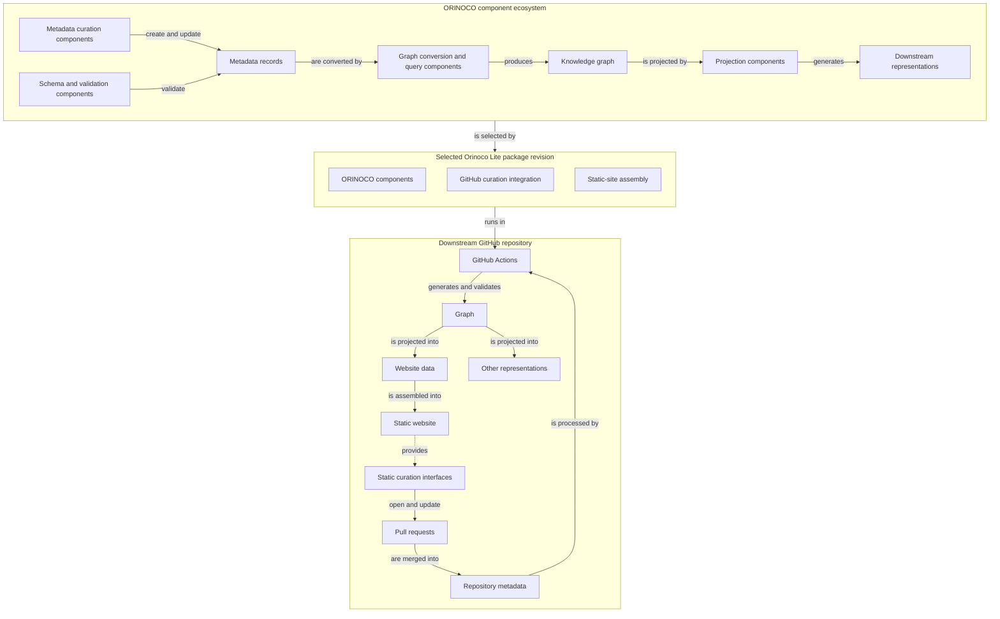
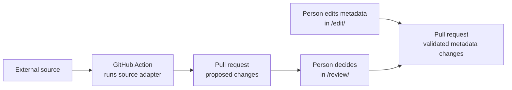

# Orinoco Lite project design charter

Orinoco Lite provides a repository template for maintaining schema-backed research information and publishing an organization's static website.
It adapts the separately maintained ORINOCO ecosystem (Organized Research Information: Ontology-mapping, Curation, Orchestration), which manages metadata records and derives consumer-specific views such as websites.
Orinoco Lite keeps the records and website on GitHub and replaces ORINOCO's server-backed metadata management with pull-request-based curation.

This document is the durable project design charter shared by maintainers, developers, and AI agents.
It describes the intended architecture rather than a release inventory or progress report.
Detailed protocols, procedures, and temporary implementation plans belong in the documents linked below.

## Terminology

- *canonical* — accepted source state that provides other representations.
  The term does not mean that the state is immutable.
- *contract* — behavior or a boundary that implementations must preserve.
  It excludes incidental implementation details.
- *downstream* — a website repository that people create and maintain with Orinoco Lite.
- *policy* — an explicit choice that a person or organization makes among supported behaviors.
  The current implementation does not imply this choice.
- *projection* — a consumer-specific view that selects, joins, or transforms canonical metadata.
  The projection does not change the metadata.
- *upstream* — the original ORINOCO ecosystem and its artifacts, including the [psychoinformatics.de](https://www.psychoinformatics.de) website.

## Objective

An Orinoco Lite deployment should help an organization:

- maintain human-readable, schema-conformant metadata under review in Git,
- prepare automated improvements from external sources for human review through pull requests,
- publish a static website based on [psychoinformatics.de](https://www.psychoinformatics.de) with GitHub Pages, and
- customize the site's content, appearance, and organization while continuing to receive Orinoco Lite updates.

The deployed site URL includes endpoints for client-side operations:

- `/edit/` for web-based metadata changes, and
- `/review/` for integrating changes from automated metadata improvements.

GitHub is the target platform for proposing, reviewing, and approving changes.
Static hosting serves the build output.

## System organization

The system has three layers: development sources, reusable components, and each deployed site.

### Development sources

| Part | Role | Boundary |
| --- | --- | --- |
| [`orinoco-lite-dev`](https://github.com/ORINOCO-Lite/orinoco-lite-dev/) | Develops Orinoco Lite and selects the exact `www-from-model` revision. It also publishes optional releases. | Downstreams do not receive its multi-repository engineering structure. |
| [`www-from-model`](https://github.com/ORINOCO-Lite/www-from-model) | Supplies Hugo layouts and assets, page templates, the graph producer, and its exact Congo theme selection. | Orinoco Lite reuses the selected revision and its declared dependencies. It does not copy German content, identity, or site-specific assets. |

Contributors develop package and template changes in ordinary downstreams through the same package CLI used for deployment.
An editable package connection lets downstream developers test improvements and contribute reusable Python code and pytest tests back to the package; scaffold and Orinoco Hugo adaptations belong in the template.
Setup, building, and serving remain separate operations, without parallel development renderers or custom test runners.
This development loop must work with representative site inputs; establishing how closely Lite tracks the upstream deployment is a separate validation effort.

### Reusable components

An Orinoco Lite package commit contains code and bundled resources under one Git identity.
A downstream selects the official repository or a fork and may use an exact commit directly; publishing a central release is optional.

| Part | Role | Boundary |
| --- | --- | --- |
| [`orinoco-lite`](../src/orinoco_lite/) | Contains the code and data that validate metadata, derive projections, and assemble the site. It also adds the static `/edit/` and `/review/` interfaces. | It includes the pinned Things Schema, generic drivers, static interface shells, licenses, and notices. It also records the engineering commit that selects `www-from-model`. It contains no organization content, organization policy, or copy of the upstream website. |
| [`orinoco-lite-template`](https://github.com/ORINOCO-Lite/orinoco-lite-template/) | Provides the Copier source that creates and updates downstream repositories. | It contains the scaffold, thin Orinoco Hugo adaptation, bounded licensed assets, workflows, and helper tools. It does not contain a website copy, German content, or site identity. |

### Deployment

| Part | Role | Boundary |
| --- | --- | --- |
| A downstream repository, exemplified by [`test-orinoco-downstream-website`](https://github.com/ORINOCO-Lite/test-orinoco-downstream-website) | Owns one organization's canonical site inputs and source adapters. It also owns review policy, deployment, and upgrade timing. | Generated projections, site output, and caches are build products. They are not canonical input. |
| The [curation service](../packages/curation-review-app/) | Signs users in and performs verified GitHub operations for online editing and review. | It is outside the build path and the public-read path. It hosts no editor or review interface. It stores no metadata, decisions, bundles, or durable sessions. |

The diagram follows reusable ORINOCO capabilities into a selected Orinoco Lite package revision.
It then shows how one downstream uses that revision to curate metadata and regenerate representations.



## Downstream data boundary

Each downstream keeps its declarative site data under `site-specific/`, separate from site-specific executable adapters:

```text
site-specific/                         # Downstream-owned declarative site data
  site.yaml                            # Site identity, navigation, and appearance settings
  assets/                              # Source assets processed by Hugo during the build
  content/                             # Hand-authored editorial pages
  static/                              # Site files published verbatim
  metadata/                            # Metadata describing organization entities
    records/                           # Schema-compliant YAML describing organization entities
    overlays/machine-provenance-annotations/              # Machine provenance kept separate for readability
  curation-records/                    # Current reviewed automated data import decisions
  sources/<adapter>/                   # Inputs, evidence, and mapping policy for metadata automation tools
  overrides/                           # Bounded replacements for framework surfaces
    config/                            # Final Hugo configuration overrides
    layouts/                           # Hugo template replacements
    static/                            # Replacements for framework static files
extensions/                            # Downstream-owned executable code for metadata management
  source-adapters/<adapter>/           # Site-specific acquisition and curation code
```

People curate `site-specific/`.
This directory is the complete source for the organization's site content and appearance.
It is declarative: it describes what the site should contain and look like without implementing how Orinoco Lite performs the work.
It holds metadata records, editorial material, identity, and display data.
It also holds assets, source evidence, policy, current curation decisions, and supported small overrides.
It does not hold implementation code.

Keep metadata records easy for people to read and edit.
Store machine provenance separately in overlays so people can focus on the metadata that matters to them; combine it automatically when needed.
Everyday commands and explanations describe records, mentioning overlays only when people need to inspect or manage provenance.

`extensions/source-adapters/` is exclusively for site-specific executable metadata acquisition and curation code.
It is not a website extension surface.
Website composition does not load adapter code, captured execution state, or dependencies.
The generated site does not receive them.
Reusable adapter primitives belong in Orinoco Lite or the template.

Orinoco Lite combines `site-specific/metadata/` with the exact Gitlink-selected `www-from-model` revision to generate the graph and Hugo pages.
It does not change metadata during that step.
These generated files are not canonical inputs and do not enter the downstream's default branch.

## Build and deployment flow

Upon a merge into the default branch, a GitHub Action deploys the website:

1. The downstream lock selects exact versions of Orinoco Lite and the template.
2. Orinoco Lite uses ORINOCO components to convert the metadata records into a graph.
   It validates and projects the graph for the website.
3. Orinoco Lite combines that projection with the upstream website and template.
   It adds downstream content and applies configured overrides.

## Generated publication records

Canonical metadata, editorial content, configuration, and accepted review decisions remain on the downstream's reviewed default branch.
Generated Hugo projection and website output must not accumulate there.

A DataLad run records the Hugo projection, including normalized records, in a commit based on the accepted source.
After deployment succeeds, `latest-hugo-projection` retains that commit and an orphan `gh-pages` branch retains the latest three website snapshots by default.
The downstream can configure how many successful publications to keep.
Other generated operational data is temporary and is neither canonical metadata nor a recovery source.
This retention does not require byte-identical rebuilds or additional manifests, attestations, ledgers, or validation machinery.

## Metadata change flow

Orinoco Lite supports two sources of metadata change:

1. **A person creates an edit.** The person uses the static SHACL Vue `/edit/` page to change the metadata and generate a pull request.
   Automation converts the submitted bundle into validated ordinary metadata changes.
   The changes include the appropriate Git attribution.

2. **Automated augmentation.** A GitHub Action runs a source adapter.
   The adapter reads an external source and opens a pull request with proposals.
   In the static `/review/` interface, a person can accept, reject, defer, or change each proposal.
   Automation finalizes and validates the selected changes.
   It retains the appropriate machine provenance and review state, then updates the pull request.



The normative contracts define the precise behavior:

- [source adapters](agents/contract/source-adapters.md),
- [GitHub source review](agents/contract/github-curation-review.md),
- [SHACL Vue editing](agents/contract/github-shacl-vue-edit.md), and
- [curation-service authentication](agents/contract/curation-service-authentication-options.md).

## Design principles

- **Reuse rather than fork.** The selected upstream revision and its declared dependencies provide the website.
  Orinoco-specific changes remain small, explicit, and separately owned.
  Inspect the selected upstream API or CLI before implementing overlapping functionality, reuse it where applicable, and add only project-specific behavior around it.
  A parallel implementation requires a demonstrated gap, an explanation of why composition cannot address it, and explicit user agreement before implementation; convenience or assumed upstream limitations are insufficient.
  Reuse upstream terminology and operations where their meanings match to ease collaboration with upstream maintainers.
  Use staged comparisons with upstream to detect unintended differences and keep this adaptation thin and maintainable as upstream evolves.
- **Separate shared behavior from site policy.** Orinoco Lite owns reusable operations and the pinned Things Schema contract.
  Each downstream owns its information, appearance choices, review policy, and downstream-defined automations.
- **Publish a static product.** The website, `/edit/`, and `/review/` are static files.
  Only signed-in GitHub operations use the curation service.
- **Preserve GitHub’s security model.** The curation App follows GitHub’s current security guidance, uses least privilege, protects operator credentials, and never trades user authorization or repository protections for a simpler setup.
- **Keep people and Git in control.** Automation only reads external sources.
  It produces proposals, people make explicit choices, and Git supplies durable history and recovery.
- **Record each fact once.** Source revisions belong in dependency declarations, ordinary tool locks, package metadata, and Gitlinks.
  A separate release lock is unnecessary.
  Change history belongs in Git and GitHub.
  Do not add parallel ledgers or inventories merely for explanation or proof.
- **Keep tool layers explicit.** Pixi supplies environments and convenient tasks; commands running in those environments must not invoke or wrap Pixi.
  Tasks should expose commands that users can run and modify directly.
  Compose DataLad around operations at the task or caller boundary; avoid commands that invoke DataLad to rerun themselves with recursion-suppression flags.
  Repository owners control DataLad storage policy.
- **Give provenance tools distinct jobs.** Git Annex is maintainer-only tooling for selecting and materializing required Hugo assets.
  DataLad records downstream adapter runs in ordinary Git.
  Downstream builds and adapter runs do not require Git Annex.

## Documentation and change control

This charter contains the project's lasting purpose, organization, and boundaries.
Narrower or shorter-lived information belongs elsewhere:

- [`docs/agents/contract/`](agents/contract/) defines exact technical rules where metadata meaning, review behavior, or security boundaries require precision.
- [`AGENTS.md`](../AGENTS.md) gives agents current operating constraints and points them to the applicable contracts.
- Project [skills](../.agents/skills/) provide step-by-step procedures for repeatable work.
- [`docs/agents/`](agents/) holds active plans and unresolved decisions, not an alternative description of the architecture.

Use this charter when deciding how Orinoco Lite should evolve.
When the intended design changes, update the charter for human agreement.
Implementation status and sequencing belong in active plans and code.
