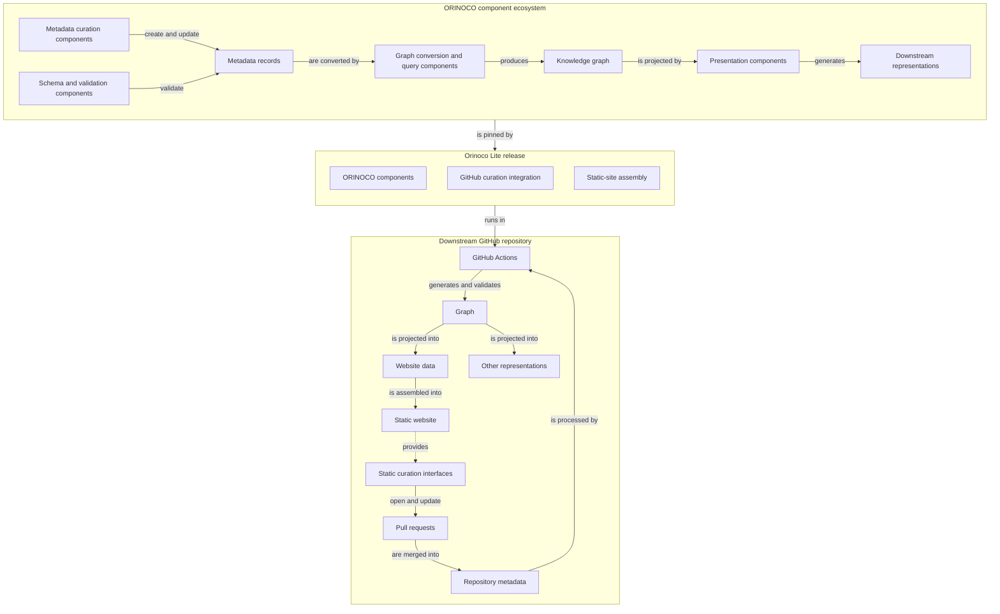
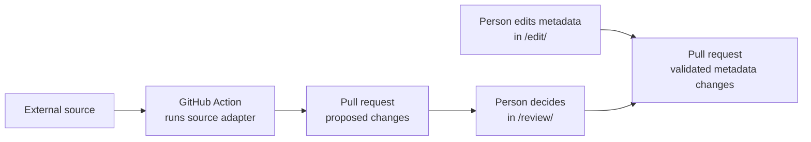

# Orinoco Lite project design charter

Orinoco Lite provides a repository template for maintaining schema-backed research information and publishing an organization's static website.
It adapts the separately maintained ORINOCO ecosystem (Organized Research Information: Ontology-mapping, Curation, Orchestration), which manages metadata records and derives consumer-specific views such as websites.
Orinoco Lite keeps the records and website on GitHub and replaces ORINOCO's server-backed metadata management with pull-request-based curation.

This document is the durable project design charter shared by maintainers, developers, and AI agents.
It describes the intended architecture rather than a release inventory or progress report.
Detailed protocols, procedures, and temporary implementation plans belong in the documents linked below.

## Terminology

- *canonical* — accepted source state from which other representations are derived, not an assertion that the state is immutable;
- *contract* — behavior or a boundary that implementations must preserve, excluding incidental implementation details;
- *downstream* — a website repository created from and maintained with Orinoco Lite;
- *policy* — an explicit human or organization choice among supported behaviors, not a choice inferred from the current implementation;
- *projection* — a consumer-specific view derived by selecting, joining, or transforming canonical metadata without changing it; and
- *upstream* — the original ORINOCO ecosystem and its artifacts, including the [psychoinformatics.de](https://www.psychoinformatics.de) website.

## Objective

An Orinoco Lite deployment should help an organization:

- maintain human-readable, schema-conformant metadata under review in Git;
- prepare automated improvements from external sources for human review through pull requests;
- publish a static website based on [psychoinformatics.de](https://www.psychoinformatics.de) with GitHub Pages; and
- customize the site's content, presentation, and organization while continuing to receive Orinoco Lite updates.

The deployed site URL includes endpoints for client-side operations:

- `/edit/` for web-based metadata changes; and
- `/review/` for integrating changes from automated metadata improvements.

GitHub is the target platform for proposing, reviewing, and approving changes; static hosting serves the build output.

## System organization

The system has three layers: development sources, released components, and each deployed site.

### Development sources

| Part | Role | Boundary |
| --- | --- | --- |
| [`orinoco-lite-dev`](https://github.com/ORINOCO-Lite/orinoco-lite-dev/) | Develops Orinoco Lite, selects the exact presentation source, assembles releases, and maintains reusable CI | Its multi-repository engineering structure is not exposed to downstreams. |
| [`www-from-model`](https://github.com/ORINOCO-Lite/www-from-model) | Supplies the reusable website presentation, page templates, graph production, and its exact Congo selection | Its selected revision and the dependencies it declares are reused without copying German content, identity, or site-specific assets. |

### Released components

An Orinoco Lite release is one Python package whose code and bundled resources share one version and integrity boundary.

| Part | Role | Boundary |
| --- | --- | --- |
| [`orinoco-lite`](../packages/orinoco-lite/) | Contains the code and data needed to validate metadata, derive projections, assemble the site, and add the static `/edit/` and `/review/` interfaces | It includes the pinned Things Schema, generic drivers, static interface shells, licenses, notices, and the engineering source commit that selects the presentation source. It contains no organization content or policy and no copy of the upstream website. |
| [`orinoco-lite-template`](https://github.com/ORINOCO-Lite/orinoco-lite-template/) | Provides the versioned Copier source for creating and updating downstream repositories | It contains the scaffold, thin Orinoco presentation adaptation, bounded licensed assets, workflows, helper tools, and initial locks—not a website copy, German content, or site identity. |

### Deployment

| Part | Role | Boundary |
| --- | --- | --- |
| A downstream repository, exemplified by [`test-orinoco-downstream-website`](https://github.com/ORINOCO-Lite/test-orinoco-downstream-website) | Owns one organization's canonical site inputs, downstream-defined source adapters, review policy, deployment, and upgrade timing | Generated projections, site output, and caches are build products rather than canonical input. |
| The [curation service](../packages/curation-review-app/) | Signs users in and performs verified GitHub operations for online editing and review | It is outside build and public-read paths, hosts no editor or review interface, and stores no metadata, decisions, bundles, or durable sessions. |

The diagram follows reusable ORINOCO capabilities into an Orinoco Lite release, then shows how one downstream repository uses that release to curate metadata and regenerate its representations.



## Downstream data boundary

Each downstream keeps its declarative site data under `site-specific/`, separate from site-specific executable adapters:

```text
site-specific/                         # Downstream-owned declarative site data
  site.yaml                            # Site identity, navigation, and presentation settings
  assets/                              # Source assets processed by Hugo during the build
  content/                             # Hand-authored editorial pages
  static/                              # Site files published verbatim
  metadata/                            # Canonical records and their annotation companions for validation and RDF view
    records/                           # Schema-compliant YAML describing organization entities
    overlays/annotations/              # Separate tree for messier record components that are part of the realized graph
  curation-records/                    # Current reviewed automated data import decisions
  sources/<adapter>/                   # Inputs, evidence, and mapping policy for metadata automation tools
  overrides/                           # Bounded replacements for framework surfaces
    config/                            # Final Hugo configuration overrides
    layouts/                           # Hugo template replacements
    static/                            # Replacements for framework static files
extensions/                            # Downstream-owned executable code for metadata management
  source-adapters/<adapter>/           # Site-specific acquisition and curation code
```

`site-specific/` is human-curated and self-contained as the source for what the organization's site contains and how it appears.
It is declarative: it describes what the site should contain and look like without implementing how Orinoco Lite performs the work.
It holds semantic assertions, machine-provenance companions, editorial material, identity, presentation data, assets, source evidence and policy, current curation decisions, and supported small overrides—not implementation code.

`extensions/source-adapters/` is exclusively for site-specific executable metadata acquisition and curation code.
It is not a website extension surface: adapter code, captured execution state, and dependencies are neither loaded by website composition nor copied into the generated site.
Reusable adapter primitives belong in Orinoco Lite or the template.

Orinoco Lite combines `site-specific/metadata/` with the exact Gitlink-selected `www-from-model` revision to generate the graph and Hugo pages.
It does not modify metadata during that step.
These generated files are not canonical inputs and do not enter the downstream's default branch.

## Build and deployment flow

Upon a merge into the default branch, a GitHub Action deploys the website:

1. The downstream lock selects exact versions of Orinoco Lite and the template.
2. Orinoco Lite uses ORINOCO components to turn the metadata records into a graph, validates the graph, and projects it into the form used by the website.
3. Orinoco Lite combines that projection with the upstream website and template, adds downstream content, and applies configured overrides to produce the static site.

## Generated publication records

Canonical metadata, editorial content, configuration, and accepted review decisions remain on the downstream's reviewed default branch.
Generated Hugo projection and website output must not accumulate there.

The latest successful deployment retains its Hugo projection and deployed static files outside the default branch, traceable to the accepted source commit.
A longer publication history may be retained for diagnosis and recovery.
Other generated operational data is temporary and is neither canonical metadata nor a recovery source.
This retention does not require byte-identical rebuilds or additional manifests, attestations, ledgers, or validation machinery.

## Metadata change flow

Orinoco Lite supports two sources of metadata change:

1. **A person creates an edit.** The static SHACL Vue `/edit/` page is used to update the metadata and generate a pull request.
Automation converts the submitted bundle into validated ordinary metadata changes with the appropriate Git attribution.

2. **Automated augmentation.** A GitHub Action runs a source adapter which reads an external source and opens a pull request with proposed changes.
In the static `/review/` interface, a person can accept, reject, defer, or modify each proposal.
Automation finalizes and validates the selected changes, retains the appropriate machine provenance and review state, and updates the pull request.



The precise behavior is defined by the normative contracts for [source adapters](agents/contract/source-adapters.md), [GitHub source review](agents/contract/github-curation-review.md), and [SHACL Vue editing](agents/contract/github-shacl-vue-edit.md), including the [curation-service authentication rules](agents/contract/curation-service-authentication-options.md).

## Design principles

- **Reuse rather than fork.** The selected upstream revision and its declared dependencies provide the website; Orinoco-specific changes remain small, explicit, and separately owned.
- **Separate shared behavior from site policy.** Orinoco Lite owns reusable operations and the pinned Things Schema contract.
Each downstream owns its information, presentation choices, review policy, and downstream-defined automations.
- **Publish a static product.** The website, `/edit/`, and `/review/` are static files.
The curation service is used only for signed-in GitHub operations.
- **Keep people and Git in control.** External sources are read-only, automation produces proposals, human choices are explicit, and Git supplies durable history and recovery.
- **Record each fact once.** Versions and integrity data belong in the locks, package metadata, Gitlinks, and release inputs that use them; change history belongs in Git and GitHub.
Do not add parallel ledgers or inventories merely for explanation or proof.
- **Give provenance tools distinct jobs.** Git Annex is maintainer-only tooling for selecting and materializing required presentation assets.
DataLad records downstream adapter runs in ordinary Git; released builds and adapter runs do not require Git Annex.

## Documentation and change control

This charter contains the project's lasting purpose, organization, and boundaries.
Narrower or shorter-lived information belongs elsewhere:

- [`docs/agents/contract/`](agents/contract/) defines exact technical rules where metadata meaning, review behavior, or security boundaries require precision;
- [`AGENTS.md`](../AGENTS.md) gives agents current operating constraints and points them to the applicable contracts;
- project [skills](../.agents/skills/) provide step-by-step procedures for repeatable work; and
- [`docs/agents/`](agents/) holds active plans and unresolved decisions, not an alternative description of the architecture.

Use this charter when deciding how Orinoco Lite should evolve.
When the intended design changes, update the charter for human agreement; implementation status and sequencing belong in active plans and code.
