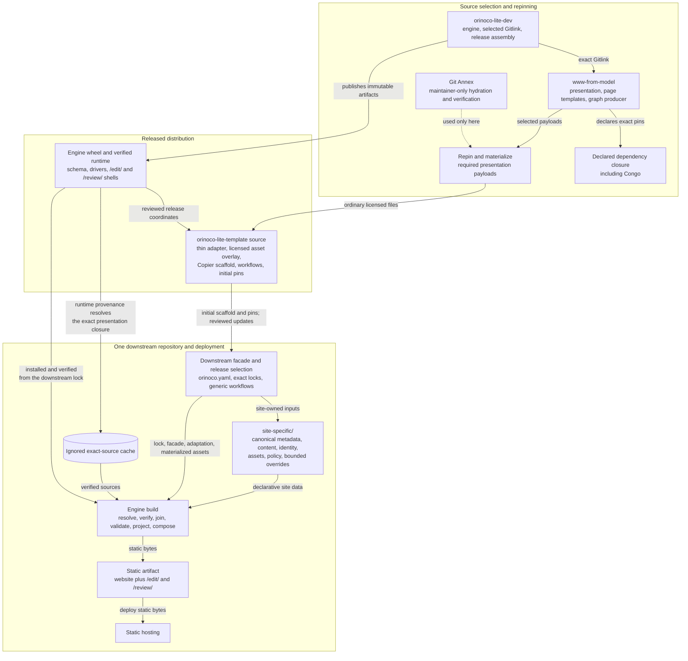
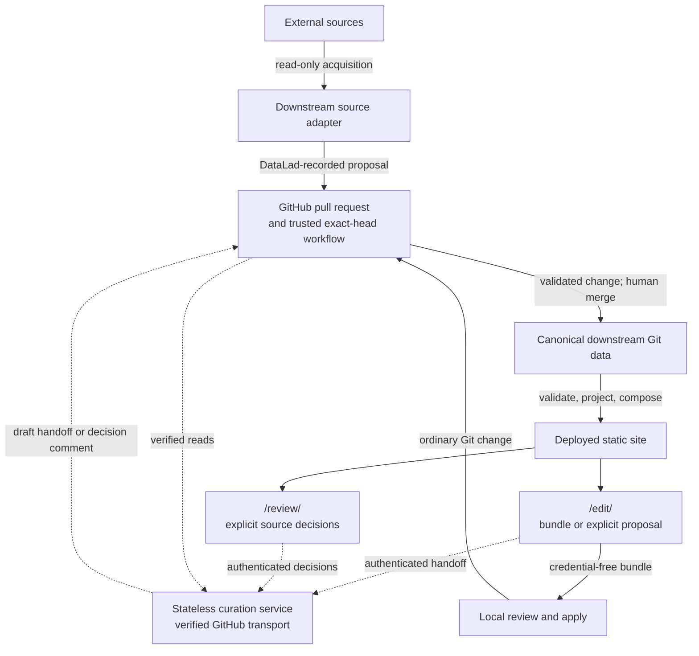

# Orinoco Lite project design

Orinoco Lite provides a templated repo to maintain schema-backed research information that, among other things, can generate an associate static website for the organization.
It is based on the the ORINOCO ecosytem (Organized Research Information: Ontology-mapping, Curation, Orchestration) maintained separately.
It differs in that it hosts the records on github, uses github to host the website, and replaces the server backed metadata management of the original system with a github pull request based workflow.

This document is the durable, high-level design contract shared by maintainers, developers, and AI agents.
It describes the intended architecture rather than a release inventory or progress report.
Detailed protocols, procedures, and temporary implementation plans belong in the documents linked below.

## Objective

An Orinoco Lite deployment should help an organization:

- maintain human-readable metadata under review in Git conformant with the schema defined by the ORINOCO system;
- augment metadata external sources using automation while allowing convenient human review using PRs;
- use github pages to publish a website based on the upstream psychoinformatics.de;
- implement customization of website content, style, and organization while continuing to update their version of orinoco-lite;

The deployed site includes `/edit/` for webpage based metadata changes and `/review/` for integrating changes from automated metadata improvement.

## System organization

| Component | Authority and responsibility | Boundary |
| --- | --- | --- |
| Selected [`www-from-model`](https://github.com/ORINOCO-Lite/www-from-model) revision and its declared dependency closure | Reusable website presentation, `page_templates/`, graph production, and the exact nested Congo selection | The engineering Gitlink selects it. Its dependency coordinates are not redeclared downstream; German records, identifiers, editorial content, and site-specific assets are not copied into the template or build. |
| [`orinoco-lite-dev`](../README.md) and the [`orinoco-lite` engine](../packages/orinoco-lite/README.md) | Generic source resolution, integrity checks, joined metadata validation, released default projection policy, composition, curation primitives, release assembly, and reusable CI | The engine owns neither organization content nor organization presentation policy. Its runtime contains verified drivers, schema, and static editor/review shells, not a copy of the website. |
| [`orinoco-lite-template` source](https://github.com/ORINOCO-Lite/orinoco-lite-template/tree/main) | Thin Orinoco presentation adaptation, bounded licensed materialized assets, Copier scaffold, helper tools, workflows, and initial release locks | It is not another website repository. It contains no German records, editorial content, or site identity. |
| One downstream repository, exemplified by the [human-gated reference downstream](https://github.com/ORINOCO-Lite/test-orinoco-downstream-website) | Canonical site inputs, optional site-specific source adapters, review policy, deployment, and the choice and timing of upgrades | It is an ordinary repository without submodules. Generated projections, caches, and sites are build products, not canonical input. |
| [`curation-review-app`](../packages/curation-review-app/README.md) | A static review shell released into downstream sites and a separately deployed GitHub authentication and verified-transport backend | The backend hosts no editor or review application and stores no metadata, decisions, bundles, or durable sessions. It is outside the build and public read paths. |
| GitHub and static hosting | Pull requests, authenticated comments, trusted workflows, human merge/revert, and publication of static bytes | Git and GitHub are the durable change-control plane; the host is not a metadata authority. |

The release and deployment path is a chain of authority rather than a copied source tree.
Linked nodes open the relevant source or tool.



## Downstream data boundary

Each downstream keeps its declarative site data under `site-specific/`, separate from site-specific executable adapters:

```text
site-specific/                         # Downstream-owned declarative site data
  site.yaml                            # Site identity, navigation, and presentation settings
  assets/                              # Source assets processed by Hugo during the build
  content/                             # Hand-authored editorial pages
  static/                              # Site files published verbatim
  metadata/                            # Canonical schema-backed metadata
    records/                           # Schema compliant yaml describing organization entities
    overlays/annotations/              # Separate tree for messier record components that are part of the realized graph
  curation-records/                    # Current reviewed automated data import decisions
  sources/<adapter>/                   # Inputs, evidence, and mapping policy for metadata automation tools
  overrides/                           # Bounded replacements for framework surfaces
    config/                            # Final Hugo configuration overrides
    layouts/                           # Hugo template replacements
    static/                            # Replacements for framework static files
extensions/                            # Downstream-owned executable code for metadata management
  source-adapters/<adapter>/           # Site-specific acquisition and curation code
```

`site-specific/` is declarative.
It contains the site's semantic assertions, machine provenance companions, editorial material, identity, presentation data, assets, source evidence and policy, current curation decisions, and supported small overrides.
Canonical records and their annotation companions join to form the validation and RDF view.

`extensions/source-adapters/` is exclusively for site-specific executable metadata acquisition and curation code.
It is not a website extension surface: adapter code, captured runtime state, and dependencies are neither loaded by website composition nor copied into the generated site.
Reusable adapter primitives belong in the engine or template.

The released default Orinoco projection contract invokes the selected upstream templates and graph producer.
Replacing that contract downstream is an exceptional compatibility decision, not routine presentation customization.
Generated projection, static output, caches, downloads, and review artifacts remain derived or transient state.

## Build and deployment flow

1. A downstream lock selects exact engine, runtime, template, and reusable workflow releases.
Runtime provenance identifies the exact engineering commit; that commit's Gitlink selects `www-from-model`, whose own declarations select Congo and the rest of its dependency closure.
2. The engine joins records with their machine provenance companions and validates the result against the exact released Things Schema profile.
3. The engine applies its released projection policy using the selected upstream `page_templates/` and graph producer.
Projection output is reproducible and ignored.
4. The engine composes the selected website and dependency closure with the template adaptation and materialized overlay, then adds declared downstream inputs and supported overrides under deterministic path and precedence rules.
It binds the released static `/edit/` and `/review/` shells to the exact site source.
5. The resulting bytes are deployed to static hosting.
After exact dependencies have been resolved and cached, validation, projection, building, browsing, editing, and bundle download require no networked metadata service.

## Metadata change flow

Direct human edits are ordinary Git changes.
The static `/edit/` application can export the same bounded change bundle for local application or explicitly hand it to GitHub through the curation service.

An optional source adapter reads an identified external source, derives a deterministic metadata proposal, and records its run and proposal commit with DataLad in ordinary Git.
The deployed `/review/` application presents the proposal and collects explicit human decisions.
The curation service verifies identity and exact GitHub state and transports the confirmed handoff or decision; trusted released workflows validate and finalize the change at the exact head.
A human remains responsible for merge.
Automation does not invent metadata semantics, identities, rights, or curation decisions.
It does not approve or merge proposals or write back to the external source.



The precise behavior is defined by the normative contracts for [source adapters](agents/contract/source-adapters.md), [GitHub source review](agents/contract/github-curation-review.md), and [SHACL Vue editing](agents/contract/github-shacl-vue-edit.md), including the [curation-service authentication boundary](agents/contract/curation-service-authentication-options.md).

## Design invariants

- **Reuse rather than fork.** The selected upstream revision and its declared dependency closure supply the reusable website.
Orinoco adaptations stay small, explicit, and separately owned.
- **Keep the template thin.** The template carries only the downstream scaffold, adaptation, workflows, locks, and bounded licensed materialized assets required by retained upstream functionality; it never carries a complete website.
- **Keep downstreams site-specific.** Organization metadata, editorial content, identity, assets, policy, decisions, and optional executable adapters live in one ordinary downstream repository.
German records, identifiers, editorial content, and site-specific assets never enter a template or downstream build.
- **Keep generic behavior in the engine.** Source resolution, integrity, validation, projection, composition, and shared curation operations do not become copied downstream framework code.
The selected Things Schema profile remains the semantic boundary unless a deliberate design change says otherwise.
- **Keep the published product static.** The website and its edit/review UI are static, and ordinary read and bundle-download paths do not depend on the curation service.
Authenticated GitHub operations cross only that narrow boundary.
- **Keep humans and Git authoritative.** External acquisition is read-only, machine changes are proposals, human choices are explicit, and commits, pull requests, merge, and revert provide durable review and recovery.
- **Do not duplicate authority.** Exact pins and integrity metadata live only in the locks, manifests, Gitlinks, and release inputs whose operation requires them.
Git and GitHub hold change history.
Do not add parallel ledgers, inventories, or compatibility machinery merely for explanation or proof.
- **Separate provenance tools.** Git Annex is maintainer-only repinning machinery used to hydrate and verify required upstream presentation payloads before ordinary licensed files enter the template overlay.
DataLad records downstream source-adapter runs in Git; released builds and adapter runs do not require Git Annex.

## Documentation and change control

This document owns durable intent, system boundaries, and architectural invariants.
More precise or shorter-lived information has one separate home:

- [`docs/agents/contract/`](agents/contract/) defines normative behavior where exact semantics or security boundaries matter;
- [`AGENTS.md`](../AGENTS.md) provides current operating constraints and routes agents to the relevant contract;
- project [skills](../.agents/skills/) define repeatable development, deployment, documentation, and upstream-maintenance procedures; and
- [`docs/agents/`](agents/) contains active plans and unresolved decisions, not a competing architecture.

Plans, code, tests, releases, and existing downstreams may temporarily lag this target during reviewed work.
A discrepancy is work to reconcile, not evidence for silently changing the design or preserving accidental compatibility.
Bring the implementation or plan back into alignment; if the intended direction itself should change, propose that change here for human agreement before it becomes implementation detail.

Do not infer production metadata semantics, review authority, migration, hosting, cutover, accessibility, privacy, or recovery ownership from this architecture.
Those choices remain in [`open-decisions.md`](agents/open-decisions.md) until humans resolve them.
