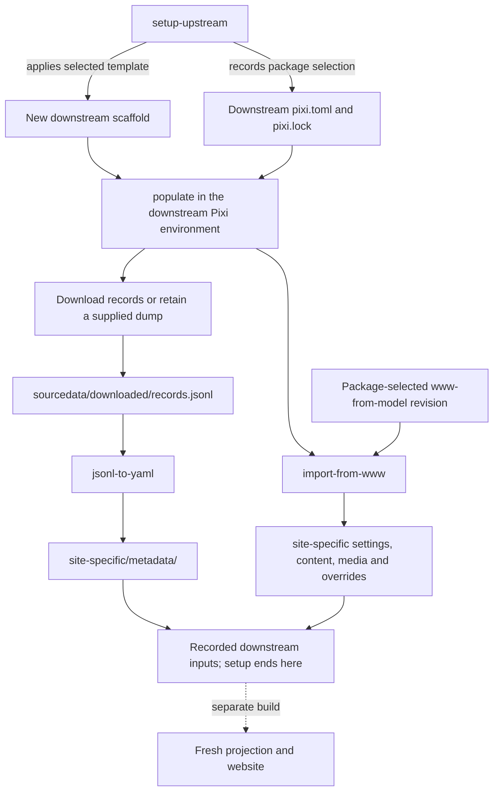

# Track an upstream website with Orinoco Lite

This guide is for maintainers comparing Orinoco Lite with the selected upstream website or keeping a downstream deployment that follows it.
The downstream imports upstream inputs and builds a fresh projection through Orinoco Lite; it does not publish upstream's existing generated pages.
The [project design](project-design.md) describes the package, thin template adaptation, and downstream ownership.

The package's engineering commit pins `www-from-model`, which selects its own dependencies.
The template supplies the thin Orinoco Lite adaptation and downstream scaffold.
Git and DataLad record the software selection, retained records, and preparation steps so changes can be inspected and repeated.
See CLI help for input and candidate selection.

## Imported inputs and persistent settings

The importer maps the selected `www-from-model` checkout into the downstream paths below.
All destination paths in this table are relative to `site-specific/`.

| Defined upstream | Stored downstream | Mapping on import |
| --- | --- | --- |
| `config/_default/languages.en.toml`: `title`, `params.description` | `site.yaml`: `identity.title`, `identity.description` | Copy values |
| `config/_default/hugo.toml`: `baseURL` | `site.yaml`: `identity.base_url` | Normalize to one trailing slash |
| `config/_default/menus.en.toml`: `main` | `site.yaml`: `navigation` | Map menu entries, including `pageRef` to `page_ref` and `params.icon` to `icon` |
| `config/_default/params.toml`: `colorScheme`, `defaultAppearance`, `header.layout` | `site.yaml`: `presentation.color_scheme`, `presentation.default_appearance`, `presentation.header_layout` | Copy values |
| `content/`: selected authored pages, section pages and bundle resources, including registered `portrait.*`, `logo.*` and `depiction.*` files | `content/`, at the same relative paths | Copy selected files and retrieve Annex-backed bytes; synchronize with deletions |
| `assets/img/`: files named `fzj.svg`, `hhu.svg`, `logo.png` | `assets/img/`, at the same relative paths | Copy ordinary bytes, retrieving Annex content when necessary |
| `static/`: top-level images and `site.webmanifest` | `static/`, at the same relative paths | Copy ordinary bytes, retrieving Annex content when necessary |
| `config/_default/params.toml`: `header.logo`, `header.logoDark`, `footer.showCopyright` | `overrides/config/params.toml`: same fields | Replace these fields; remove them when absent upstream |
| `config/_default/languages.en.toml`: `copyright` | `overrides/config/languages.en.toml`: `copyright` | Replace this field; remove it when absent upstream |

Refresh replaces `site.yaml` and synchronizes `content/`, `assets/`, and `static/`, including deletions.
Local edits in those imported surfaces do not persist; keep downstream choices in the separate settings below.
Site import leaves metadata to the record-conversion stage.

These explicitly separate settings persist through `populate` and site reimport:

| Downstream setting or override | Where it is stored | Why it persists |
| --- | --- | --- |
| GitHub repository and optional curation service | `orinoco.yaml`: `site.repository`, `site.curation_service` | Outside the imported inputs |
| Deployment URL | Build command `--base-url`, or `ORINOCO_BASE_URL` in deployment configuration | Supplied at build time; does not edit regenerated `site.yaml` |
| GitHub Pages publication and Netlify pull-request previews | Downstream `.github/workflows/` and `netlify.toml` | Outside the imported inputs |
| Additional theme parameters | `site-specific/overrides/config/params.toml` | Fields other than the three importer-owned logo/footer fields are preserved |
| Additional English language settings | `site-specific/overrides/config/languages.en.toml` | Fields other than `copyright` are preserved |
| Other supported Hugo configuration, layout and static overrides | Other files under `site-specific/overrides/` | The importer leaves these files unchanged |

These settings survive input refresh; template updates remain a separate review.
Use the build URL setting above because it takes precedence over Hugo configuration.
See [the importer](../src/orinoco_lite/site_inputs.py) for exact file selection rules.

### Depiction records and image files

A depiction is metadata: `XYZDepiction` is a `Thing` whose `distributions` link to `XYZFile` representations.
SHACL Vue's configured upload wizard creates these records and links them to the depicted subject.
Upstream's [Register depictions workflow](../submodules/www-from-model/.forgejo/workflows/register-depictions.yaml) follows their download URLs and retrieves images with Git Annex into page bundles, named `portrait.jpg`, `logo.svg`, or `depiction.jpg`.

The importer retains those resources and authored section pages, while excluding generated entity pages and the homepage.
The build combines freshly projected entity pages with the upstream presentation, template adaptation, and imported media; Hugo finds depictions beside the regenerated pages.

Media comes from the pinned website revision, not by downloading every depiction referenced in the records dump.
A newer dump can therefore refer to images absent from that revision; full-site comparisons should check the rendered depictions as well as metadata.

## Comparing and following upstream

**Disposable downstreams** let maintainers review a candidate without changing a deployed site.
Keep the same records dump when comparing package, template, or upstream presentation changes; refresh the dump separately to identify data changes.
Compare the resulting metadata, graph, pages, and rendered site using the [staged validation approach](agents/staged-upstream-validation.md).

**Persistent downstreams**, such as the proposed `ORINOCO-Lite/psychoinformatics-downstream`, retain imported upstream content alongside the explicit deployment settings above.
GitHub Pages publishes the canonical site; Netlify provides pull-request previews only.
Review refreshes in pull requests, including changes within the site-input subdataset, before adopting them.
Publish referenced subdataset commits along with the parent repository's updates.

Repinning changes the selected upstream presentation; reimport brings its authored inputs and media into the downstream.
Review the resulting differences to keep the Orinoco Lite adaptation small.

## Recovery

Atomicity is not required for preparation.
Restore recorded Git state, including the affected subdataset, remove partial untracked outputs as needed, and repeat in the recorded software environment.
Preserve unrelated work when choosing what to restore or remove.
