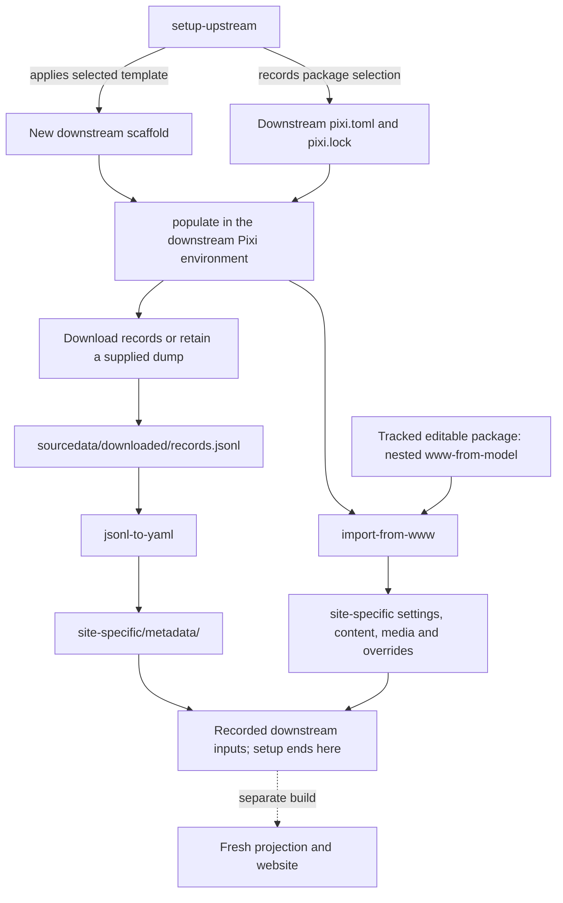

# Instantiate and update the upstream website with Orinoco Lite

This guide is for maintainers comparing Orinoco Lite with the selected upstream website or keeping a downstream deployment that follows it.
The downstream imports upstream inputs and builds a fresh projection through Orinoco Lite; it does not publish upstream's existing generated pages.
This engineering edge case always uses downstream development mode with `.orinoco-lite/orinoco-lite-dev` tracked as a Git submodule.
Its nested `www-from-model` checkout supplies authored content, identity images, and Annex media for import.
The installed rendering subset supports ordinary builds; it does not contain these upstream website inputs.
Normal downstreams supply their own content and receive rendering functionality and required framework assets through the package.
The engineering **Update upstream comparison** workflow proposes updates to the upstream instantiation; see [comparison updates](agents/upstream-comparison-updates.md).
The [project design](project-design.md) describes the package, thin template adaptation, and downstream ownership.


```mermaid
flowchart TD
    setup["setup-upstream"] -->|applies selected template| scaffold["New downstream scaffold"]
    setup -->|records package selection| lock["Downstream pixi.toml and pixi.lock"]
    scaffold --> populate["populate in the downstream Pixi environment"]
    lock --> populate
    populate --> acquire["Download records or retain a supplied dump"]
    acquire --> dump["sourcedata/downloaded/records.jsonl"]
    dump --> convert["jsonl-to-yaml"]
    convert --> metadata["site-specific/metadata/"]
    populate --> import["import-from-www"]
    upstream["Tracked editable package: nested www-from-model"] --> import
    import --> inputs["site-specific settings, content, media and overrides"]
    metadata --> ready["Recorded downstream inputs; setup ends here"]
    inputs --> ready
    ready -. separate build .-> build["Fresh projection and website"]
```

The package's engineering commit pins `www-from-model`, which selects its own dependencies.
The template supplies the thin Orinoco Lite adaptation and downstream scaffold.
Git and DataLad record the software selection, retained records, and preparation steps so changes can be inspected and repeated.
See CLI help for input and candidate selection.

To prepare a fresh development downstream from upstream inputs and build it:

```console
pixi run setup-upstream ../psychoinformatics-candidate --dump /path/to/records.jsonl --build
```

`populate` imports from the same package-selected `www-from-model` checkout used for projection and builds.
Setup registers `.orinoco-lite/orinoco-lite-dev` as a downstream submodule and installs it editable before importing.
Development mode is the default; `--development` may also be supplied explicitly.
Use `--no-development --site-specific PATH` only to compare a fixed package installation against retained site inputs; this mode does not import upstream website files.
The downstream records its package gitlink and editable manifest selection; `www-from-model` remains nested inside that tracked package.
The import also records the local Pixi lock as an input.
Native upstream instantiation can use `www-from-model` and its dependencies as nested Git submodules without installing Orinoco Lite.
`--build` uses the ordinary build command and retains its recorded projection and website in `build/pages-publication.bundle`; it does not deploy or push publication refs.
Without `--build`, setup ends after preparation.
`--site-specific` installs existing site inputs and skips upstream import.

Setup selects the engineering checkout’s current commit and template `origin/main`.
GitHub package origins use HTTPS for credential-free reads; an explicit repository URL remains unchanged.
Publish the package commit first; setup verifies both selections before creating the downstream.
Use `--package-revision FULL_SHA` to test another package revision, or `--local-heads` to include the local template commit.
For an existing upstream-reproduction downstream, select the package commit in `.orinoco-lite/orinoco-lite-dev`, initialize its nested submodules at their gitlinks, and re-run `dev enable` to prepare resources and refresh the editable environment.
Record the changed package gitlink and dependency declarations in the downstream.

## Imported inputs and persistent settings

The importer maps the selected `www-from-model` checkout into the downstream paths below.
`pyproject.toml` is at the downstream root; other destination paths in this table are relative to `site-specific/`.

| Defined upstream | Stored downstream | Mapping on import |
| --- | --- | --- |
| `config/_default/languages.en.toml`: `title`, `params.description` | `pyproject.toml` (`tool.orinoco.site`): `identity.title`, `identity.description` | Copy values |
| `config/_default/hugo.toml`: `baseURL` | `pyproject.toml` (`tool.orinoco.site`): `identity.base_url` | Normalize to one trailing slash |
| `config/_default/menus.en.toml`: `main` | `pyproject.toml` (`tool.orinoco.site`): `navigation` | Map menu entries, including `pageRef` to `page_ref` and `params.icon` to `icon` |
| `config/_default/params.toml`: `colorScheme`, `defaultAppearance`, `header.layout` | `pyproject.toml` (`tool.orinoco.site`): `appearance.color_scheme`, `appearance.default_appearance`, `appearance.header_layout` | Copy values |
| `content/`: selected authored pages, section pages and bundle resources, including registered `portrait.*`, `logo.*` and `depiction.*` files | `content/`, at the same relative paths | Copy selected files and retrieve Annex-backed bytes; synchronize with deletions |
| `assets/img/`: files named `fzj.svg`, `hhu.svg`, `logo.png` | `assets/img/`, at the same relative paths | Copy ordinary bytes, retrieving Annex content when necessary |
| `static/`: top-level images and `site.webmanifest` | `static/`, at the same relative paths | Copy ordinary bytes, retrieving Annex content when necessary |
| `config/_default/params.toml`: `header.logo`, `header.logoDark`, `footer.showCopyright` | `overrides/config/params.toml`: same fields | Replace these fields; remove them when absent upstream |
| `config/_default/languages.en.toml`: `copyright` | `overrides/config/languages.en.toml`: `copyright` | Replace this field; remove it when absent upstream |

Refresh updates only imported fields in `tool.orinoco.site`, preserving unrelated TOML and operational policy, and synchronizes `content/`, `assets/`, and `static/`, including deletions.
Local edits in those imported surfaces do not persist; keep downstream choices in the separate settings below.
Site import leaves metadata to the record-conversion stage.

### Generated defaults and authored overrides

An ordinary lab site needs metadata and site settings, not imported upstream Markdown scaffolding.
Assembly applies shared presentation and section front matter, then fresh metadata projection, then optional authored content at the same Hugo paths.
`site-specific/content/_index.md` replaces the complete generated homepage, including its front matter and body; it does not append an introduction to the generated page.
Section overrides such as `content/persons/_index.md` use the same rule.
Entity pages continue to come from metadata unless deliberately replaced at their exact content path.

Upstream reproduction imports authored sections and page-bundle resources while regenerating the homepage and entity pages.
If a selected source has an intentionally authored homepage, explicitly request `dev upstream import-from-www --include-homepage` to copy it as an override.
This option never enables importing generated entity pages.
The ordinary import still excludes the homepage, and hard synchronization removes earlier imported or authored files absent from the selected import, including a homepage override when the option is omitted.

These explicitly separate settings persist through `populate` and site reimport:

| Downstream setting or override | Where it is stored | Why it persists |
| --- | --- | --- |
| GitHub repository and optional curation service | `pyproject.toml`: `tool.orinoco.github.repository`, `tool.orinoco.service.url` | Outside the imported inputs |
| Deployment URL | Build command `--base-url`, or `ORINOCO_BASE_URL` in deployment configuration | Supplied at build time; does not edit imported `tool.orinoco.site` settings |
| GitHub Pages publication and Netlify pull-request previews | Downstream `.github/workflows/` and `netlify.toml` | Outside the imported inputs |
| Additional theme parameters | `site-specific/overrides/config/params.toml` | Fields other than the three importer-owned logo/footer fields are preserved |
| Additional English language settings | `site-specific/overrides/config/languages.en.toml` | Fields other than `copyright` are preserved |
| Other supported Hugo configuration, layout and static overrides | Other files under `site-specific/overrides/` | The importer leaves these files unchanged |

These settings survive input refresh; template updates remain a separate review.
Use the build URL setting above because it takes precedence over Hugo configuration.
See [the importer](../src/orinoco_lite/site_inputs.py) for exact file selection rules.

### Depiction records and image files

A depiction is metadata: `XYZDepiction` is a `Thing` whose `distributions` link to `XYZFile` representations.
SHACL Vue's configured upload wizard creates these records and links them to the depicted subject.
Upstream's [Register depictions workflow](../submodules/www-from-model/.forgejo/workflows/register-depictions.yaml) follows their download URLs and retrieves images with Git Annex into page bundles, named `portrait.jpg`, `logo.svg`, or `depiction.jpg`.

The importer retains those resources and authored section pages, while excluding generated entity pages and the homepage.
The build combines freshly projected entity pages with the upstream Hugo layouts and assets, template adaptation, and imported media; Hugo finds depictions beside the regenerated pages.

Media comes from the pinned website revision, not by downloading every depiction referenced in the records dump.
A newer dump can therefore refer to images absent from that revision; full-site comparisons should check the rendered depictions as well as metadata.
Other labs must supply the corresponding local page-bundle resources through their site inputs or arrange their own acquisition; a depiction URL alone does not make a local Hugo resource available.

## Comparing and following upstream

**Disposable downstreams** let maintainers review a candidate without changing a deployed site.
Keep the same records dump when comparing package, template, or `www-from-model` changes; refresh the dump separately to identify data changes.
Compare the resulting metadata, graph, pages, and rendered site using the [staged validation approach](agents/staged-upstream-validation.md).

**Persistent downstreams**, such as the proposed `ORINOCO-Lite/psychoinformatics-downstream`, retain imported upstream content alongside the explicit deployment settings above.
GitHub Pages publishes the canonical site; Netlify provides pull-request previews only.
Review refreshes in pull requests, including changes within the site-input subdataset, before adopting them.
Publish referenced subdataset commits along with the parent repository's updates.

Repinning changes the selected `www-from-model` revision; reimport brings its authored inputs and media into the downstream.
Review the resulting differences to keep the Orinoco Lite adaptation small.

After updating the tracked editable package and its nested dependencies, refresh retained upstream inputs with:

```console
pixi run orinoco-lite dev upstream populate --reuse-dump
```

This reuses the saved capture, records the new upstream gitlink, and records conversion and import separately.
Template updates remain independent and preserve site-owned inputs and submodule selections.
For historical import replay, restore the parent dataset and subdataset revisions and the recorded Pixi environment first.
Inspect `datalad rerun --report COMMIT`, then use `datalad rerun --assume-ready inputs COMMIT` when the recorded upstream checkout is installed: the importer retrieves and verifies only its selected Annex media.
The assumption skips DataLad's broad content retrieval; it does not replace installing the pinned input subdataset.

The normal projection uses the selected upstream JSON-to-RDF validation without requiring a lossless inverse conversion.
In particular, upstream RDF readback omits the captured invalid `at_time: "-"` value; original captures and stored records remain intact.
Build success does not establish RDF round-trip preservation; use the optional comparison commands to assess it.

## Recovery

Atomicity is not required for preparation.
Restore recorded Git state, including the affected subdataset, remove partial untracked outputs as needed, and repeat in the recorded software environment.
Preserve unrelated work when choosing what to restore or remove.
