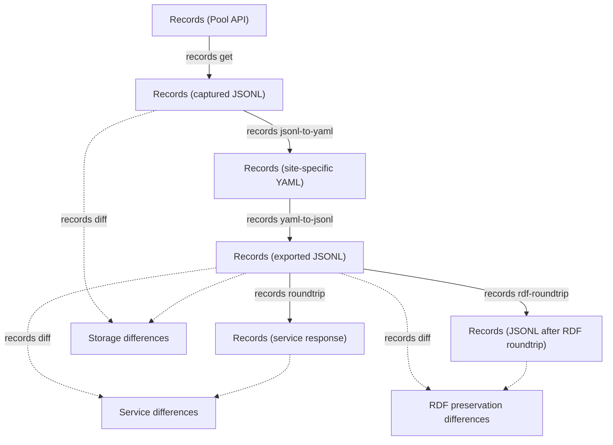
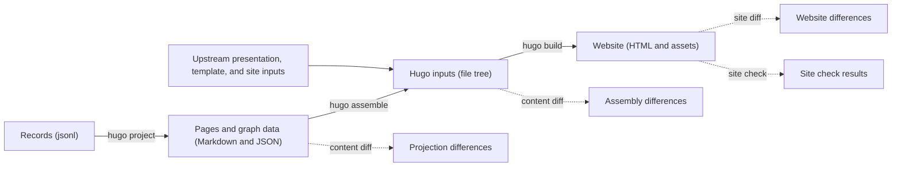
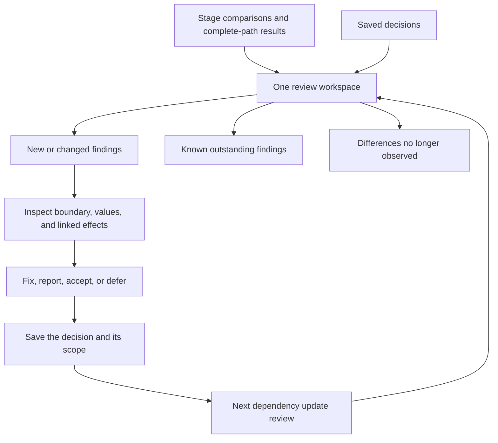

# Diff review application

Planned web interface for understanding what changes as Orinoco metadata becomes a website.
Build it only after all staged CLI comparisons, complete-path checks, and decision reuse have been implemented and reviewed.
Until then, maintainers assess each stage through readable reports, intermediate data, and reproducible commands.
The interface reuses those established reports and matching operations.
It brings comparisons from each stage into one review, locates where differences first appear, and carries reviewed decisions into the next dependency update.

## Follow the metadata

Record preservation is checked before differences reach pages.
Storage, RDF conversion, and service upload each have their own comparison, so a conversion loss has a place in the diagnosis.
Arrow labels abbreviate proposed commands under `orinoco-lite dev`; the build specification supplies their arguments.

RDF preservation is a separate diagnostic check, not an extra website-generation step.
The website comparisons follow projection, assembly, and rendering:

At each stage, upstream and Lite receive the same input to reveal differences introduced by that operation.
A final comparison follows both complete paths, each using its own preceding outputs, to expose interactions between stages.

## Review a difference once

The application opens a review containing stage results and their evidence.
Start with new or changed findings, inspect the affected records or pages, and follow the difference back to its first observed boundary.
When the cause is uncertain, a focused rerun can test whether an earlier change explains a later effect.

Verified downstream effects are grouped with the finding that explains them; a new consequence still requires review even when its originating finding has a saved decision.
The raw differences remain available, and unexplained effects stay in the review queue.
Record fields, RDF evidence, generated content, assembled files, and rendered pages each have an appropriate view in the same workspace.

A saved decision records what was judged, why, and when it should be reconsidered.
Unchanged decisions carry forward; changed behavior returns for review.
Tolerated defects and deferred questions stay visible without demanding the same decision each time.
Failed or skipped checks remain visibly incomplete.

## Review a dependency update

Run the affected stage comparisons and both complete generation paths, open the review, and resolve the new findings.
Inspect differences that have disappeared and test whether the corresponding adaptation can now be removed.
Review retained Git patches as well: agreement while a patch is active does not show that it is unnecessary.

The aim is confidence in meaningful changes and deliberate adaptations.
Outputs do not have to be byte-identical, and incidental variation does not have to become another code tweak.

The [build specification](../../docs/agents/staged-upstream-validation.md) defines the interfaces, decision rules, and implementation sequence.
