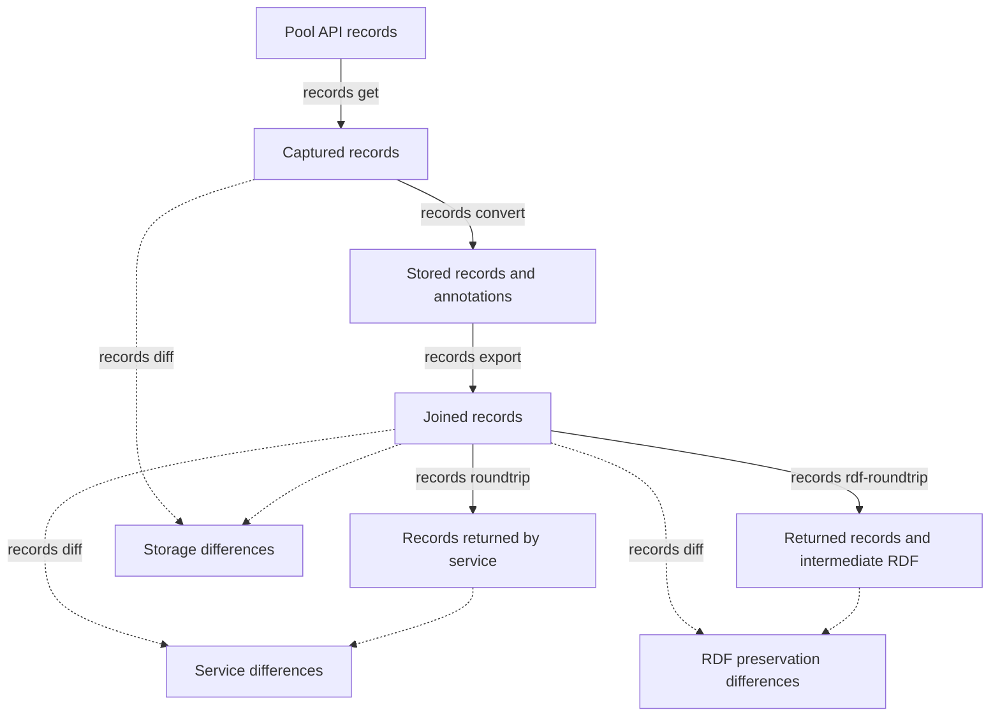
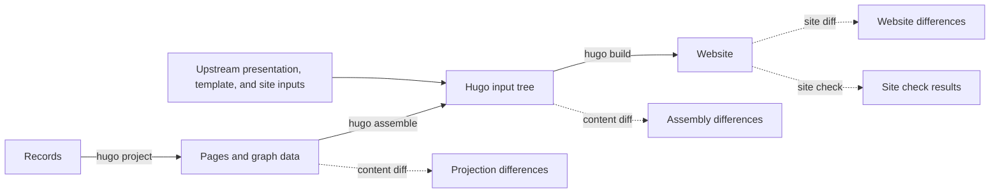
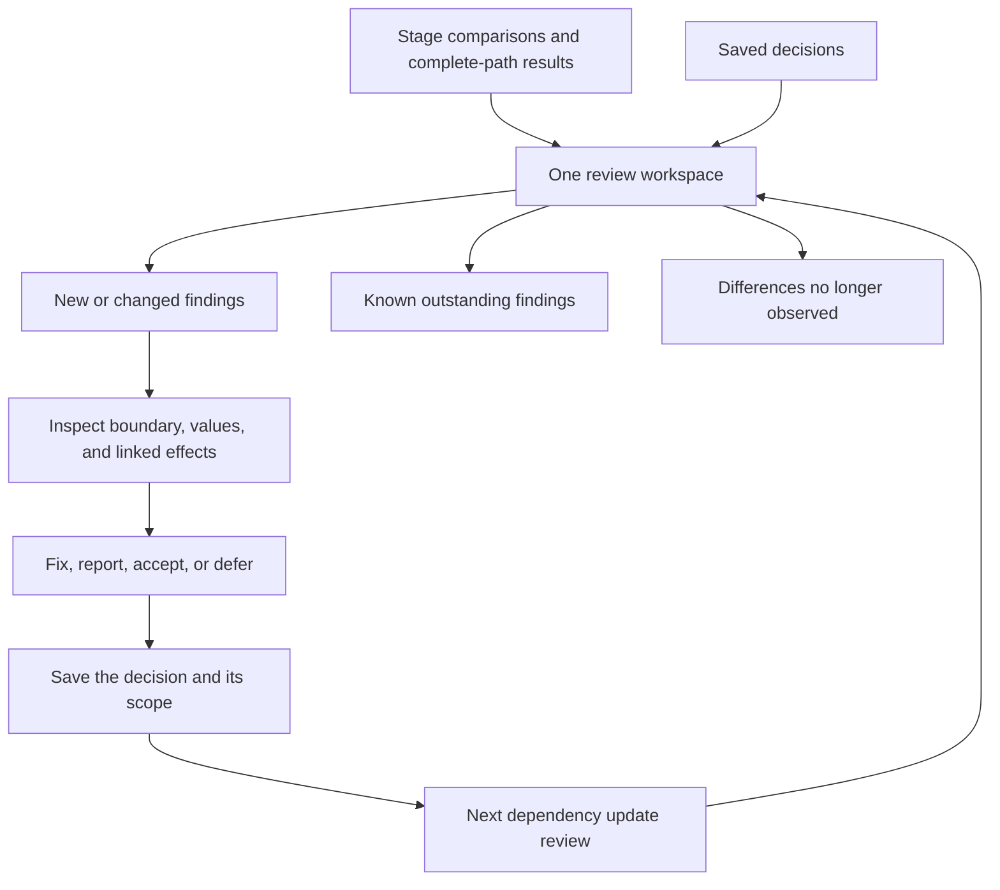

# Diff review application

Local web interface for understanding what changes as Orinoco metadata becomes a website.
It reads the staged CLI reports and uses the package's existing matcher to preview scoped decision edits.
It does not run transformations, modify metadata, or apply repository changes.

## Open a review

Supply the reports you want to compare, including isolated stages and complete-path results.
Use a fresh output directory; bundling copies their validated evidence and the current decision snapshot.
It does not fetch dependencies or run missing stages.

```sh
orinoco-lite dev review bundle \
  build/reports/storage build/reports/rdf build/reports/projection \
  build/reports/site --decisions docs/agents/upstream-review-decisions.json \
  --title "Dependency update review" --output build/review
orinoco-lite dev review serve build/review --open
```

The server prints its loopback URL; `--port 0` selects an available port.
Stop it with Ctrl-C.
A copied bundle opens with the same commands on another machine with Orinoco Lite installed.
The installed package supplies the application code; a bundle supplies evidence, never executable application code.
Recorded commands can mention their original machine's paths, but opening the copied evidence does not require those paths or live services.

Start with **New & changed**, select a report and stage, and inspect typed before/after values. The stage cards include successful comparisons with no findings. **Known outstanding** retains tolerated and undecided issues. **Retirement candidates** shows differences not observed in compatible scope; **Not evaluated** shows decisions outside this collection's coverage. The selected run, comparison mode, coverage, actual left/right operations, diagnostics, and recorded commands remain visible.
A missing command is shown as unrecorded.
**Reports & data flow** shows execution context and verified artifact dependencies.
Finding links separately identify possible attribution or causality established by a selective replay.

Inspect JSONL, RDF, generated content, settings, HTML source, and raster images through the artifact browser.
Large text is bounded on screen; downloads preserve the original bytes.
HTML opens on a separate loopback origin with a sandbox that disables scripts, forms, and external requests.
Root-relative local asset references are rebased for that preview.
This is a static inspection view: use retained browser evidence or rerun `dev site check` for interactive behavior, network failures, or an exact rendering claim.

## Draft and apply decisions

A decision records an actual reviewer, disposition (**Intended**, **Tolerated**, or **Undecided**), rationale, and reconsideration condition.
New decisions use the selected finding's exact scope.
For changed behavior, explicitly select a prior decision to revise; the matcher preserves its selector and applicability conditions.
Conflicting prior decisions remain visible until the reviewer resolves them.
A retirement is an explicit removal with a reason, not a consequence of hiding a finding.

The draft stays in browser memory and is lost on reload or closing the page.
Previewing recomputes matching through the Python package; the baseline queue still describes the original snapshot.
Export the validated JSON, then preview and apply it to the repository decision file:

```sh
orinoco-lite dev review apply orinoco-review-changes.json \
  --decisions docs/agents/upstream-review-decisions.json
orinoco-lite dev review apply orinoco-review-changes.json \
  --decisions docs/agents/upstream-review-decisions.json --write
git diff -- docs/agents/upstream-review-decisions.json
```

The base digest rejects edits against a decision file changed since bundling.
Rebuild the bundle to review against that newer file.
The server never writes the repository decision file, commits, posts to GitHub, or changes an upstream patch.
This engineering review is separate from the downstream website's authenticated curation application.

The CLI remains usable independently: `dev review summarize REPORT... --output DIRECTORY` produces readable and machine-readable summaries; `dev review inspect REPORT... --decisions FILE --author NAME` provides the terminal workflow.
Add `--decisions FILE` to summaries to carry saved decisions forward.
The named `annotation-representation-v1` rule covers tested annotation equivalence only.
It does not accept resulting page changes or new consequences.

## Design concerns exposed by the reports

- **A raw finding is an observation, not a defect count.** A file-byte change and several structured field changes may describe one cause.
  Pagination retains every row; links group only demonstrated relationships.
- **Stage names do not identify experiments.** Several projection, assembly, or rendering runs may coexist.
  The interface distinguishes their run, mode, and scope; reviewers must choose the intended report collection.
- **Absence is scoped, not chronological.** The matcher considers coverage across supplied reports, not their order.
  Do not mix superseded runs into a collection to infer that the newest run resolved an issue.
  Removing an adaptation still requires evidence from a run without it.
- **A quiet queue does not establish integration agreement.** Failed/skipped stages, omitted coverage, and interactions between complete paths still require judgment.
  The application never turns matching decisions into overall approval.
- **Static preview is not a browser regression result.** Active editors, remote resources, and script behavior need the existing browser-check workflow.
  The isolated preview deliberately cannot reproduce those behaviors.
- **An exported draft is not shared review state.** There is no collaborative session, automatic draft recovery, or report-generation scheduler.
  Reopening a review requires its retained evidence and decision snapshot.

Diagnostic `dev hugo build` covers Hugo rendering and the selected output adapter.
The ordinary `orinoco-lite build` also binds the editor and review applications, whose inputs include workspace metadata and configuration.
Check that complete build separately before claiming whole-site agreement.

## Follow the metadata

Record preservation is checked before differences reach pages.
Storage, RDF conversion, and service upload each have their own comparison, so a conversion loss has a place in the diagnosis.
Arrow labels abbreviate commands under `orinoco-lite dev`; the build specification supplies their arguments.



RDF preservation is a separate diagnostic check, not an extra website-generation step.
The website comparisons follow projection, assembly, and rendering:



At each stage, upstream and Lite receive the same input to reveal differences introduced by that operation.
A final comparison follows both complete paths, each using its own preceding outputs, to expose interactions between stages.

## Review a difference once

The application opens a review containing stage results and their evidence.
Start with new or changed findings, inspect the affected records or pages, and follow the difference back to its first observed boundary.
When the cause is uncertain, a focused rerun can test whether an earlier change explains a later effect.



Verified downstream effects are grouped with the finding that explains them; a new consequence still requires review even when its originating finding has a saved decision.
The raw differences remain available, and unexplained effects stay in the review queue.
Record fields, RDF evidence, generated content, assembled files, and rendered pages each have an appropriate view in the same workspace.

A saved decision records what was judged, why, and when it should be reconsidered.
Unchanged decisions carry forward; changed behavior returns for review.
Tolerated defects and deferred questions stay visible without demanding the same decision each time.
Failed or skipped checks remain visibly incomplete.

## Review a dependency update

Run the affected stage comparisons and both complete generation paths, open the review, and resolve the new findings.
Inspect differences that have disappeared and test whether the corresponding adaptation can now be removed.
Review retained Git patches as well: agreement while a patch is active does not show that it is unnecessary.

The aim is confidence in meaningful changes and deliberate adaptations.
Outputs do not have to be byte-identical, and incidental variation does not have to become another code tweak.

The [build specification](../../docs/agents/staged-upstream-validation.md) defines the interfaces, decision rules, and implementation sequence.
