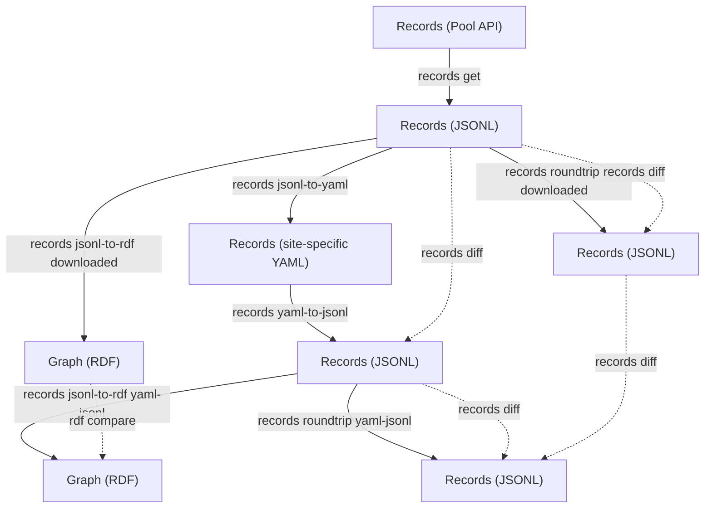
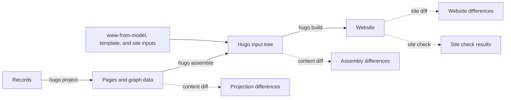
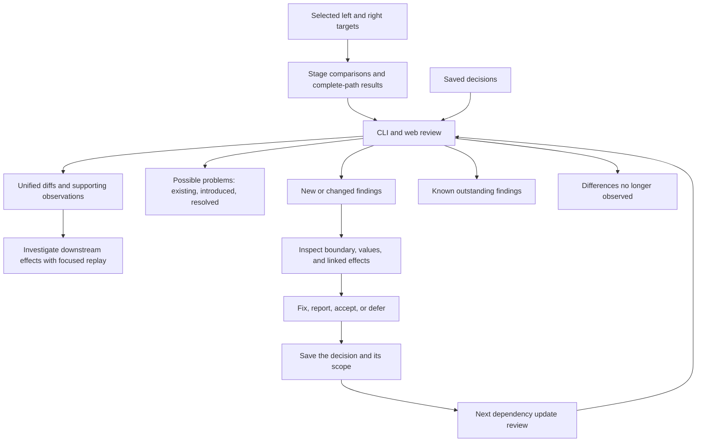

# Diff review application

CLI and web review for understanding what changes as Orinoco metadata becomes a website.
Choose the two comparison targets, inspect unified diffs, then trace their effects.
Keep possible problems, such as broken links, separate from differences between outputs.
Prefer implementing comparison and investigation operations in the CLI for testing, maintenance, and Unix composition; this does not prohibit additional web functionality.

## Choose the comparison

Compare Orinoco with Lite, an earlier Lite revision with a candidate, or retained outputs from an official site or draft deployment.
Reports retain both artifacts and any recorded producing operations.
To compare explicit artifacts with labels and source references:

```sh
orinoco-lite dev review compare retained/orinoco retained/draft \
  --name draft-comparison --stage rendering \
  --left-label Orinoco --right-label "Draft deployment" \
  --right-url https://example.org/preview/ \
  --right-branch-url https://example.org/hub/branch/draft
orinoco-lite dev review show draft-comparison | less
```

Link the relevant upstream Aneksajo hub branch when available.
Its current head is not proof of the deployed commit: a branch may advance after deployment.
Supply revisions and capture/deployment timestamps only from retained evidence.
`compare` reads retained artifacts; use `capture` first to fetch a live site.
Capture composes GNU Wget, retains original response bodies without rewriting links, and saves its WARC HTTP archive, response index, and log.
Supply explicit routes, or use a local rendered tree to choose the routes to request:

```sh
orinoco-lite dev review capture https://www.psychoinformatics.de/ \
  --name official-today --label "Official site" \
  --branch-url https://hub.psychoinformatics.de/www/www-from-model/src/branch/published \
  --routes-from sourcedata/complete-path/upstream/website --route graph.json
orinoco-lite dev review capture https://www-draft.psychoinformatics.de/ \
  --name draft-today --label "Draft site" \
  --branch-url https://hub.psychoinformatics.de/www/www-from-model/src/branch/main \
  --routes-from sourcedata/complete-path/upstream/website --route graph.json
orinoco-lite dev review compare sourcedata/captures/official-today/site \
  sourcedata/captures/draft-today/site --name official-vs-draft
```

Capture requests selected routes and Wget-discovered same-host page assets, not an exhaustive crawl or JavaScript execution.
HTTP 404/410 responses establish observed absence; network errors and unreceived responses make retrieval incomplete.
The comparison imports capture labels, timestamps, URLs, source-branch references, and HTTP evidence automatically.
It explicitly limits claims to retained files; missing intermediate data or deployment coordinates are never inferred.
For durable acquisitions, run the public capture command through the downstream's `datalad run` with explicit inputs and outputs.

## Read differences and investigate effects

`dev review show` prints classified and unclassified structured differences by default.
Use `--classification unclassified`, `recognized`, or `coverage` to narrow the view.
Classification does not change original evidence, AI annotations, or human dispositions.
Identical unknown HTML edits can be grouped across files, but remain unclassified.

The default Python heuristic is `src/orinoco_lite/review_heuristic.py`.
Its ordered `RULES` classify complete differences; the first match wins, with specific adaptations before general representation rules.
A rule receives `(finding, stage)` and returns a category name, a dictionary with a `rule` name, or `None`.
Labels and explanations are optional.
For a downstream-specific heuristic, compose ordinary Python functions:

```python
from orinoco_lite.review_heuristic import RULES as shared_rules


def site_change(finding, stage):
    if (finding['subject'] == 'title.txt'
            and finding['before'] == 'Old title'
            and finding['after'] == 'New title'):
        return 'site-title-change'
    return None


RULES = (site_change, *shared_rules)
```

Select trusted Python explicitly with `--heuristic FILE` on `compare`, `replay`, `show`, `bundle`, or `serve`.
The Python file executes with the caller's privileges.
`show` and `serve` can reclassify retained evidence without rebuilding the sites.
Bundles retain classifications and heuristic identity; opening a bundle never executes its saved heuristic selection.
Retain custom heuristic source and its environment with the investigation when rerunning its classification matters.
This separation follows [HeuDiConv's Python heuristic approach](https://heudiconv.readthedocs.io/en/latest/heuristics.html); rule precedence is explicit here.

The web starts with buttons for two coherent site outputs.
Each button shows the total difference count across its linked stages; sidebar counts and contents follow the selected pair and stage.
The default is the complete local Orinoco → Lite site comparison when supplied.
Stages are associated through exact artifact digests and producing-operation links, not display labels.
Stage choices sit directly below the comparison buttons; unavailable stages are explicit.
Related isolated-stage diagnostics and replay evidence open from their relevant change without switching the selected sites.
Categories expose all their occurrences, with explanations when supplied.
Capture coverage and supporting size observations are identified separately before applying the selected heuristic.
Capture coverage describes the saved snapshot: selected routes, saved files, successful responses, HTTP-confirmed absence, and errors or unknown outcomes.
Routes outside the selection may never have been requested; their absence is not a verdict on the live site.
`dev review show --view files` compares every original retained file, independently of findings and decisions.
The web **Original-file diffs** view exposes the same text, added/deleted files, and explicit binary changes.
**All observations** includes supporting size and fingerprint observations.
Original-file diffs preserve formatting; the structured view explains what its comparator observes.
Structured values use sorted mapping keys while preserving types, list order, multiplicity, and missing versus null.
Size and fingerprint observations support their owning change; `--raw` exposes them separately.
Use `--subject` to narrow the output and `--format json` for further processing.
`dev review show --category problems` exposes checks separately.
For rendered trees, `dev review compare --check-links` also writes a separate checks report distinguishing existing, introduced, and resolved link problems.

For a projection or assembly file with one semantic difference:

```sh
orinoco-lite dev review replay projection projection:3 \
  --assembly sourcedata/complete-path/lite/assembly \
  --name identifier-replay --base-url /demo/
orinoco-lite dev review show projection identifier-replay
```

Use the actual finding ID from the selected report.
Replay requires the assembly file to match the right-side evidence, replaces it with the left-side file, and builds both through the same renderer.
A repeated baseline must agree before the result supports an effect claim.
Retained inputs and outputs connect the result to the original finding in both CLI and web review.
This tests that substitution for those inputs and that renderer, not every deployment.
Files with multiple semantic changes require a more focused investigation.

## Plan an investigation

`dev review experiments` describes the questions, controls, prerequisites, preparation, commands, and limits shared with the website's **Questions and experiments** view.
It works before any reports exist; `--format json` supplies structured guidance for agents.
Each comparison also exposes what it establishes.
Use `compare --experiment software-change` (or another listed design) to record the intended question when comparing prepared outputs.
The flag does not run builds or prove that the controls were met.
Statuses describe supplied comparison runs; a missing experiment remains visible without being required for every update.
Selected differences link to the same guidance under **Plan an investigation**.

## Add an agent investigation

Agent annotations are separate from human dispositions.
Supply a JSON file to `review show --annotations notes.json` or `review bundle --annotations notes.json`:

```json
{
  "annotations": [{
    "finding_key": "RUN-ID/projection:3",
    "author": "Codex",
    "tags": ["identifier representation"],
    "explanation": "Explain what the linked data shows.",
    "hypothesis": "State the proposed cause, if unresolved.",
    "conclusion": "State only the supported conclusion.",
    "limits": "Name the tested inputs, renderer, and remaining uncertainty.",
    "evidence": [{"label": "Reproduce experiment", "path": "experiment"}],
    "commands": [["python", "experiment/reproduce.py", "--output", "fresh-output"]]
  }]
}
```

Evidence paths are relative to the notes file; files and directories are copied into the portable review and verified against their digests.
Every annotation, including an opinion, requires inspectable evidence.
Commands are displayed and never executed by the page.
Use ordinary retained scripts for investigations beyond the single-file replay.
Keep inputs, package selections, locks, and outputs with the experiment; exercise its instructions from a fresh directory before claiming it is reproducible.
A command from a dirty checkout is historical evidence, not a recoverable software selection.
Comparing retained outputs and reproducing the experiment are separate operations.
Annotations do not change decision matching or automatically establish a verified effect.

## Open a review

Comparison buttons name the task or the two sites.
Selecting one exposes its target details above the stage diagram.

After running comparisons, bundle and open them:

```sh
orinoco-lite dev review bundle
orinoco-lite dev review serve --open
```

The commands use `sourcedata/`, like the record and website commands.
Use `--directory PATH` for another investigation.
`bundle` copies the existing reports and optional `decisions.json` into `bundle/`; use `--force` to replace an existing bundle.
It does not run missing stages.
Create retained record comparisons with `records diff all --report sourcedata/reports`.
Select particular comparisons by name when needed, such as `review bundle downloaded-vs-yaml-jsonl rdf rdf-records`.

## Retain evidence with Git Annex

A separate DataLad dataset can retain investigations and be selected by a Git submodule in an engineering checkout.
Keep small human-authored decisions, annotations, scripts, and environment selections in Git.
Large captures, finding payloads, and outputs can use Annex; configure a content remote before relying on another clone to retrieve them.
Record acquisitions and transformations with native `datalad run`; use `datalad save` when ingesting supplied historical bytes whose generating environment is unavailable.
Do not relabel historical dirty-checkout evidence as a reproducible software selection.
Save the child dataset before advancing the parent's gitlink.

`review bundle` also writes a derived `overview.json` for browsing without artifact content.
Keep that file in ordinary Git; full `review.json`, report payloads, and artifacts may be annexed.
For example, an evidence dataset can use these `.gitattributes` entries:

```text
* annex.largefiles=anything
.gitattributes annex.largefiles=nothing
*.py annex.largefiles=nothing
*.toml annex.largefiles=nothing
*.lock annex.largefiles=nothing
**/overview.json annex.largefiles=nothing
decisions.json annex.largefiles=nothing
annotations.json annex.largefiles=nothing
```

With a bundle under `evidence/run/bundle`, browse its saved overview or explicitly retrieve and verify a full review:

```sh
orinoco-lite dev review serve --directory evidence/run --metadata-only
orinoco-lite dev review materialize evidence/run/bundle build/review/bundle --get
orinoco-lite dev review serve --directory build/review
```

Metadata-only viewing marks the saved counts as unverified in this session and disables evidence inspection and decision editing.
`materialize --get` runs DataLad retrieval for the selected bundle; omit `--get` to require local content.
It resolves only recognized Annex file links, copies ordinary files into a fresh destination, and verifies the resulting reports before exposing the output.
The ordinary comparison engine and full review continue to require ordinary verified files.
This engineering evidence storage does not change downstream canonical metadata or introduce an Annex dependency into ordinary site builds.

## Draft and apply decisions

A decision records an actual reviewer, disposition (**Intended**, **Tolerated**, or **Undecided**), rationale, and reconsideration condition.
New decisions use the selected finding's exact scope.
For changed behavior, explicitly select a prior decision to revise; the matcher preserves its selector and applicability conditions.
Conflicting prior decisions remain visible until the reviewer resolves them.
A retirement is an explicit removal with a reason, not a consequence of hiding a finding.

The draft stays in browser memory and is lost on reload or closing the page.
Previewing recomputes matching through the Python package; the baseline queue still describes the original snapshot.
Save the exported `decision-edits.json` in your investigation directory, then preview and apply it:

```sh
orinoco-lite dev review apply
orinoco-lite dev review apply --write
```

The changes apply to `decisions.json` in that directory.
Inspect that file before retaining it in Git or reusing it in another investigation.

The base digest rejects edits against a decision file changed since bundling.
Rebuild the bundle to review against that newer file.
The server never writes the repository decision file, commits, posts to GitHub, or changes an upstream patch.
This engineering review is separate from the downstream website's authenticated curation application.

Use `dev review summarize` for a text summary or `dev review inspect --author NAME` for terminal review.
Both use the same reports and decisions.

## Design concerns exposed by the reports

- **A raw finding is an observation, not a defect count.** A file-byte change and several structured field changes may describe one cause.
  Pagination retains every row; links group only demonstrated relationships.
- **Stage names do not identify experiments.** Several projection, assembly, or rendering runs may coexist.
  The interface distinguishes their run, mode, and scope; reviewers must choose the intended report collection.
- **Absence is scoped, not chronological.** The matcher considers coverage across supplied reports, not their order.
  Do not mix superseded runs into a collection to infer that the newest run resolved an issue.
  Removing an adaptation still requires evidence from a run without it.
- **A quiet queue does not establish integration agreement.** Failed/skipped stages, omitted coverage, and interactions between complete paths still require judgment.
  The application never turns matching decisions into overall approval.
- **Static preview is not a browser regression result.** Active editors, remote resources, and script behavior need the existing browser-check workflow.
  The isolated preview deliberately cannot reproduce those behaviors.
- **An exported draft is not shared review state.** There is no collaborative session, automatic draft recovery, or report-generation scheduler.
  Reopening a review requires its retained evidence and decision snapshot.

Diagnostic `dev hugo build` covers Hugo rendering and the selected output adapter.
The ordinary `orinoco-lite build` also binds the editor and review applications, whose inputs include workspace metadata and configuration.
Check that complete build separately before claiming whole-site agreement.

## Follow the metadata

Record preservation is checked before differences reach pages.
Storage, RDF conversion, and service upload each have their own comparison, so a conversion loss has a place in the diagnosis.
Arrow labels abbreviate commands under `orinoco-lite dev`; the build specification supplies their arguments.


```mermaid
flowchart TD
  pool["Records (Pool API)"] -->|records get| capture["Records (JSONL)"]
  capture -->|records jsonl-to-yaml| storage["Records (site-specific YAML)"]
  storage -->|records yaml-to-jsonl| joined["Records (JSONL)"]
  capture -->|records jsonl-to-rdf downloaded| directRdf["Graph (RDF)"]
  joined -->|records jsonl-to-rdf yaml-jsonl| rdf["Graph (RDF)"]
  capture -->|records roundtrip downloaded| directService["Records (JSONL)"]
  joined -->|records roundtrip yaml-jsonl| service["Records (JSONL)"]
  capture -. records diff .-> joined
  directRdf -. rdf compare .-> rdf
  capture -. records diff .-> directService
  joined -. records diff .-> service
  directService -. records diff .-> service
```

RDF preservation is a separate diagnostic check, not an extra website-generation step.
The website comparisons follow projection, assembly, and rendering:


```mermaid
flowchart LR
  records[Records] -->|hugo project| projection[Pages and graph data]
  projection -->|hugo assemble| assembly[Hugo input tree]
  sources[www-from-model, template, and site inputs] --> assembly
  assembly -->|hugo build| website[Website]
  projection -. content diff .-> p[Projection differences]
  assembly -. content diff .-> a[Assembly differences]
  website -. site diff .-> w[Website differences]
  website -. site check .-> checks[Site check results]
```

At each stage, upstream and Lite receive the same input to reveal differences introduced by that operation.
A final comparison follows both complete paths, each using its own preceding outputs, to expose interactions between stages.

## Review a difference once

The application opens a review containing stage results and their evidence.
Start with new or changed findings, inspect the affected records or pages, and follow the difference back to its first observed boundary.
When the cause is uncertain, a focused rerun can test whether an earlier change explains a later effect.


```mermaid
flowchart TD
  targets[Selected left and right targets] --> results[Stage comparisons and complete-path results]
  results --> review[CLI and web review]
  review --> differences[Unified diffs and supporting observations]
  review --> problems[Possible problems: existing, introduced, resolved]
  differences --> effects[Investigate downstream effects with focused replay]
  previous[Saved decisions] --> review
  review --> new[New or changed findings]
  review --> outstanding[Known outstanding findings]
  review --> retirement[Differences no longer observed]
  new --> evidence[Inspect boundary, values, and linked effects]
  evidence --> decision[Fix, report, accept, or defer]
  decision --> saved[Save the decision and its scope]
  saved --> next[Next dependency update review]
  next --> review
```

Verified downstream effects are grouped with the finding that explains them; a new consequence still requires review even when its originating finding has a saved decision.
The raw differences remain available, and unexplained effects stay in the review queue.
Record fields, RDF evidence, generated content, assembled files, and rendered pages each have an appropriate view in the same workspace.

A saved decision records what was judged, why, and when it should be reconsidered.
Unchanged decisions carry forward; changed behavior returns for review.
Tolerated defects and deferred questions stay visible without demanding the same decision each time.
Failed or skipped checks remain visibly incomplete.

## Review a dependency update

Run the affected stage comparisons and both complete generation paths, open the review, and resolve the new findings.
Inspect differences that have disappeared and test whether the corresponding adaptation can now be removed.
Review retained Git patches as well: agreement while a patch is active does not show that it is unnecessary.

The aim is confidence in meaningful changes and deliberate adaptations.
Outputs do not have to be byte-identical, and incidental variation does not have to become another code tweak.

The [build specification](../../docs/agents/staged-upstream-validation.md) defines the interfaces, decision rules, and implementation sequence.
